2arf

**AVIATION & AEROSPACE EDUCATION KIT**

SECTION 2 • BEGINNER PROJECTS • SHS 1 TERMS 1–2

**PROJECT 2**

**Foam Hand-Launch**

**Glider Build**

| **LEVEL**  Beginner | **DURATION**  3 Lessons (40–50 min each) | **KIT**  Kit 1 & 2 |
| --- | --- | --- |

**Student & Teacher Manual**

**1. Project Overview**

Building on the paper aircraft skills developed in Project 1, this project guides students through constructing a durable EVA foam hand-launch glider from scratch. Students learn to shape an airfoil, locate and adjust the centre of gravity, and trim the glider's control surfaces to achieve stable, straight flight — mirroring the workflow real aircraft engineers follow during initial test-flight programmes.

| **Curriculum Area** | Aviation Science – Aerodynamics, Stability & Control |
| --- | --- |
| **Year Group** | SHS 1 (Terms 1–2) |
| **Duration** | 3 lessons of 40–50 minutes each |
| **Materials Source** | Kit 1 and Kit 2 (all items) |
| **Power Required** | None – manual (hand) launch only |
| **Prerequisite** | Project 1 – Paper Dart & Glider Comparison Tournament |

**Learning Objectives**

* Construct a foam glider with a correctly shaped airfoil, wing spar, and tail assembly
* Define and locate the centre of gravity (CG) and explain why its position matters for flight stability
* Distinguish between static stability and dynamic stability
* Identify and operate the three primary flight control surfaces: elevator, rudder, and ailerons
* Apply the iterative trim-and-test process to achieve stable, straight flight
* Collect, record, and interpret flight performance data across three competition categories

**2. Components Required**

| **Item** | **Quantity** | **Source** |
| --- | --- | --- |
| EVA foam sheet (3 mm, A4) | 2 sheets | Kit 1 & 2 |
| Bamboo skewers | 5 | Kit 1 |
| Glue sticks (hot glue) | 3 | Kit 1 |
| Sandpaper (assorted grit) | 1 sheet | Kit 1 |
| Marker pen | 1 | Kit 1 |
| Steel ruler (30 cm) | 1 | Kit 1 |
| Craft knife with safety guard | 1 | Kit 1 |
| Cutting mat (A3) | 1 | Kit 1 |
| Masking tape | 1 roll | Kit 1 |
| Small coins or metal washers (weights) | 4–6 | Teacher-provided |

**3. Build Steps & Assembly**

**Lesson 1 – Cutting & Assembly**

| **STEP 1** | **Template Tracing** |
| --- | --- |
|  | * Distribute foam sheets and printed templates to each group * Using a marker pen and ruler, trace the following four parts onto foam: * Main wing – wide shape with slight forward sweep * Horizontal stabilizer – small wing for the tail * Vertical stabilizer – the tail fin * Fuselage – long rectangular body strip * Label each traced piece with the group name before cutting |

| **STEP 2** | **Cutting the Foam** |
| --- | --- |
|  | * Use the craft knife and steel ruler on the cutting mat * Cut slowly along traced lines; do not rush – foam tears if the knife is not sharp * After cutting, use sandpaper to smooth all edges; aim for a clean, rounded leading edge on the wing * Only blunt-edge cutting is permitted; no powered cutting tools * Teacher or adult must be present during all cutting activities |

| **STEP 3** | **Shaping & Assembling the Wing** |
| --- | --- |
|  | * To create an airfoil, gently curve the wing by rolling it over a round object (e.g., a ruler handle) * The upper surface should be slightly more curved than the lower surface * Insert a bamboo skewer lengthwise through the wing centre as a spar for rigidity * Trim skewer flush with the wing tips using scissors * Glue the wing to the fuselage at the position marked on the template (approximately 40% from the nose) * Hold firmly for 60 seconds while hot glue sets; check alignment before glue cools |

| **STEP 4** | **Tail Assembly** |
| --- | --- |
|  | * Apply a thin bead of hot glue along the bottom edge of the horizontal stabilizer * Press onto the tail of the fuselage, centred left-to-right; hold for 60 seconds * Glue the vertical stabilizer on top of the horizontal stabilizer, exactly centred * Use a set square or right-angle card to check that the fin is perfectly vertical * Allow glue to fully cure (5 minutes) before handling further |

**Lesson 2 – Balancing & Trimming**

| **STEP 5** | **Finding & Setting the Centre of Gravity (CG)** |
| --- | --- |
|  | * Balance the completed glider on one fingertip placed under the wing * The balance point (CG) should sit at approximately 1/3 of the wing chord from the leading edge * If the nose drops (tail-heavy): add masking tape or a small coin to the nose until balanced * If the tail drops (nose-heavy): add a small piece of tape to the tail, or trim foam from the nose area * Mark the CG position on the fuselage with a marker dot for reference |

| **STEP 6** | **Initial Glide Test** |
| --- | --- |
|  | * Hold the glider at the fuselage, level, and release with a gentle forward push * Launch at a slight downward angle (about 10 degrees below horizontal) * Observe the flight path carefully: * Nose dives immediately -> tail-heavy -> add nose weight or reduce tail weight * Climbs then stalls -> nose-heavy -> add tail weight or reduce nose weight * Turns left or right -> rudder or wing is misaligned -> see Step 7 * Repeat until the glider flies straight and level for at least 5 metres |

| **STEP 7** | **Trimming the Control Surfaces** |
| --- | --- |
|  | * Make only ONE small adjustment at a time; test fly after every change * Elevator (trailing edge of horizontal stabilizer): bend up to pitch nose up; bend down to pitch nose down * Rudder (trailing edge of vertical stabilizer): bend right to turn right; bend left to turn left * Adjustments of 1–2 mm are sufficient – foam responds sensitively * Record every adjustment and result in the Trim Log table (Section 6) * Continue until the glider achieves straight, level flight with no corrections needed |

**Lesson 3 – Flight Challenge Day**

| **STEP 8** | **Set Up the Flight Zone** |
| --- | --- |
|  | * Clear a corridor or outdoor space of at least 25 metres * Mark the launch line with masking tape * Place a 1 m diameter target circle at 5 metres for the Accuracy Challenge * Lay measuring tape from the launch line for the Distance Challenge * Assign group roles: Launcher, Timer, Measurer, Recorder |

| **STEP 9** | **Distance Challenge** |
| --- | --- |
|  | * Launcher throws from the launch line using a full-arm throw * Measurer records the distance from launch line to first ground contact * Complete 3 launches; record all measurements * Calculate average distance; compare with other groups * Expected performance: 10–15 metres with a well-trimmed glider |

| **STEP 10** | **Accuracy Challenge** |
| --- | --- |
|  | * Launch the glider toward the 1 m diameter target circle placed at 5 metres * Measure the distance from where the glider lands to the centre of the target * 3 attempts per group; record best result * This challenge rewards trim quality over raw launch power |

**4. Power & Safety Notes**

| **⚠ Safety Requirements**  Power: None required – manual (hand) launch only.  Hot glue guns: Teacher supervision is mandatory. Hot glue causes burns – do not touch the nozzle or freshly applied glue.  Craft knives: Adults must be present at all times during cutting. Safety goggles are mandatory.  Flight zone: Clear all people from the flight path before every launch. A safety marshal should stand at the side, not in front.  Foam debris: Collect and dispose of all foam offcuts; small pieces are a slip hazard. |
| --- |

**5. Engineering Principles**

**Airfoil Shape & Lift Generation**

An airfoil is a shape designed to generate lift when moving through air. The curved upper surface of the wing forces air to travel a longer path than the air moving under the flat lower surface. By Bernoulli's Principle, faster-moving air exerts lower pressure — creating a net upward force (lift) on the wing.

| **Key Formula**  Lift (L) = CL x (1/2 x rho x V^2) x A  Where: CL = lift coefficient (wing shape), rho = air density, V = speed, A = wing area  Practical implication: doubling the speed quadruples the lift produced. |
| --- |

**Centre of Gravity & Aerodynamic Centre**

* The Centre of Gravity (CG) is the point at which the aircraft's total weight acts downward
* The Aerodynamic Centre (AC) is the point at which the total lift force acts — approximately 1/4 chord from the leading edge for most wings
* For stable flight, CG must be slightly forward of AC
* If CG moves behind AC, the aircraft becomes unstable and tends to pitch nose-up, leading to a stall

**Stability Types**

| **Stability Type** | **Behaviour** | **Design Factor** |
| --- | --- | --- |
| **Static Stability** | Returns to level after a disturbance | CG forward of aerodynamic centre |
| **Dynamic Stability** | Oscillations dampen over time | Dihedral angle and tail size |
| **Neutral Stability** | Holds new attitude after disturbance | CG at aerodynamic centre |
| **Instability** | Diverges further from level | CG behind aerodynamic centre |

**Flight Control Surfaces**

Control surfaces are small movable sections of the wing and tail that change the direction of airflow, producing forces that rotate the aircraft about its three axes.

| **Surface** | **Location** | **Controls** | **How to Adjust** |
| --- | --- | --- | --- |
| **Elevator** | Horizontal stabilizer | Pitch (nose up / nose down) | Bend trailing edge up/down |
| **Rudder** | Vertical stabilizer | Yaw (nose left / nose right) | Bend trailing edge left/right |
| **Ailerons** | Outer wing trailing edge | Roll (bank left / bank right) | Bend opposite sides up/down |

**Dihedral Effect**

| **Dihedral Explained**  Dihedral is the upward angle of the wings when viewed from the front.  When a gust rolls the aircraft, the lower wing presents a greater angle of attack and generates more lift, automatically returning the aircraft to level flight.  Our foam glider uses a small dihedral angle (5–10 degrees) built into the wing template for this reason. |
| --- |

**6. How to Test**

**Test Methods & Success Criteria**

| **Test** | **Method** | **Success Criteria** |
| --- | --- | --- |
| **Balance** | Balance on fingertip at wing midpoint | CG sits at 1/3 chord from leading edge |
| **Glide Test** | Gentle launch at slight downward angle | Flies straight for 5+ metres with no input |
| **Trim Test** | Adjust control surfaces by 1–2 mm | Straight flight achieved without corrections |
| **Distance** | Full-arm launch from standing position | 10+ metres measured from launch line |
| **Accuracy** | Launch toward 1 m diameter target circle at 5 m | Landing within 1 m of target centre |

**Trim Log (complete during Lesson 2)**

Record every adjustment made and what happened after each flight. The first three rows show example entries — continue in the blank rows below.

| **Adjustment Made** | **Result Observed** | **Next Action** |
| --- | --- | --- |
| *Initial flight* | *Turned left* | *Adjust rudder right* |
| *Rudder right* | *Straight but nose-heavy* | *Add tail weight* |
| *Tail weight added* | *Level, straight flight* | *Success – record trim settings* |
|  |  |  |
|  |  |  |

**Flight Data Collection Table (Lesson 3)**

Complete this table during the Flight Challenge. Use a pencil so corrections can be made.

| **Test Category** | **Attempt 1** | **Attempt 2** | **Attempt 3** | **Average** | **Notes** |
| --- | --- | --- | --- | --- | --- |
| **Distance (m)** |  |  |  |  |  |
| **Hang Time (s)** |  |  |  |  |  |
| **Accuracy – dist. to target (m)** |  |  |  |  |  |

Example expected results for a well-trimmed glider:

* Distance: ~12 m average
* Hang Time: ~3.5 s average
* Accuracy: ~0.5 m from target centre

**7. Expected Output & Success Criteria**

| **Outcome** | **Success Criteria** |
| --- | --- |
| **Glider fully assembled** | All 4 parts built and joined with clean, strong joints |
| **CG correctly balanced** | Glider balances at 1/3 chord; flies level without diving or stalling |
| **Straight flight achieved** | Glider flies straight for 5+ metres unaided |
| **Trim log completed** | All adjustment steps recorded with observations |
| **Competition participation** | Group enters at least one flight challenge category |

**8. Common Errors & Fixes**

| **Error** | **Likely Cause** | **Fix** |
| --- | --- | --- |
| **Nose dives** | CG too far forward / nose-heavy | Add tail weight or remove nose weight; adjust elevator up slightly |
| **Stalls (climbs then drops)** | CG too far back / tail-heavy | Add nose weight or remove tail weight; adjust elevator down slightly |
| **Turns left or right** | Asymmetric wing or rudder misaligned | Check wing symmetry; gently bend rudder opposite to the turn |
| **Unexpected loop** | Elevator trimmed too high | Bend elevator trailing edge down by 1–2 mm |
| **Short glide distance** | Rough foam edges causing drag | Re-sand all edges; ensure wing surfaces are flat and smooth |
| **Wing detaches** | Insufficient glue at joint | Re-glue with hot glue; allow full cure time before flight |

**9. Upgrade & Extension Ideas**

Groups that finish early, or who want to investigate further, can try the following extensions:

* Wing Position Experiment – Move the wing 1 cm forward and 1 cm backward; measure the effect on CG and flight stability
* Wing Camber Experiment – Increase the wing curvature; compare glide ratio with the original
* Winglets – Add small vertical foam pieces at the wing tips; observe effect on turning tendency and drag
* Ailerons – Score and bend the outer 3 cm of the wing trailing edge to create functional roll control surfaces
* Biplane Design – Build a second, identical wing and mount it above the first on bamboo skewer struts; compare performance
* Glide Ratio Calculation – Measure altitude at launch and distance flown; calculate glide ratio (L/D) for your design

**10. Teacher Notes & Differentiation**

**Lesson Planning Tips**

* Lesson 1 (Cutting & Assembly) is the most time-intensive. Pre-scoring the foam templates before class saves 10–15 minutes
* Hot glue guns need 5 minutes to heat up. Plug them in at the start of the lesson
* Have spare bamboo skewers and foam sheets available; foam tears easily on first attempts
* Encourage students to check wing symmetry by sighting along the wing from the nose before gluing
* For the Trim Log, prompt students after every flight: 'What changed? What will you adjust next, and why?'

**Differentiation Strategies**

* Support – Provide pre-cut foam pieces; focus on assembly, CG, and one test flight only
* Core – Full build with CG balancing, trim log, and all three flight challenges
* Extension – Students derive glide ratio (L/D) from height and distance data, and design a second variant

**Assessment Suggestions**

* Practical observation: Safe tool use, CG balancing technique, and trim adjustment method (formative)
* Trim Log completeness: Every flight attempt recorded with cause-and-effect reasoning
* Flight data table: Values recorded accurately; averages calculated correctly
* Exit discussion: Students explain in their own words why CG position determines stability

| **Curriculum Links**  Physics: Forces, pressure, Newton's laws, measurement and data analysis  Mathematics: Averages, ratio (glide ratio), graphing flight data  Design & Technology: Engineering design process, materials, iterative testing  This project aligns with GCAA youth aerospace awareness goals and STEM integration targets for SHS 1. |
| --- |

## Images

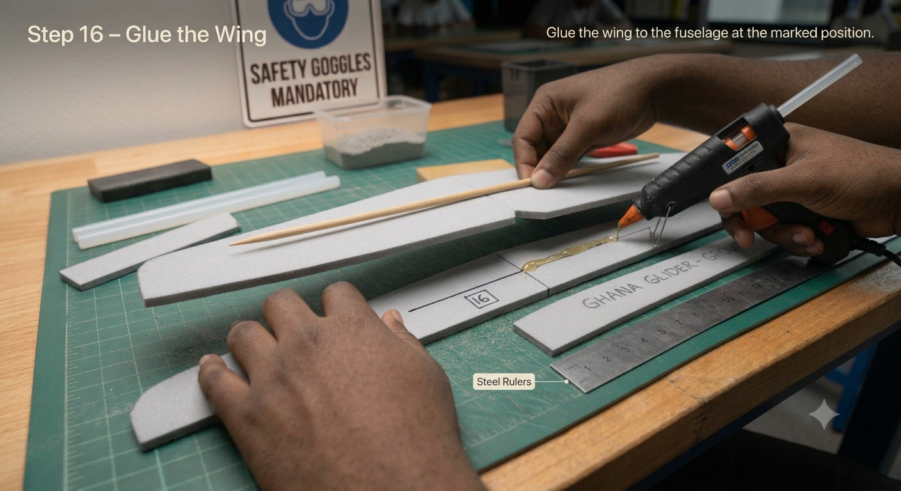

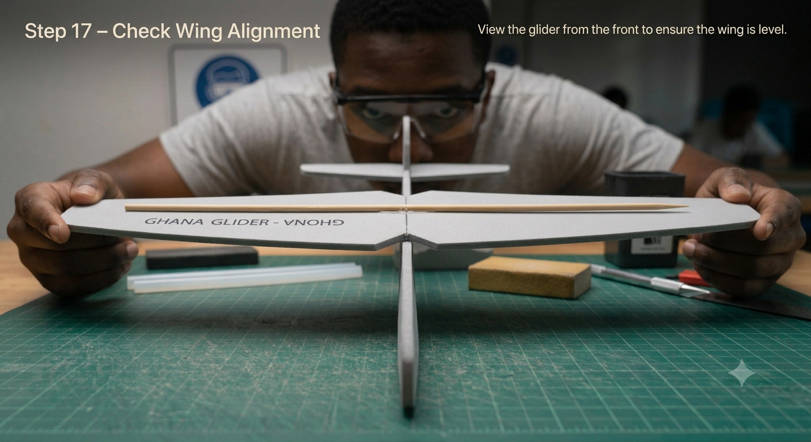

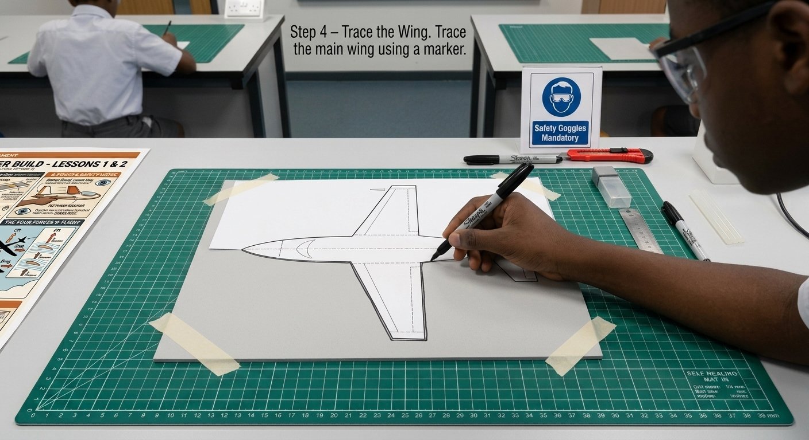

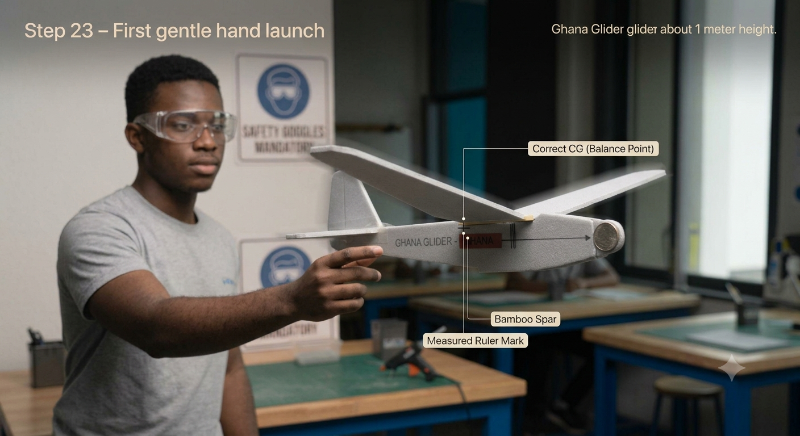

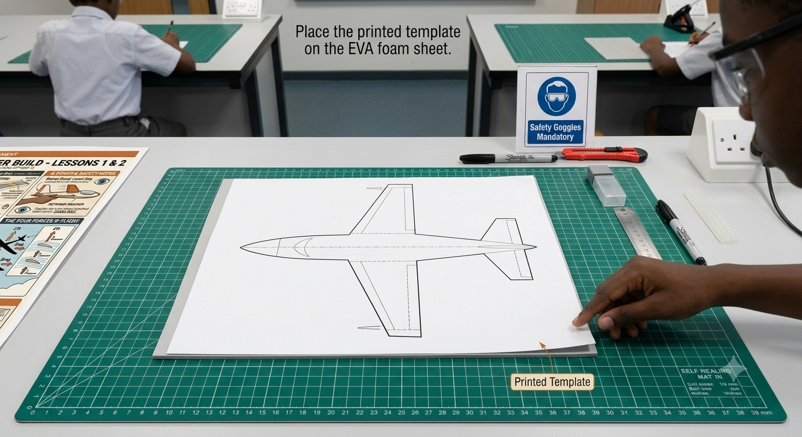

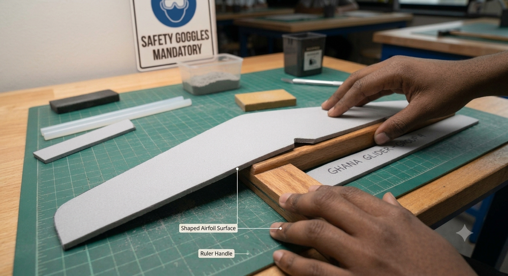

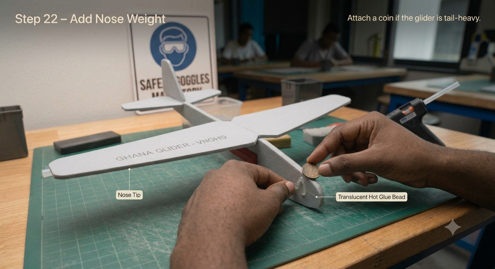

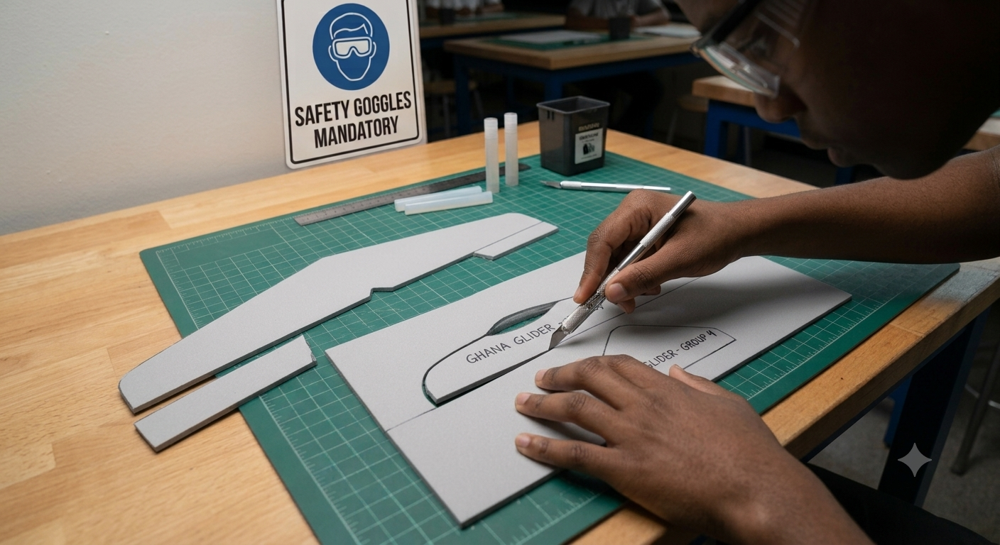

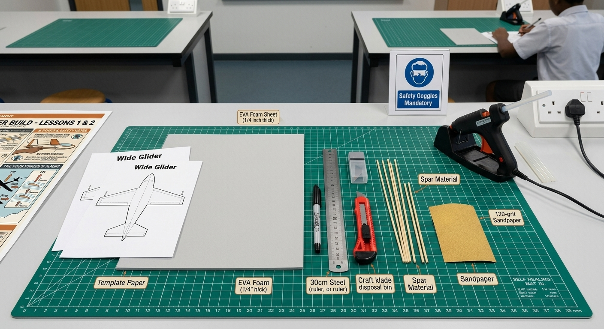

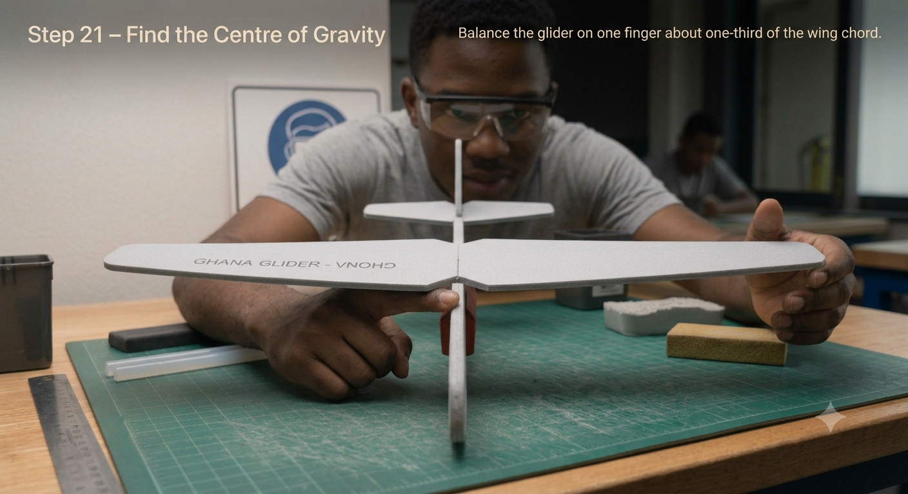

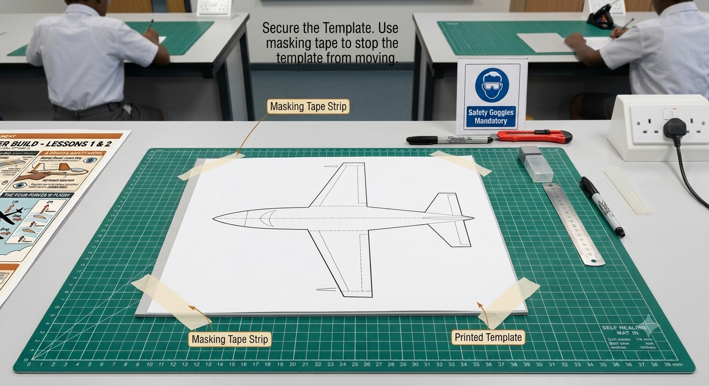

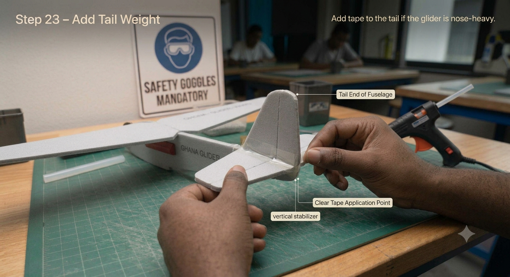

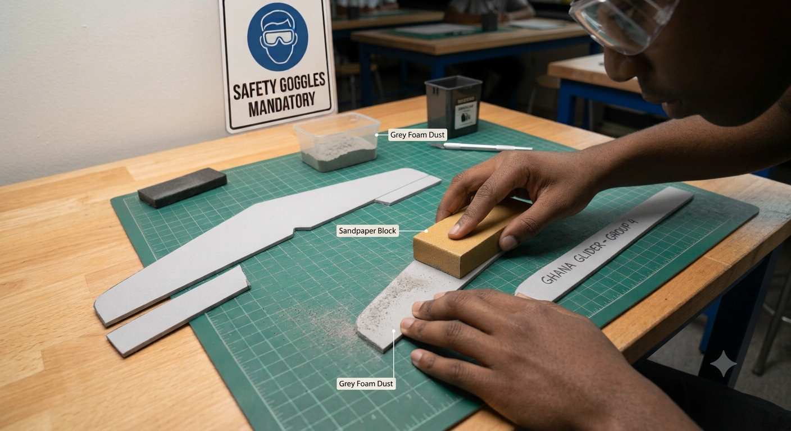

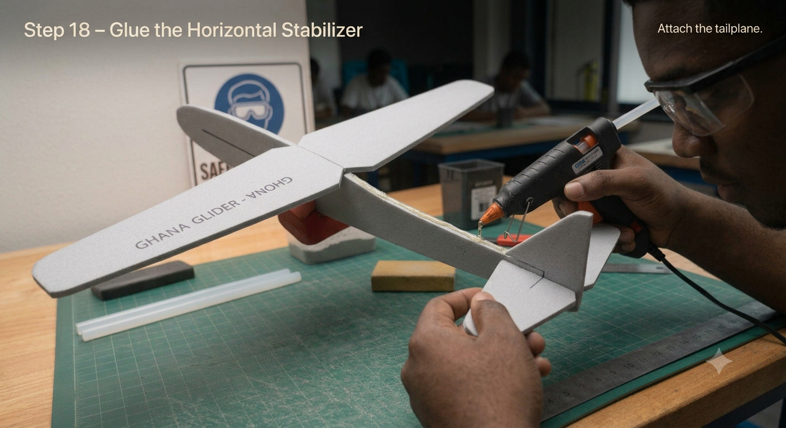
