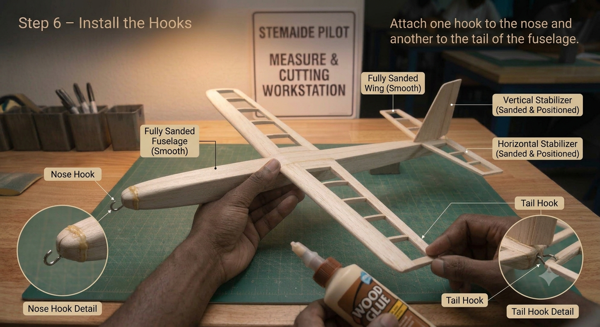
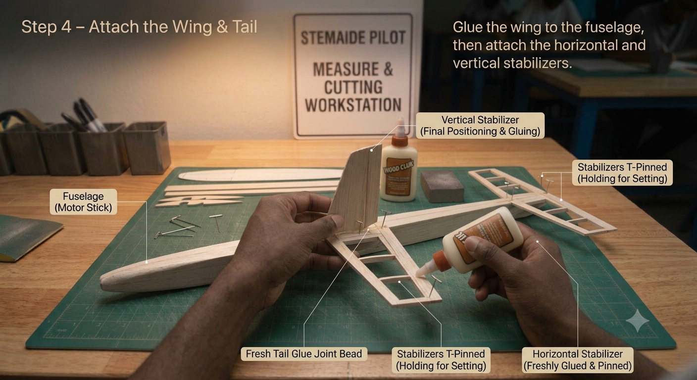
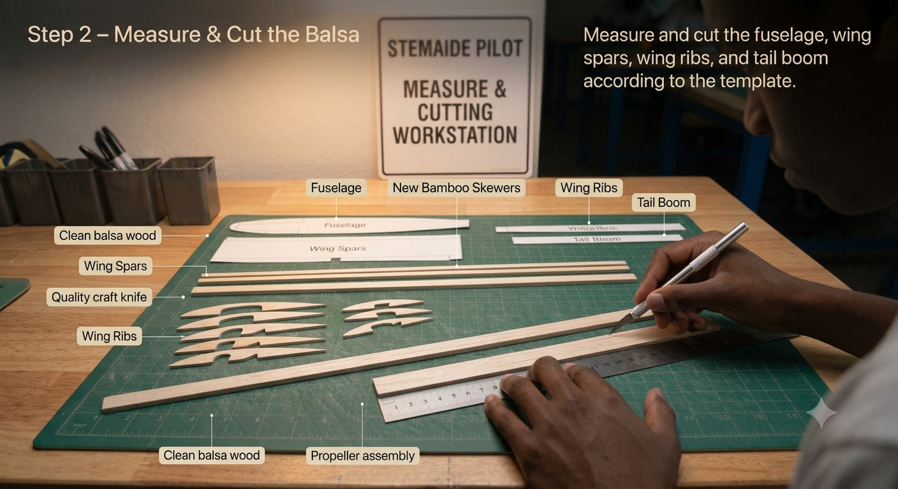
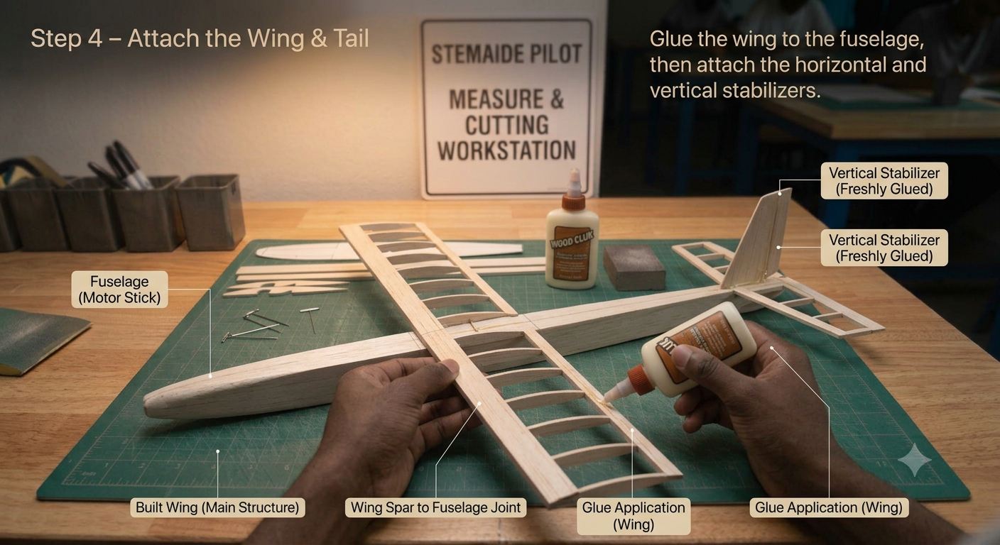
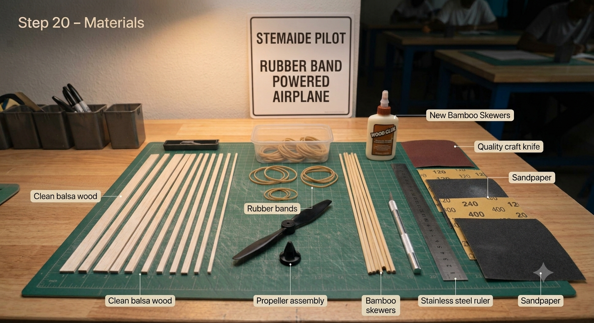
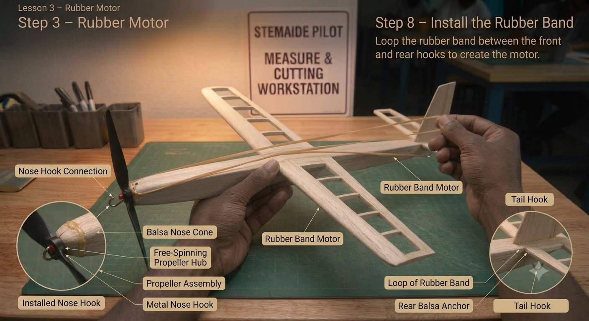
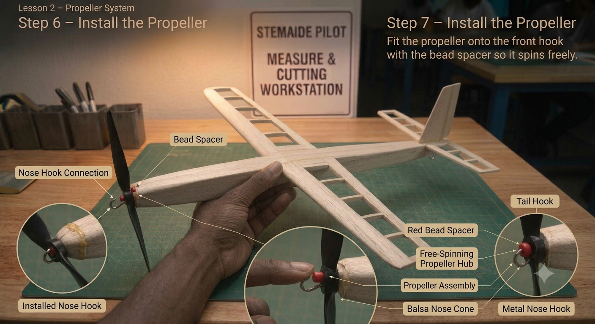
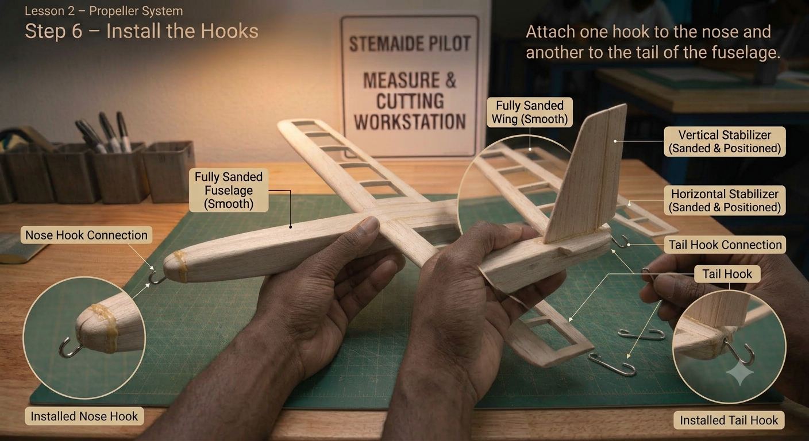
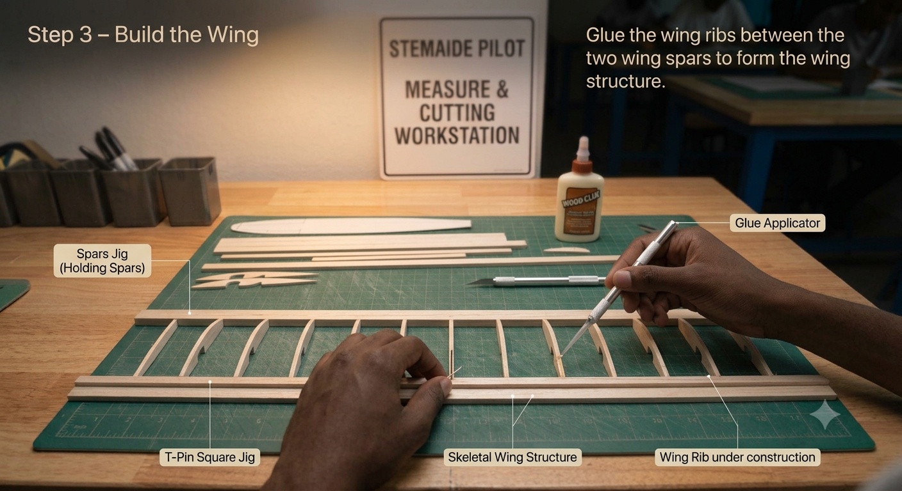

**AVIATION & AEROSPACE EDUCATION KIT**

SECTION 2 • BEGINNER PROJECTS • SHS 1 TERMS 1–2

**PROJECT 3**

**Rubber-Band Powered**

**Propeller Plane**

| **LEVEL**  Beginner | **DURATION**  4 Lessons (40–50 min each) | **KIT**  Kit 1 & 5 |
| --- | --- | --- |

**Student & Teacher Manual**

**1. Project Overview**

This project takes students from passive flight (gliding) to active propulsion. By constructing a balsa wood airframe and fitting it with a rubber-band powered propeller mechanism, students directly experience how stored elastic energy is converted into thrust — the same fundamental principle used in early aviation pioneers' aircraft. Through systematic wind-and-fly data collection, students discover the relationship between energy input and flight performance, including the phenomenon of diminishing returns.

| **Curriculum Area** | Aviation Science – Propulsion, Energy & Aerodynamics |
| --- | --- |
| **Year Group** | SHS 1 (Terms 1–2) |
| **Duration** | 4 lessons of 40–50 minutes each |
| **Materials Source** | Kit 1 and Kit 5 (propeller) |
| **Power Required** | Mechanical only – rubber band (no electrical power) |
| **Prerequisite** | Project 2 – Foam Hand-Launch Glider Build |

**Learning Objectives**

* Construct a balsa wood airframe with wing, fuselage, and tail assembly
* Install and align a propeller mechanism driven by a rubber-band motor
* Explain the energy conversion chain: elastic potential energy → kinetic energy → thrust
* Apply Newton's Third Law to describe how the propeller generates forward thrust
* Collect systematic flight data across four winding levels and graph the results
* Identify and explain the point of diminishing returns in the turns-vs-flight-time relationship

**2. Components Required**

| **Item** | **Quantity** | **Source** |
| --- | --- | --- |
| Balsa wood strips (3 mm × 3 mm) | 5 | Kit 1 |
| Bamboo skewers | 3 | Kit 1 |
| Rubber bands (thick, 10 cm) | 3 | Kit 1 |
| Small plastic propeller | 1 | Kit 5 |
| PVA wood glue | 1 bottle | Kit 1 |
| Sandpaper (assorted grit) | 1 sheet | Kit 1 |
| Scissors | 1 pair | Kit 1 |
| Steel ruler (30 cm) | 1 | Kit 1 |
| Craft knife | 1 | Kit 1 |
| Cutting mat (A3) | 1 | Kit 1 |
| Small hook screws (or bent paperclips) | 2 | Kit 1 |
| Small bead or metal washer (bearing) | 1 | Kit 1 |

**3. Build Steps & Assembly**

**Lesson 1 – Airframe Construction**

| **STEP 1** | **Cutting the Balsa Wood** |
| --- | --- |
|  | * Measure and mark the following pieces on the balsa strips with a pencil: * Fuselage: 30 cm (1 piece) * Wing spars: 25 cm (2 pieces) * Tail boom: 15 cm (1 piece) * Wing ribs: 5 cm (4 pieces) * Cut using the craft knife and steel ruler on the cutting mat; cut in a single smooth stroke * Sand all cut ends smooth immediately after cutting |

| **STEP 2** | **Wing Construction** |
| --- | --- |
|  | * Lay the two 25 cm spars parallel on a flat surface, 3 cm apart * Glue ribs perpendicular across the spars at equal intervals * Apply PVA glue sparingly – excess glue adds unnecessary weight * Place a heavy book on top while drying to keep the wing flat * Allow to dry for a minimum of 20 minutes before handling * Sand the leading edge to a gentle round profile; taper the trailing edge |

| **STEP 3** | **Fuselage & Tail Assembly** |
| --- | --- |
|  | * Glue the completed wing to the top of the fuselage, centred fore-to-aft at the 40% mark from the nose * Glue the tail boom to the rear of the fuselage; check it is perfectly straight by sighting from the nose * Glue the horizontal stabilizer to the end of the tail boom, centred * Glue the vertical stabilizer on top of the horizontal stabilizer; use a right-angle card to ensure it is vertical * Allow all joints to cure for at least 30 minutes |

| **STEP 4** | **Final Sanding** |
| --- | --- |
|  | * Sand all surfaces lightly with fine-grit sandpaper * Round the wing leading edge – this creates the airfoil effect * Taper the wing trailing edge to a thin, sharp line * Wipe away all dust with a dry cloth before the next lesson |

**Lesson 2 – Propeller Mechanism**

| **STEP 5** | **Hook Installation** |
| --- | --- |
|  | * Screw or press-fit a small hook into the nose of the fuselage * Install a second identical hook at the tail end of the fuselage * Ensure both hooks point in the same direction (upward) and are perfectly aligned front-to-back * Test alignment by stretching a piece of thread between the two hooks – it should lie straight along the centreline |

| **STEP 6** | **Propeller Attachment** |
| --- | --- |
|  | * Slide the propeller hub onto the front hook * Place the small bead or washer between the propeller hub and the fuselage nose as a bearing * Spin the propeller by hand – it should rotate freely with minimal friction * If it catches, add a second washer or sand the bearing contact surface lightly |

| **STEP 7** | **Rubber-Band Motor Assembly** |
| --- | --- |
|  | * Loop one thick rubber band between the front hook (through the propeller hub) and the rear hook * The rubber band should be slightly under tension when the propeller is in the rest position * Wind the propeller by hand in the correct direction (check which way it spins to pull air forward) * Test with 10 winds; release and verify the propeller spins in the correct direction to generate thrust * Do not exceed 20 test winds at this stage |

**Lesson 3 – Balance & Test**

| **STEP 8** | **CG Adjustment** |
| --- | --- |
|  | * Balance the aircraft on one fingertip under the wing * CG must sit at approximately 1/3 of the wing chord from the leading edge * If tail-heavy: add masking tape to the nose, or move the wing slightly forward * If nose-heavy: add a small piece of tape to the tail, or move the wing slightly backward * Mark the confirmed CG point on the fuselage |

| **STEP 9** | **Ground Thrust Test** |
| --- | --- |
|  | * Hold the fuselage firmly in one hand with the nose pointing forward * Wind the propeller 50 turns with the other hand * Release the propeller and feel the thrust push against your hand * The thrust should be steady and sustained for at least 3 seconds * If the rubber band makes a high-pitched whine, it is over-wound – reduce to 40 turns |

| **STEP 10** | **First Glide Test (No Power)** |
| --- | --- |
|  | * Do not wind the rubber band for this step * Launch the aircraft gently from a slight downward angle * The glide must be straight and stable for at least 3 metres * If it turns or dives, adjust trim (bend rudder or elevator) before proceeding to powered flight * Only move to Lesson 4 once a straight glide is confirmed |

**Lesson 4 – Powered Flight & Data Collection**

| **STEP 11** | **Full Power Test** |
| --- | --- |
|  | * Wind the rubber band to 50 turns * Hold the aircraft level; point into any gentle breeze if outdoors * Release smoothly – do not push; let the propeller generate the thrust * Record flight time with a stopwatch; measure distance to landing point * Inspect for damage before each subsequent flight |

| **STEP 12** | **Systematic Data Collection** |
| --- | --- |
|  | * Fly three attempts at each of: 50, 75, 100, and 125 turns * Record each flight time in the data table (Section 6) * Calculate the average for each winding level * Plot a bar graph: Turns (x-axis) vs. Average Flight Time in seconds (y-axis) * Note the winding level at which flight time begins to decrease – this is the point of diminishing returns |

| **STEP 13** | **Analysis & Class Presentation** |
| --- | --- |
|  | * Each group discusses: At what turn count did performance peak? Why? * Identify reasons for diminishing returns: rubber band stretches beyond elastic limit; propeller over-speeds and loses efficiency * Present findings to the class; compare results across groups * Discuss: How could you store more energy without snapping the rubber band? |

**4. Power & Safety Notes**

| **⚠ Safety Requirements**  Power: Mechanical only – rubber band energy storage. No electrical components.  Eye protection: Safety goggles MANDATORY during all winding and launch operations. A snapping rubber band can cause eye injury.  Maximum winds: Do not exceed 125 turns with the standard rubber band supplied in Kit 1.  Supervision: The winding process must be supervised by a teacher or adult at all times.  Flight zone: Ensure the area is clear of people before every launch. No one should stand in the flight path.  Rubber band inspection: Replace any rubber band that shows cracks, whitening, or has snapped once. |
| --- |

**5. Engineering Principles**

**Energy Conversion Chain**

The rubber-band motor is a complete energy system. Every flight demonstrates a chain of energy conversions from start to finish.

| **Energy Form** | **Where In System** | **Key Fact** |
| --- | --- | --- |
| **Stored (Elastic Potential)** | Wound rubber band | Energy increases with turns squared |
| **Kinetic (Rotating)** | Spinning propeller shaft | Converted from stored energy as band unwinds |
| **Kinetic (Thrust)** | Air pushed rearward | Newton's 3rd Law: aircraft pushed forward |
| **Lost (Heat & Friction)** | Hook bearings, air drag | Reduces with smoother bearings and less excess glue |

**Newton's Third Law & Propeller Thrust**

| **Key Principle**  The propeller pushes a column of air backward (action).  The air pushes the aircraft forward with an equal and opposite force (reaction) — this is THRUST.  Propeller efficiency depends on three factors: pitch (angle of the blade), diameter, and rotational speed.  An over-wound rubber band spins the propeller too fast, causing the blades to slip through the air like a car wheel spinning on ice — this is why performance peaks and then falls. |
| --- |

**Diminishing Returns — Why More Turns Doesn't Always Mean More Flight**

* Below the optimum: more turns = more stored energy = longer flight
* At the optimum: the rubber band is fully loaded within its elastic range — maximum efficiency
* Beyond the optimum: the rubber band stretches past its elastic limit; energy is lost as heat; propeller over-speeds and stalls the air column
* Real aircraft face the same principle: jet engines have a maximum efficient throttle setting beyond which fuel burn rises faster than thrust

**6. How to Test**

**Test Methods**

| **Test** | **Method** | **Success Criteria** |
| --- | --- | --- |
| **Glide Test** | Hold glider at fuselage; release with gentle push, no winding | Straight flight for 3+ m with no corrections |
| **Ground Thrust** | Hold aircraft nose-in-hand; wind 50 turns; feel the push | Measurable forward pull felt on hand |
| **Flight Time** | Wind to target turns; launch; start stopwatch at release | Aircraft stays airborne for 3+ s (50 turns) |
| **Distance** | Wind to target turns; launch; measure to landing point | 5+ m under power at 100 turns |

**Data Collection Table (Lesson 4)**

Complete this table during Lesson 4. Record all three attempts before calculating the average.

| **Turns** | **Flight 1 (s)** | **Flight 2 (s)** | **Flight 3 (s)** | **Average (s)** |
| --- | --- | --- | --- | --- |
| **50** |  |  |  |  |
| **75** |  |  |  |  |
| **100** |  |  |  |  |
| **125** |  |  |  |  |

Example expected results (reference only):

* 50 turns: ~3 s average flight time
* 75 turns: ~5 s average flight time
* 100 turns: ~7 s average flight time
* 125 turns: ~6.5 s average flight time (diminishing returns evident)

**7. Expected Output & Success Criteria**

| **Outcome** | **Success Criteria** |
| --- | --- |
| **Aircraft fully built** | Square joints, smooth surfaces, secure propeller mechanism |
| **Propeller mechanism works** | Propeller spins freely; rubber band winds smoothly without binding |
| **Glide test passes** | Aircraft flies straight for 3+ metres without power |
| **Powered flight achieved** | Aircraft flies 5+ metres under rubber-band power |
| **Data fully collected** | 4 turn counts recorded, 3 attempts each, averages calculated |
| **Graph produced** | Turns vs. flight time graph with labelled axes and title |

**8. Common Errors & Fixes**

| **Error** | **Likely Cause** | **Fix** |
| --- | --- | --- |
| **Propeller does not spin** | Rubber band looped in wrong direction | Re-loop rubber band; confirm it twists to spin the propeller forward |
| **Rubber band snaps** | Too many turns or degraded rubber | Reduce turns by 25; replace rubber band; keep spare bands available |
| **Aircraft turns immediately** | Asymmetric wing or misaligned fin | Check wing symmetry by sighting from nose; bend rudder slightly opposite |
| **Very short flight time** | Aircraft too heavy | Check all joints for excess glue; reduce number of ribs if needed |
| **Nose dives on launch** | CG too far forward | Move wing 5 mm toward tail; re-check CG |
| **Propeller wobbles** | Loose propeller hub | Tighten hub screw; add small washer as bearing |

**9. Upgrade & Extension Ideas**

Groups that complete the core project can investigate the following extensions:

* Propeller Size Experiment – Test three propellers of different diameters; keep turn count constant and compare flight times
* Rubber Band Comparison – Test thin, medium, and thick rubber bands at the same turn count; graph the results
* Wing Area Experiment – Build a second wing with 50% more area; compare glide ratio and powered flight distance
* Pusher Configuration – Move the propeller to the tail end of the fuselage; compare performance with tractor (front) configuration
* Tandem Rubber Bands – Loop two rubber bands in parallel; investigate the effect on maximum turns and peak flight time
* Energy Calculator – Use mass, spring constant estimate, and height/distance data to calculate mechanical efficiency of the system

**10. Teacher Notes & Differentiation**

**Lesson Planning Tips**

* Pre-cut balsa strips save 15–20 minutes in Lesson 1 for younger or less experienced groups
* PVA glue needs at least 20 minutes to cure — plan drying time into the lesson. Have a spare pre-built airframe ready if groups fall behind
* Rubber bands degrade with sunlight and heat — store them in a cool, dark place and inspect before each use
* During Lesson 4, stagger launch times so only one aircraft is in the air at a time
* After the graph is plotted, ask students: 'What does the shape of this graph tell you about energy efficiency?'

**Differentiation Strategies**

* Support – Provide pre-assembled airframe; students focus on propeller mechanism, CG, and 2 winding levels only
* Core – Full build, all 4 winding levels, graph, and class presentation
* Extension – Calculate mechanical efficiency; design and test a modified propeller pitch

**Assessment Suggestions**

* Practical: Safe winding technique; CG balancing; propeller alignment (formative observation)
* Data table: All 12 flight times recorded; averages calculated correctly
* Graph: Correctly scaled axes, title, bars drawn accurately, diminishing returns identified
* Presentation: Student can explain energy conversion chain in own words

| **Curriculum Links**  Physics: Energy conversion, Newton's laws, forces and motion, data analysis  Mathematics: Averages, graph construction, identifying trends  Design & Technology: Iterative engineering, materials selection, mechanism design  This project aligns with GCAA youth aerospace awareness goals and SHS 1 STEM integration targets. |
| --- |

## Images

