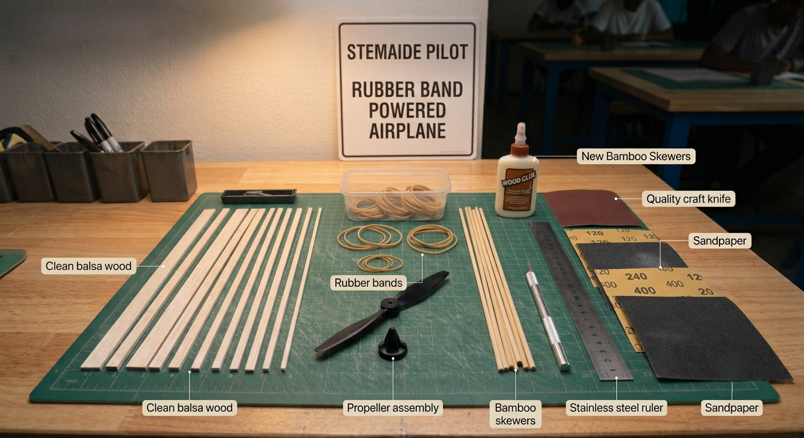
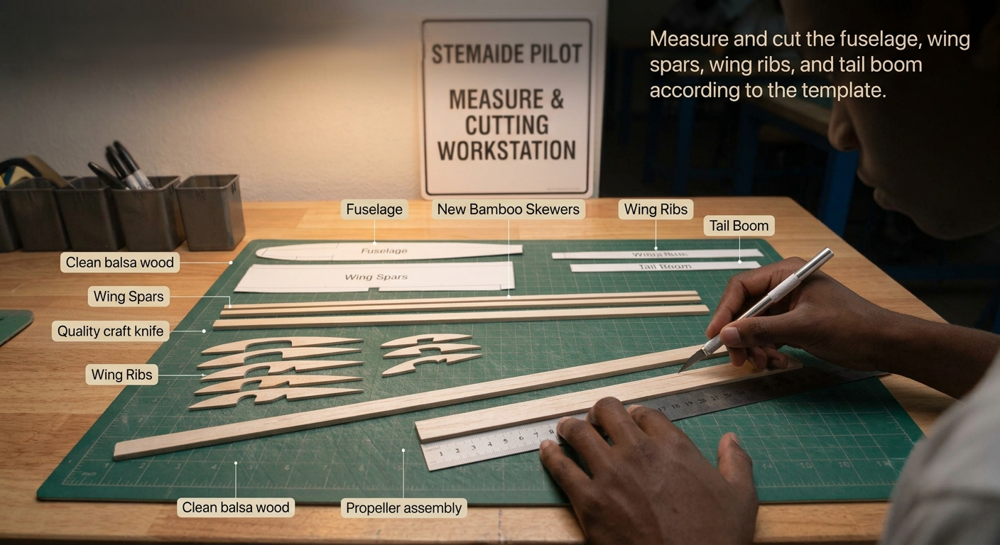
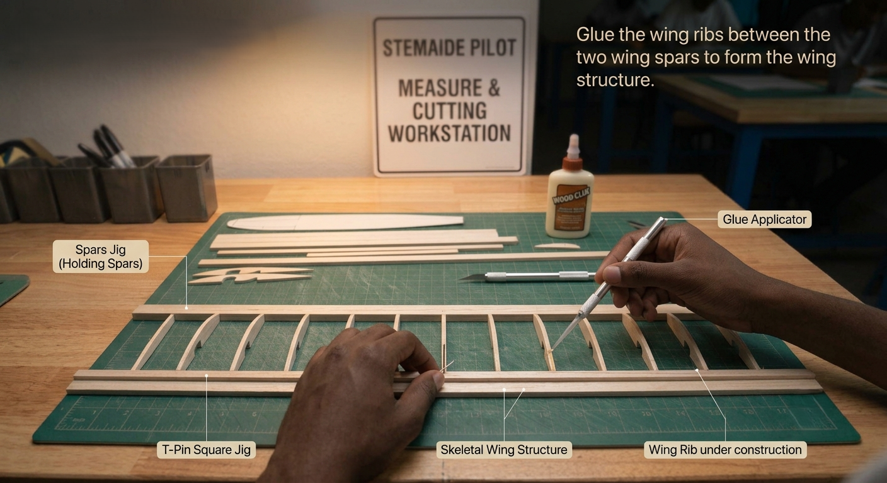
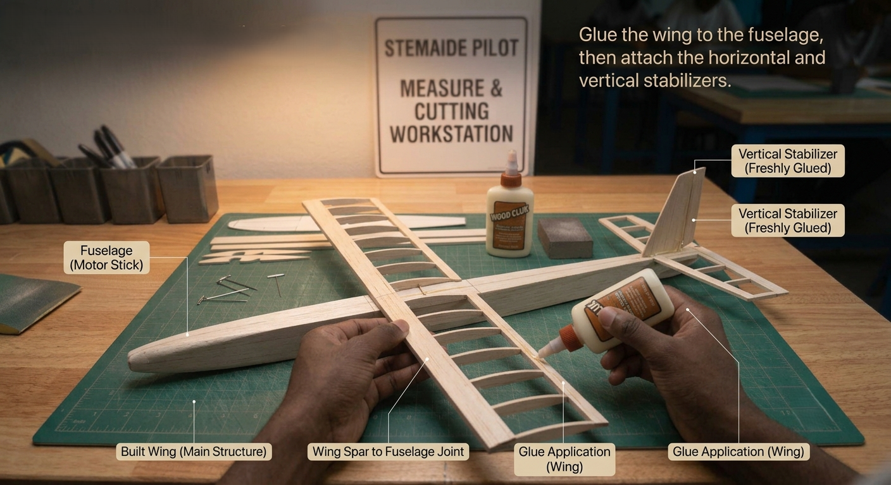
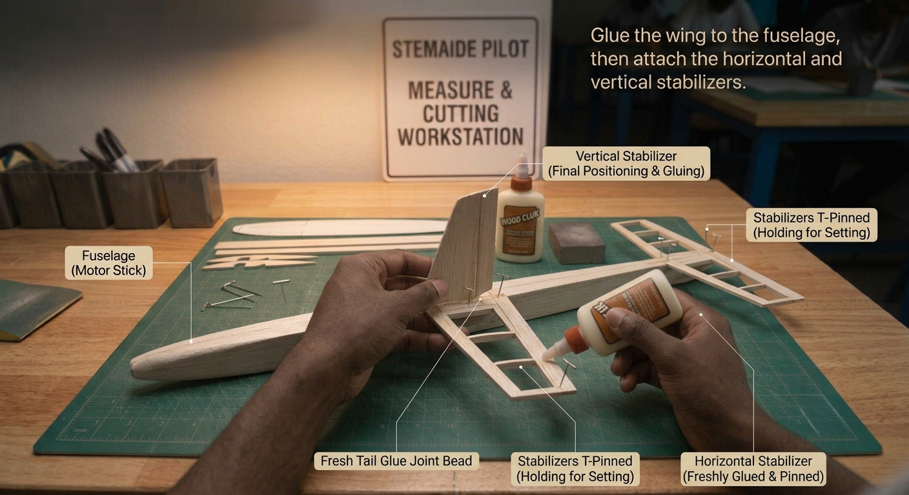
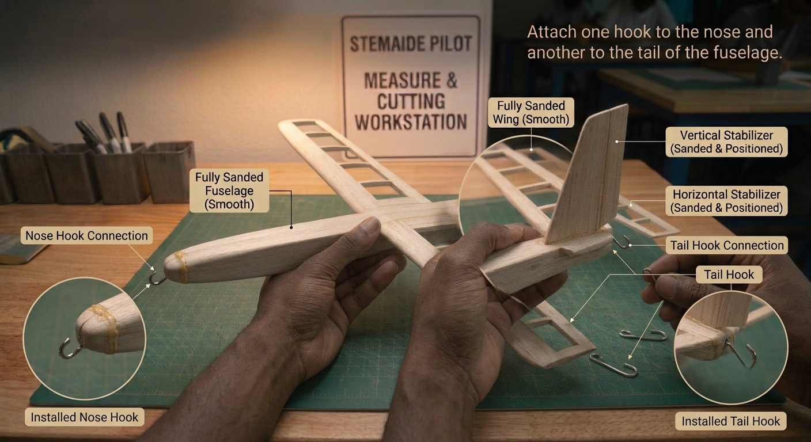
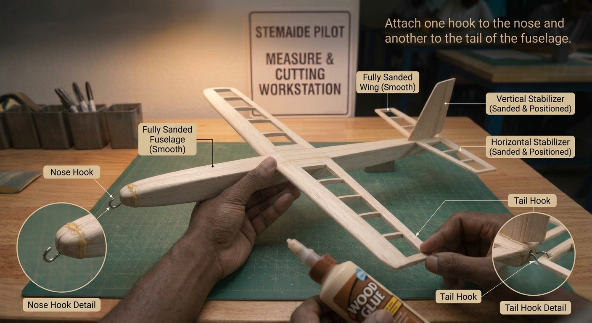
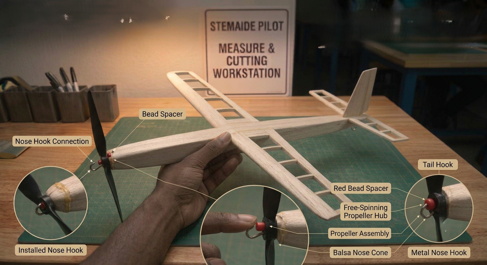
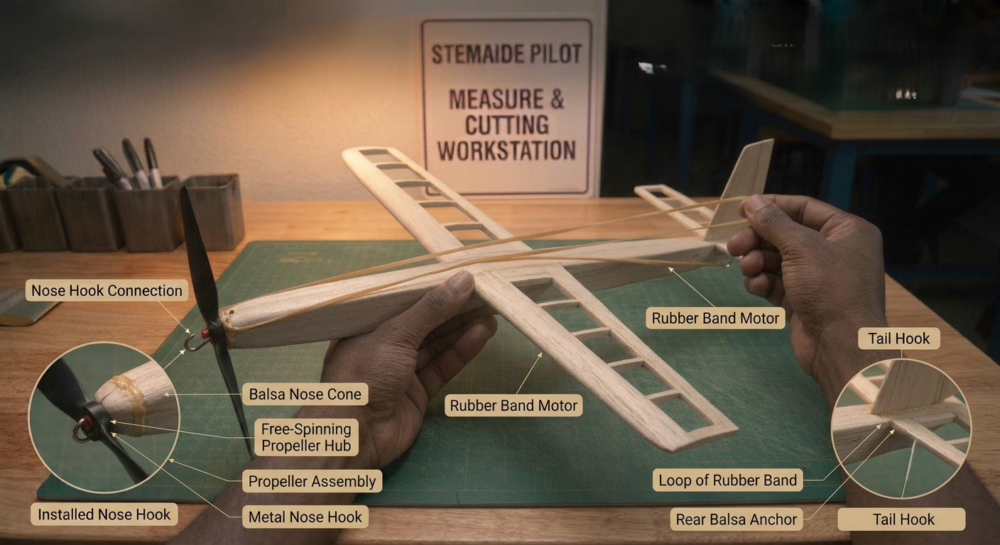

**1. Project Overview**

This project takes students from passive flight (gliding) to active propulsion. By constructing a balsa wood airframe and fitting it with a rubber-band powered propeller mechanism, students directly experience how stored elastic energy is converted into thrust; the same fundamental principle used in early aviation pioneers' aircraft. Through systematic wind-and-fly data collection, students discover the relationship between energy input and flight performance, including the phenomenon of diminishing returns.

**2. Components Required**

| **Item** | **Quantity** | **Source** |
| --- | --- | --- |
| Balsa wood strips (3 mm × 3 mm) | 5 | Kit 1 |
| Bamboo skewers | 3 | Kit 1 |
| Rubber bands (thick, 10 cm) | 3 | Kit 1 |
| Small plastic propeller | 1 | Kit 5 |
| PVA wood glue | 1 bottle | Kit 1 |
| Sandpaper (assorted grit) | 1 sheet | Kit 1 |
| Scissors | 1 pair | Kit 1 |
| Steel ruler (30 cm) | 1 | Kit 1 |
| Craft knife | 1 | Kit 1 |
| Cutting mat (A3) | 1 | Kit 1 |
| Small hook screws (or bent paperclips) | 2 | Kit 1 |
| Small bead or metal washer (bearing) | 1 | Kit 1 |

**3. Build Steps & Assembly**

**Guide 1: Airframe Construction**

| **STEP 1** | **Cutting the Balsa Wood** |
| --- | --- |
|  |  Measure and mark the following pieces on the balsa strips with a pencil:  Fuselage: 30 cm (1 piece)  Wing spars: 25 cm (2 pieces)  Tail boom: 15 cm (1 piece)  Wing ribs: 5 cm (4 pieces)  Cut using the craft knife and steel ruler on the cutting mat; cut in a single smooth stroke  Sand all cut ends smooth immediately after cutting |

| **STEP 2** | **Wing Construction** |
| --- | --- |
|  |  Lay the two 25 cm spars parallel on a flat surface, 3 cm apart  Glue ribs perpendicular across the spars at equal intervals  Apply PVA glue sparingly – excess glue adds unnecessary weight  Place a heavy book on top while drying to keep the wing flat  Allow to dry for a minimum of 20 minutes before handling  Sand the leading edge to a gentle round profile; taper the trailing edge |

| **STEP 3** | **Fuselage & Tail Assembly** |
| --- | --- |
|  |  Glue the completed wing to the top of the fuselage, centred fore-to-aft at the 40% mark from the nose  Glue the tail boom to the rear of the fuselage; check it is perfectly straight by sighting from the nose  Glue the horizontal stabilizer to the end of the tail boom, centred  Glue the vertical stabilizer on top of the horizontal stabilizer; use a right-angle card to ensure it is vertical  Allow all joints to cure for at least 30 minutes |

| **STEP 4** | **Final Sanding** |
| --- | --- |
|  |  Sand all surfaces lightly with fine-grit sandpaper  Round the wing leading edge – this creates the airfoil effect  Taper the wing trailing edge to a thin, sharp line  Wipe away all dust with a dry cloth before the next lesson |

**Guide 2: Propeller Mechanism**

| **STEP 5** | **Hook Installation** |
| --- | --- |
|  |  Screw or press-fit a small hook into the nose of the fuselage  Install a second identical hook at the tail end of the fuselage  Ensure both hooks point in the same direction (upward) and are perfectly aligned front-to-back  Test alignment by stretching a piece of thread between the two hooks – it should lie straight along the centreline |

| **STEP 6** | **Propeller Attachment** |
| --- | --- |
|  |  Slide the propeller hub onto the front hook  Place the small bead or washer between the propeller hub and the fuselage nose as a bearing  Spin the propeller by hand – it should rotate freely with minimal friction  If it catches, add a second washer or sand the bearing contact surface lightly |

| **STEP 7** | **Rubber-Band Motor Assembly** |
| --- | --- |
|  |  Loop one thick rubber band between the front hook (through the propeller hub) and the rear hook  The rubber band should be slightly under tension when the propeller is in the rest position  Wind the propeller by hand in the correct direction (check which way it spins to pull air forward)  Test with 10 winds; release and verify the propeller spins in the correct direction to generate thrust  Do not exceed 20 test winds at this stage |

**Guide 3: Balance & Test**

| **STEP 8** | **CG Adjustment** |
| --- | --- |
|  |  Balance the aircraft on one fingertip under the wing  CG must sit at approximately 1/3 of the wing chord from the leading edge  If tail-heavy: add masking tape to the nose, or move the wing slightly forward  If nose-heavy: add a small piece of tape to the tail, or move the wing slightly backward  Mark the confirmed CG point on the fuselage |

| **STEP 9** | **Ground Thrust Test** |
| --- | --- |
|  |  Hold the fuselage firmly in one hand with the nose pointing forward  Wind the propeller 50 turns with the other hand  Release the propeller and feel the thrust push against your hand  The thrust should be steady and sustained for at least 3 seconds  If the rubber band makes a high-pitched whine, it is over-wound – reduce to 40 turns |

| **STEP 10** | **First Glide Test (No Power)** |
| --- | --- |
|  |  Do not wind the rubber band for this step  Launch the aircraft gently from a slight downward angle  The glide must be straight and stable for at least 3 metres  If it turns or dives, adjust trim (bend rudder or elevator) before proceeding to powered flight  Only move to Lesson 4 once a straight glide is confirmed |

**Guide 4: Powered Flight & Data Collection**

| **STEP 11** | **Full Power Test** |
| --- | --- |
|  |  Wind the rubber band to 50 turns  Hold the aircraft level; point into any gentle breeze if outdoors  Release smoothly – do not push; let the propeller generate the thrust  Record flight time with a stopwatch; measure distance to landing point  Inspect for damage before each subsequent flight |

**5. How to Test**

**Test Methods**

| **Test** | **Method** | **Success Criteria** |
| --- | --- | --- |
| **Glide Test** | Hold glider at fuselage; release with gentle push, no winding | Straight flight for 3+ m with no corrections |
| **Ground Thrust** | Hold aircraft nose-in-hand; wind 50 turns; feel the push | Measurable forward pull felt on hand |
| **Flight Time** | Wind to target turns; launch; start stopwatch at release | Aircraft stays airborne for 3+ s (50 turns) |
| **Distance** | Wind to target turns; launch; measure to landing point | 5+ m under power at 100 turns |

Example expected results (reference only):

* 50 turns: ~3 s average flight time
* 75 turns: ~5 s average flight time
* 100 turns: ~7 s average flight time
* 125 turns: ~6.5 s average flight time (diminishing returns evident)

**6. Expected Output & Success Criteria**

| **Outcome** | **Success Criteria** |
| --- | --- |
| **Aircraft fully built** | Square joints, smooth surfaces, secure propeller mechanism |
| **Propeller mechanism works** | Propeller spins freely; rubber band winds smoothly without binding |
| **Glide test passes** | Aircraft flies straight for 3+ metres without power |
| **Powered flight achieved** | Aircraft flies 5+ metres under rubber-band power |
| **Data fully collected** | 4 turn counts recorded, 3 attempts each, averages calculated |
| **Graph produced** | Turns vs. flight time graph with labelled axes and title |

**7. Common Errors & Fixes**

| **Error** | **Likely Cause** | **Fix** |
| --- | --- | --- |
| **Propeller does not spin** | Rubber band looped in wrong direction | Re-loop rubber band; confirm it twists to spin the propeller forward |
| **Rubber band snaps** | Too many turns or degraded rubber | Reduce turns by 25; replace rubber band; keep spare bands available |
| **Aircraft turns immediately** | Asymmetric wing or misaligned fin | Check wing symmetry by sighting from nose; bend rudder slightly opposite |
| **Very short flight time** | Aircraft too heavy | Check all joints for excess glue; reduce number of ribs if needed |
| **Nose dives on launch** | CG too far forward | Move wing 5 mm toward tail; re-check CG |
| **Propeller wobbles** | Loose propeller hub | Tighten hub screw; add small washer as bearing |

**8. Upgrade & Extension Ideas**

Groups that complete the core project can investigate the following extensions:

* Propeller Size Experiment: Test three propellers of different diameters; keep turn count constant and compare flight times
* Rubber Band Comparison Test: Test thin, medium, and thick rubber bands at the same turn count; graph the results
* Wing Area Experiment: Build a second wing with 50% more area; compare glide ratio and powered flight distance
* Pusher Configuration: Move the propeller to the tail end of the fuselage; compare performance with tractor (front) configuration
* Tandem Rubber Bands: Loop two rubber bands in parallel; investigate the effect on maximum turns and peak flight time
* Energy Calculator: Use mass, spring constant estimate, and height/distance data to calculate mechanical efficiency of the system

