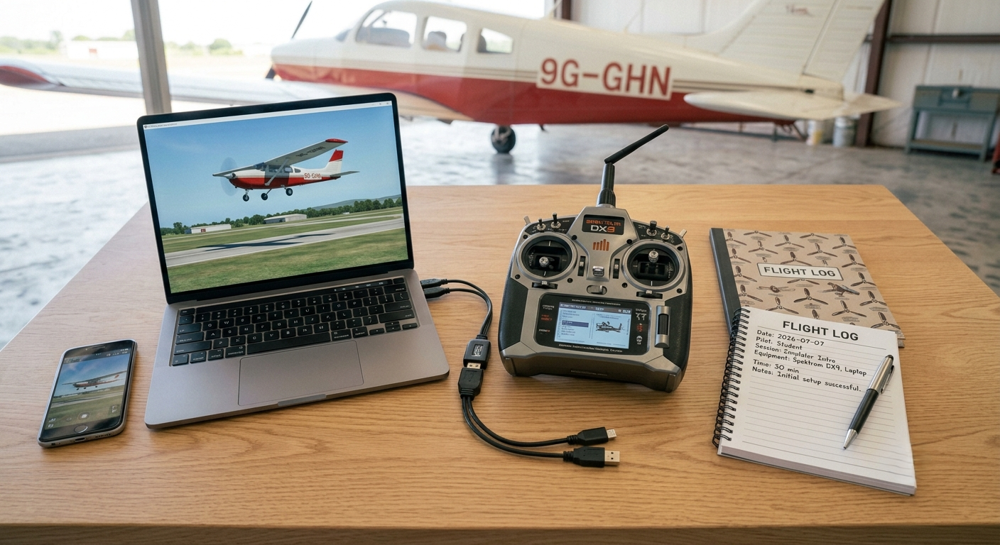
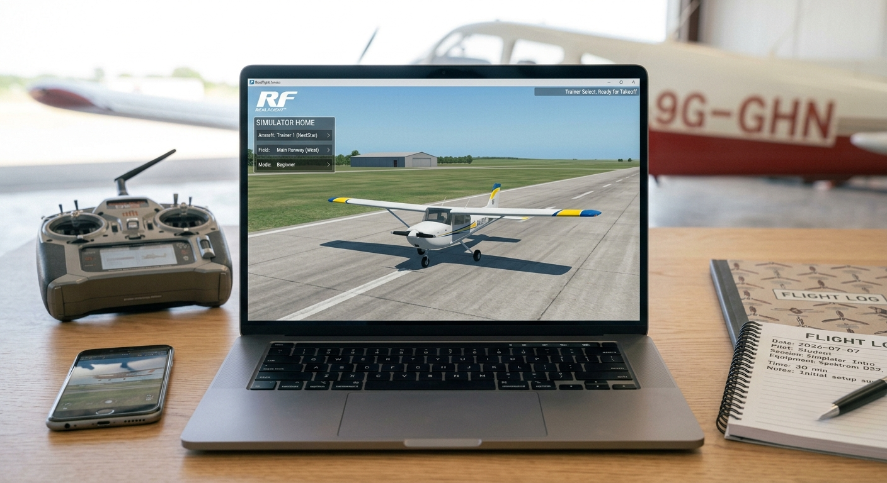
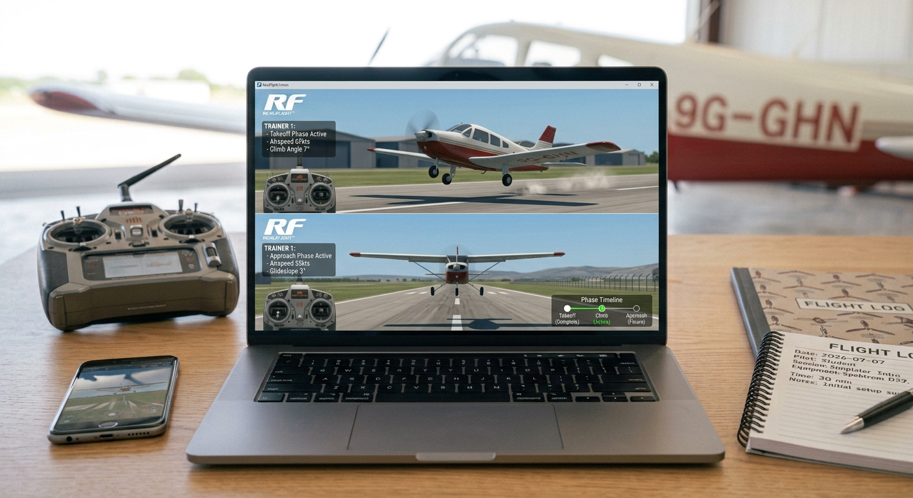
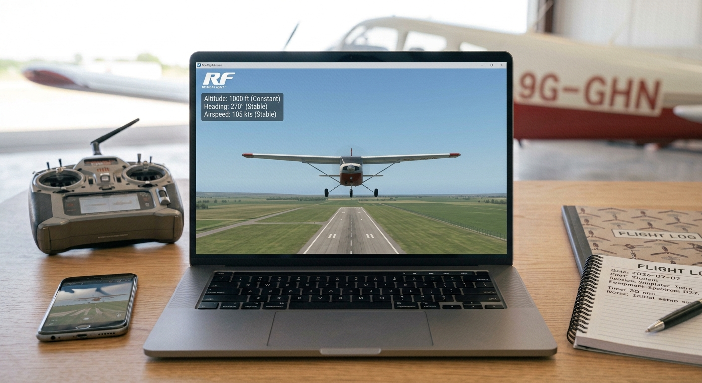
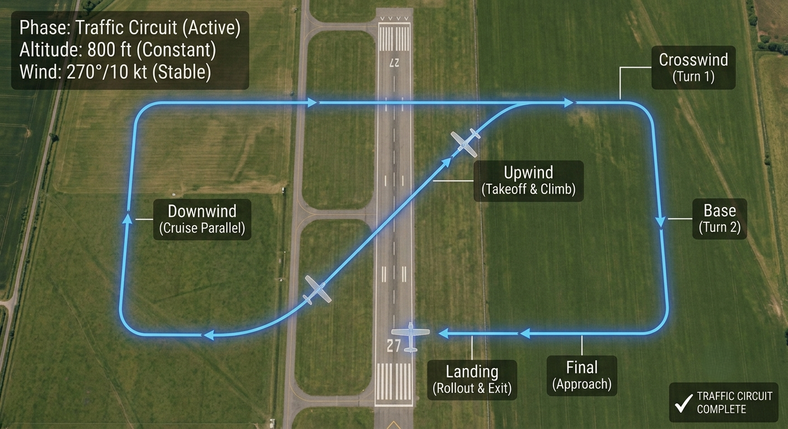
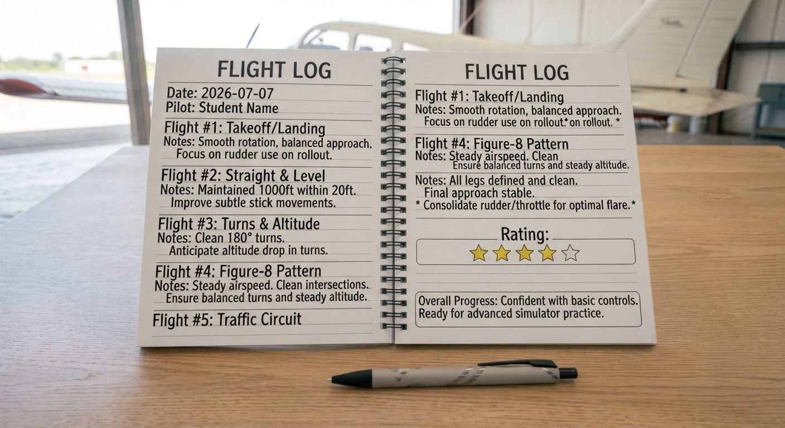

**1. Project Overview**

This project bridges physical aircraft construction and real aircraft operation by introducing students to Radio Control (RC) flight through a safe, risk-free simulator environment. Students learn to identify and operate the four primary flight controls, progress through five structured flight exercises, and build the hand-eye coordination and situational awareness required for future real RC or full-scale aircraft operations — all without the consequence of a real crash.

**2. Components Required**

| **Item** | **Quantity** | **Source** |
| --- | --- | --- |
| RC transmitter (Mode 2, 4-channel) | 1 | Kit 10 |
| Computer or smartphone (school/student) | 1 | School / Student |
| RC flight simulator software (free) | 1 | Download – see Section 3 |
| USB trainer cable (if required) | 1 | Kit 10 |
| Flight log template (paper) | 1 | Appendix E / this manual |

**3. Setup Steps**

**Guide 1 – Installation & Control Familiarisation**

| **STEP 1** | **Install & Launch the Simulator** |
| --- | --- |
|  | Install the chosen simulator on the classroom computer, tablet, or student phone   (**PicaSim** (Free)  **RC Desk Pilot** (Free)  **Multiplex MULTIflight**  )    If using the USB trainer cable: connect the transmitter to the computer via the cable before launching  Open the simulator and select a trainer aircraft (slow, stable, forgiving flight model)  Choose a flat, open scenery with no obstacles for the first lesson |

| **STEP 2** | **Calibrate the Controller** |
| --- | --- |
|  |  Follow the on-screen calibration wizard to register the transmitter  Move all sticks and switches through their full range when prompted  After calibration, verify all four controls respond correctly on screen:  Left stick up/down: throttle increases/decreases  Left stick left/right: rudder deflects left/right  Right stick up/down: elevator deflects up/down  Right stick left/right: ailerons deflect left/right  If any control is reversed, use the transmitter's reverse switch for that channel |

| **STEP 3** | **Control Identification & Diagram** |
| --- | --- |
|  |  Students draw an outline of the transmitter in their logbook  Label all four controls with their name, stick location, and aircraft effect  Refer to the Controls Reference Table in Section 5  Note: Mode 2 is the international standard — left stick controls throttle and rudder; right stick controls aileron and elevator  Confirm understanding with a partner before proceeding |

| **STEP 4** | **First Virtual Flight – Orientation** |
| --- | --- |
|  |  Set aircraft on the runway; apply 50% throttle slowly  Allow aircraft to lift off; climb to approximately 10 m altitude  Maintain straight and level flight for 30 seconds using only small stick inputs  Reduce throttle and allow aircraft to descend gently back to the runway  Do not worry about a perfect landing at this stage — focus on feel for the controls |

**Guide 2 – Five Structured Flights & Logbook**

| **STEP 5** | **Flight 1 – Takeoff & Landing** |
| --- | --- |
|  |  Apply throttle smoothly to 70%; allow aircraft to accelerate down runway  Apply gentle up elevator as speed builds; rotate at approximately 40% of full speed  Climb to 10 m; hold altitude; reduce throttle to cruise (~50%)  Turn downwind; reduce throttle; descend on approach; flare and touch down  Record outcome in flight log: tick if successful takeoff and landing completed |

| **STEP 6** | **Flight 2 – Straight & Level Flight** |
| --- | --- |
|  |  Take off normally; climb to 15 m  Fly a straight heading for 30 seconds; make only small corrections  Focus: Keep wings level using small aileron inputs; hold altitude with minimal elevator  Land; record outcome and any tendency to drift or bank |

| **STEP 7** | **Flight 3 – Gentle Turns** |
| --- | --- |
|  |  Take off; climb to 20 m  Apply right aileron to bank ~30°; simultaneously apply slight up elevator to maintain altitude in the turn  Complete a 90° right turn; level the wings; fly straight for 5 seconds  Repeat with a 90° left turn  Key skill: Coordinated turn = aileron + elevator together; rudder only used to prevent adverse yaw  Land; record outcome |

| **STEP 8** | **Flight 4 – Figure-8 Pattern** |
| --- | --- |
|  |  Take off; climb to 20 m  Complete a 180° right turn; fly straight across the centre; complete a 180° left turn  The aircraft should trace a figure-8 when viewed from above * Challenge: Maintain constant altitude throughout both turns  Land; record outcome; note which turn direction felt harder to control |

| **STEP 9** | **Flight 5 – Full Traffic Circuit** |
| --- | --- |
|  |  A traffic circuit is the standard rectangular flight pattern used at all aerodromes  Legs: Takeoff (upwind) → Crosswind (90° turn) → Downwind (parallel to runway, opposite direction) → Base (90° turn) → Final (aligned with runway) → Land  Fly each leg at a consistent altitude; aim for 90° turns at each corner  Reduce throttle gradually on final approach; aim to touch down within 50 m of the runway threshold  This is the same circuit pattern used by all pilots at Kotoka International Airport and every aerodrome in Ghana |

| **STEP 10** | **Debrief & Logbook Completion** |
| --- | --- |
|  |  Complete all entries in the flight log table (Section 6)  Discuss as a group: Which flight was hardest? Why?  Identify one specific area for improvement for each student  Teacher signs off completed logbooks |

**The Four Controls – Reference Table**

| **Control** | **Stick / Axis** | **Effect** | **Key Note** |
| --- | --- | --- | --- |
| **Throttle** | Left stick – Up/Down | Engine power | More throttle = faster / more climb |
| **Aileron** | Right stick – Left/Right | Roll (bank) | Left = bank left; Right = bank right |
| **Elevator** | Right stick – Up/Down | Pitch (nose attitude) | Up = nose up (climb); Down = nose down (descend) |
| **Rudder** | Left stick – Left/Right | Yaw (nose direction) | Left = nose yaws left; Right = nose yaws right |

**Coordinated Turns – The Most Important Skill**

| **Why Coordination Matters**  A banked turn requires BOTH aileron (to bank) and elevator (to maintain altitude).  When an aircraft banks, the lift vector tilts sideways; some lift is now being used to turn rather than support the aircraft's weight.  To compensate, the pilot must increase back pressure on the elevator to 'load' the turn and maintain altitude.  A turn with aileron only, and no elevator, results in the nose dropping, a common beginner mistake.  Rudder is added in small amounts to prevent 'adverse yaw' — a tendency for the nose to yaw opposite to the direction of roll. |
| --- |

**6. How to Test – Flight Log**

**Flight Log (complete during Lesson 2)**

Tick (✓) each flight after successful completion. Record what went wrong and what to improve in the Notes column.

| **Flight** | **Task** | **Outcome (✓ / ✗)** | **Notes / Improvement** |
| --- | --- | --- | --- |
| **1** | Takeoff & Landing |  |  |
| **2** | Straight & Level Flight |  |  |
| **3** | Gentle Turns (90° left & right) |  |  |
| **4** | Figure-8 Pattern |  |  |
| **5** | Full Traffic Circuit |  |  |

**7. Expected Output & Success Criteria**

| **Outcome** | **Success Criteria** |
| --- | --- |
| **Simulator installed & calibrated** | Software opens; all 4 controls respond correctly |
| **Controls diagram completed** | All 4 controls labelled correctly in logbook |
| **Flight 1 – Takeoff & Landing** | Successful takeoff and landing without crashing |
| **Flight 2 – Straight Flight** | Maintains heading within 10° for 30 seconds |
| **Flight 3 – Turns** | Completes 90° turns both directions; recovers level |
| **Flight 4 – Figure-8** | Completes full figure-8 pattern at constant altitude |
| **Flight 5 – Full Circuit** | Completes downwind, base, and final legs; lands on runway |

**8. Common Errors & Fixes**

| **Error** | **Likely Cause** | **Fix** |
| --- | --- | --- |
| **Aircraft stalls on takeoff** | Too much up elevator applied too early | Apply elevator gently after reaching takeoff speed; increase throttle first |
| **Crashes immediately after launch** | Incorrect control direction input | Practice stick movements with aircraft stationary; confirm Mode 2 setup |
| **Cannot maintain altitude** | Throttle not held steady | Set throttle to ~60%; make small corrections rather than large inputs |
| **Overcontrolling (oscillates)** | Stick inputs too large | Make small, smooth inputs; wait for the aircraft to respond before correcting |
| **Landing too fast** | Throttle too high on final approach | Begin throttle reduction on base leg; aim for a slow, stable approach speed |
| **Aircraft rolls on takeoff** | Aileron or rudder not centred | Re-calibrate controller; centre trims before each flight |

**9. Upgrade & Extension Ideas**

Students who complete all five flights successfully can progress to:

* Wind Simulation: Enable 10–15 knot crosswind in simulator settings; practice crosswind takeoff and landing corrections
* Aircraft Comparison: Fly three different aircraft models (trainer, aerobatic, glider); compare handling characteristics and control sensitivity
* Engine Failure Simulation: Cut throttle at altitude; practise a glide approach and deadstick landing
* Night Flying: Enable night mode; add lights to aircraft; fly the circuit in low-visibility conditions
* Simulator Race: Set up a pylon course; groups race around the course; record fastest lap time
* Flight Log Extension: Continue logging flights across 5 simulator sessions; track improvement in completion rates

