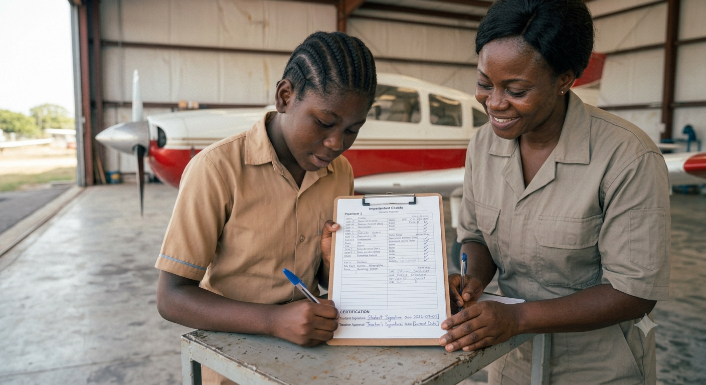
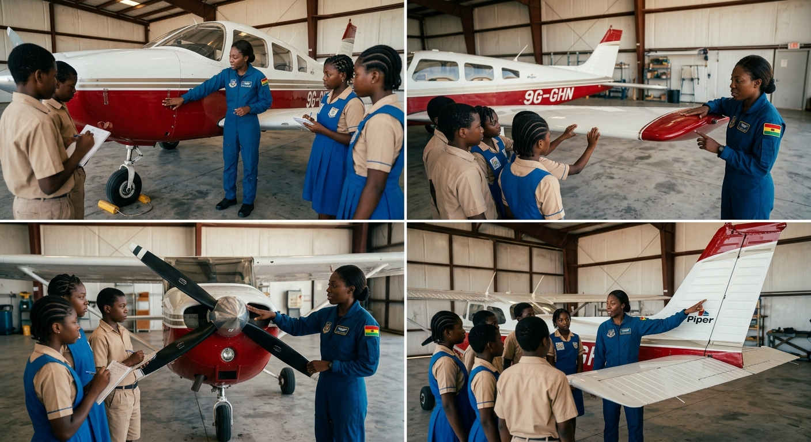
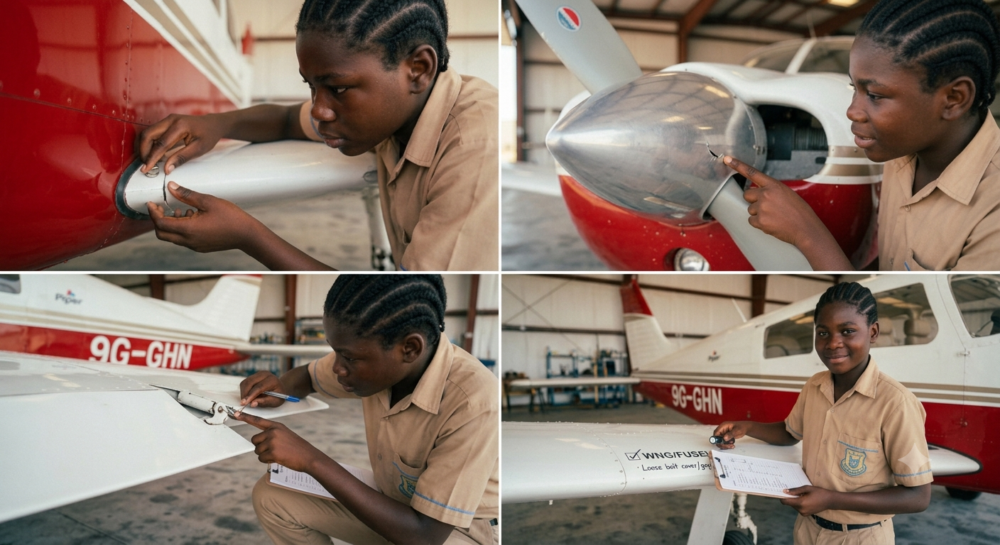
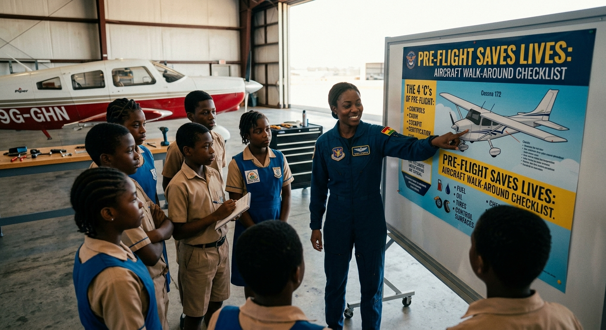
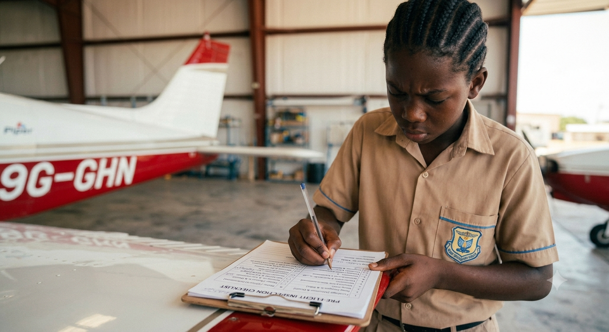
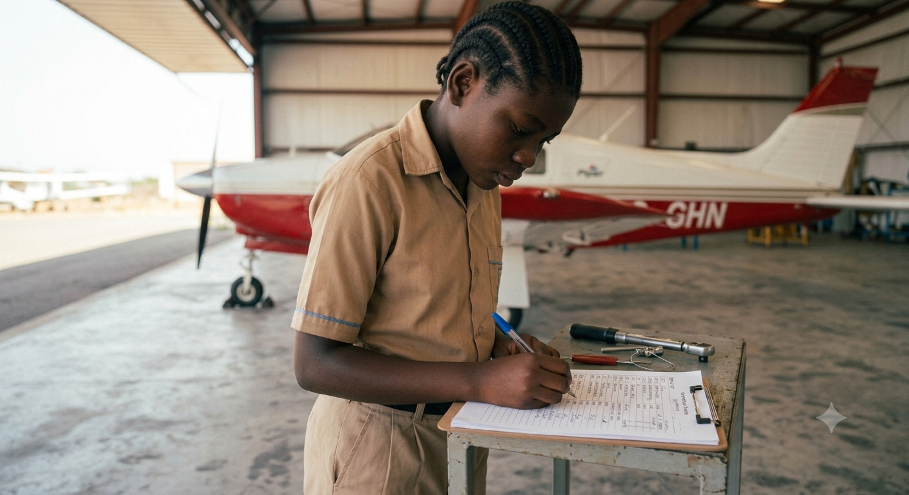
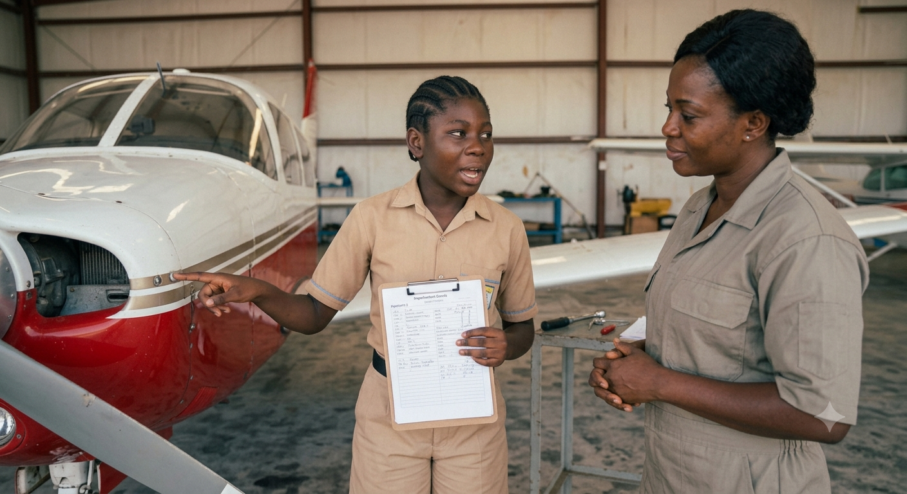
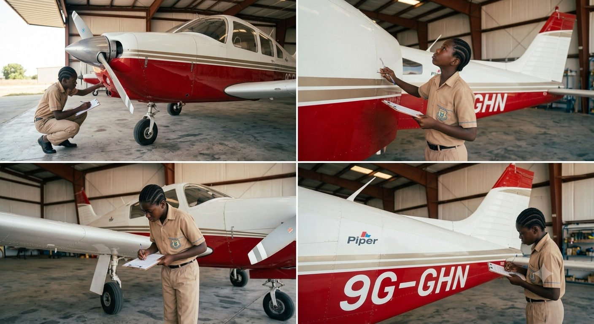

**AVIATION & AEROSPACE EDUCATION KIT**

SECTION 2 • BEGINNER PROJECTS • SHS 1 TERMS 1–2

**PROJECT 5**

**Pre-Flight Safety Checklist**

**& Aircraft Walk-Around**

| **LEVEL**  Beginner | **DURATION**  2 Lessons (40–50 min each) | **KIT**  Kit 1 & 2 |
| --- | --- | --- |

**Student & Teacher Manual**

**1. Project Overview**

This project instils the systematic safety discipline that underpins all aviation operations. Students learn why checklists are the single most important tool in an aviator's toolkit, master a 10-point pre-flight inspection procedure, and practice identifying real defects on a foam model aircraft. By the end of the project, every student will have personally signed off a completed inspection — the same act performed by every commercial, military, and private pilot before departure.

| **Curriculum Area** | Aviation Safety, Airworthiness & Professional Discipline |
| --- | --- |
| **Year Group** | SHS 1 (Terms 1–2) |
| **Duration** | 2 lessons of 40–50 minutes each |
| **Materials Source** | Kit 1 and Kit 2 (foam model aircraft, poster, clipboard, checklist templates) |
| **Power Required** | None – inspection activity only |
| **Prerequisite** | Projects 1–4 recommended (familiarity with aircraft parts and terminology) |

**Learning Objectives**

* Explain why checklists are essential in aviation and describe the consequences of skipping pre-flight checks
* Identify and describe all 10 standard inspection points on a model aircraft
* Perform a complete, systematic 10-point walk-around inspection in the correct sequence
* Complete, sign, and interpret a pre-flight checklist form
* Detect hidden defects on a model aircraft during a timed inspection challenge
* Relate classroom inspection skills to real-world commercial and military aviation practice

**2. Components Required**

| **Item** | **Quantity** | **Source** |
| --- | --- | --- |
| Foam model aircraft (from Project 2 or pre-built) | 1 | Kit 1 & 2 |
| Laminated safety rules poster | 1 | Kit 1 |
| Clipboard | 1 | Kit 1 |
| Checklist template (paper) | 1 per student | Kit 1 / this manual |
| Marker pen | 1 | Kit 1 |
| Defects kit (tape, loose part, simulated crack, etc.) | 1 set | Kit 1 (teacher-prepared) |
| Laminating pouches (optional) | 1 per student | Teacher-provided |

**3. Session Steps**

**Lesson 1 – Safety Theory & Checklist Creation**

| **STEP 1** | **Safety Poster Review** |
| --- | --- |
|  | * Display the laminated safety poster at the front of the class * Read each rule aloud as a class; discuss why each rule exists * Key question for discussion: 'What could happen if a pilot skips the battery check?' * Discuss real aviation incidents where checklist failures contributed to accidents * Students write the 3 safety rules they consider most important in their logbook, with a reason for each |

| **STEP 2** | **Learn the 10-Point Inspection** |
| --- | --- |
|  | * Teacher introduces each of the 10 inspection points using the reference table below * For each point, demonstrate what a GOOD item looks like and what a DEFECTIVE item looks like * Students copy the 10-point sequence into their logbooks * Key principle: always inspect in the SAME order every time — this prevents omissions * Practice saying each point aloud; the class repeats it together (verbal reinforcement) |

| **STEP 3** | **Create Your Own Checklist** |
| --- | --- |
|  | * Each student creates their own pre-flight inspection checklist on paper * Must include: all 10 inspection items, a tick/cross column, a notes column, and a sign-off block * Use the template at the end of Section 6 as a guide, or design your own layout * If laminating pouches are available, laminate the completed checklist so it can be reused with a whiteboard marker * Teacher checks each checklist is complete before the student moves on |

| **STEP 4** | **Simulated Walk-Around Practice** |
| --- | --- |
|  | * Teacher demonstrates a full 10-point walk-around on the foam model, verbalising each step * Students then perform their own walk-around in pairs * One student inspects while the other follows the checklist and ticks off each point * Swap roles and repeat * Teacher circulates and corrects any missed steps or incorrect sequence |

**Lesson 2 – Defect Detection Challenge & Sign-Off**

| **STEP 5** | **Defect Detection Challenge** |
| --- | --- |
|  | * Before Lesson 2: Teacher hides 5–8 defects on the foam model aircraft * Suggested defects: loose wing joint, partially detached control surface, covered propeller chip, hidden tape added as weight, bent tail fin, disconnected 'wire' (string), obstructed antenna * Students perform a full 10-point walk-around using their checklist * Record every defect found: location, nature, and recommended action * Success criterion: 80% or more of hidden defects identified |

| **STEP 6** | **Results Debrief & Comparison** |
| --- | --- |
|  | * Groups compare their defect findings * Class discussion: Which defects were hardest to find? Why? * Teacher reveals all hidden defects; students score their results * Discuss: In a real aircraft, which of these defects would prevent flight? Which are acceptable with monitoring? |

| **STEP 7** | **Walk-Around Demonstration for Teacher** |
| --- | --- |
|  | * Each student performs a solo walk-around verbally, naming each point without reading the checklist * Teacher observes and evaluates using the assessment criteria in Section 10 * Student must correctly identify all 10 points in sequence without prompting * This mirrors the verbal competency check required for real pilot licensing |

| **STEP 8** | **Final Sign-Off** |
| --- | --- |
|  | * Student completes a clean copy of the pre-flight checklist on the foam model * All 10 items ticked; notes completed for any defects found * Student signs and dates the checklist * Teacher countersigns to confirm the inspection was witnessed * Completed checklist is filed in the student's aviation logbook |

**4. Power & Safety Notes**

| **⚠ Safety Notes**  Power: None required – inspection activity only. No electrical components are active during this project.  Risk level: Low. Students handle a foam model aircraft without any power source.  Goggles: Not required for this project.  Defects kit: Ensure all simulated defects are clearly marked so they can be fully removed after the activity.  Supervision: Standard classroom supervision is sufficient for this project. |
| --- |

**5. Engineering Principles**

**Why Checklists Are Not Optional**

Human memory is fallible — especially under time pressure, fatigue, or distraction. Aviation checklists were introduced after a series of accidents in the 1930s caused by experienced pilots forgetting critical steps during routine procedures. The checklist removes reliance on memory and replaces it with a verifiable, accountable system.

| **The Cost of Skipping a Check**  1972 Eastern Air Lines Flight 401: A landing gear indicator light failure distracted the entire flight deck crew. While they investigated the light, nobody was flying the aircraft. It descended slowly into the Florida Everglades. 101 people died.  Root cause: Loss of situational awareness; no one was following their assigned checklist procedure.  Lesson: Checklists exist precisely because intelligent, experienced professionals still make critical errors under pressure. |
| --- |

**The 10-Point Inspection – Reference Table**

Memorise this sequence. Perform it in this exact order, every time.

| **#** | **Check Item** | **What to Look For** | **Status** |
| --- | --- | --- | --- |
| **1** | **Fuselage** | Cracks, dents, loose parts, structural damage, delamination of foam |  |
| **2** | **Wing** | Deformation, warps, loose attachments, leading edge damage |  |
| **3** | **Tail Assembly** | Loose horizontal or vertical stabilizer, cracks at root joints |  |
| **4** | **Control Surfaces** | Freedom of movement, correct trim alignment, no binding or slop |  |
| **5** | **Propeller** | Chips, cracks, secure mounting, balanced spin when turned by hand |  |
| **6** | **Motor / ESC** | Secure mounting, no loose wires, no burn marks, connections tight |  |
| **7** | **Battery** | Secure in tray, correct charge level, no swelling or damage to casing |  |
| **8** | **Receiver** | Antenna fully extended and secured, all servo leads connected firmly |  |
| **9** | **Landing Gear** | Secure mounting, no cracks, wheels spin freely |  |
| **10** | **Overall Check** | No loose parts, no debris on control surfaces, area is clear |  |

**Real Aviation Applications**

* Commercial pilots: Perform a walk-around before every departure, regardless of how many flights they have done
* Maintenance engineers: Use checklists for every repair and inspection; sign each step as it is completed
* Air Traffic Controllers: Use checklists for every handoff, frequency change, and emergency procedure
* GCAA requirement: All aircraft operating in Ghana must have a completed maintenance release (a form of checklist sign-off) before every flight

**6. How to Test**

**Test Methods & Success Criteria**

| **Test** | **Method** | **Success Criteria** |
| --- | --- | --- |
| **Checklist Completion** | Fill in all 10 points; sign and date | All 10 rows completed; signed by student and teacher |
| **Defect Detection Challenge** | Teacher hides defects; student performs walk-around | 80%+ of hidden defects correctly identified |
| **Safety Knowledge Quiz** | Written or verbal 10-question quiz | Score of 80% or higher |
| **Walk-Around Demonstration** | Student performs inspection verbally for teacher | All 10 points explained correctly in sequence |

**PRE-FLIGHT INSPECTION CHECKLIST (Student Copy)**

| **Instructions**  Perform the inspection in sequence from point 1 to point 10.  Tick (✓) each item if satisfactory. Mark (✗) if a defect is found. Describe all defects in the Notes column.  Do not sign off until all 10 points are complete. |
| --- |

| **#** | **Item** | **Checked (✓ / ✗)** | **Notes / Defects Found** |
| --- | --- | --- | --- |
| **1** | **Fuselage** |  |  |
| **2** | **Wing** |  |  |
| **3** | **Tail Assembly** |  |  |
| **4** | **Control Surfaces** |  |  |
| **5** | **Propeller** |  |  |
| **6** | **Motor / ESC** |  |  |
| **7** | **Battery** |  |  |
| **8** | **Receiver** |  |  |
| **9** | **Landing Gear** |  |  |
| **10** | **Overall Check** |  |  |

Pre-Flight Battery Voltage Reading: \_\_\_\_\_\_\_\_\_\_\_\_\_\_\_ V

Weather / Operating Conditions: \_\_\_\_\_\_\_\_\_\_\_\_\_\_\_

Student Name: \_\_\_\_\_\_\_\_\_\_\_\_\_\_\_\_\_\_\_\_\_\_\_\_\_\_\_\_\_\_\_ Signature: \_\_\_\_\_\_\_\_\_\_\_\_\_\_\_\_\_\_\_\_\_ Date: \_\_\_\_\_\_\_\_\_\_\_

Approved / Countersigned by (Teacher): \_\_\_\_\_\_\_\_\_\_\_\_\_\_\_\_\_\_\_\_\_\_\_\_ Date: \_\_\_\_\_\_\_\_\_\_\_

**7. Expected Output & Success Criteria**

| **Outcome** | **Success Criteria** |
| --- | --- |
| **Checklist created** | Laminated or neatly written; all 10 items present; sign-off space included |
| **Inspection completed** | All 10 points checked in correct sequence on the foam model |
| **Defects found** | 80%+ of teacher-hidden defects correctly identified and documented |
| **Safety quiz passed** | Score of 80%+ on safety rules and checklist principles |
| **Walk-around verbalized** | All 10 points explained correctly without prompting |

**8. Common Errors & Fixes**

| **Error** | **Likely Cause** | **Fix** |
| --- | --- | --- |
| **Defects missed during inspection** | Inspection rushed; not systematic | Slow down; follow 10-point sequence strictly; verbalise each check aloud |
| **Checklist submitted unsigned** | Sign-off step overlooked | Always complete sign-off block before submitting; teacher checks before accepting |
| **Safety rules forgotten** | Insufficient review | Read safety poster aloud at start of each lesson; quiz each other in pairs |
| **Inspection sequence inconsistent** | Different order each time | Always follow the printed 10-point sequence; practice with a partner timing you |
| **Defects not described clearly** | Vague notes | Record exact location and nature: e.g. 'crack at left wing root, 2 cm long' |

**9. Upgrade & Extension Ideas**

Students who complete the core project can extend their learning:

* Digital Checklist – Recreate the 10-point checklist as a mobile app or fillable PDF; use a tablet for the walk-around
* Video Walk-Around – Record a narrated video walk-around; review and self-assess against the 10-point criteria
* Local Language Checklist – Translate the full 10-point checklist into Twi, Ga, or Ewe for use in community aviation education
* Advanced Inspection – Add control surface throw measurement using a digital protractor; compare against manufacturer limits
* Maintenance Log – Create a maintenance log for the foam model; record every defect and repair across the entire project series
* Peer Inspection – Students inspect each other's Project 3 rubber-band aircraft using the checklist; compare findings

**10. Teacher Notes & Differentiation**

**Lesson Planning Tips**

* Prepare the defects kit before Lesson 2: hide 5–8 defects that vary in difficulty — some obvious, some subtle
* Photograph the defected model before the lesson so you have a record of all hidden defects for the debrief
* Pair students strategically for Step 4: stronger students paired with those who need support
* The verbal walk-around demonstration (Step 7) is the most rigorous assessment — allocate 3 minutes per student
* Consider displaying real photos of pre-flight inspections from Ghanaian aviation operations to contextualise the activity

**Differentiation Strategies**

* Support – Students use a pre-printed checklist; focus on 5 key points only; teacher-assisted walk-around
* Core – Full 10-point checklist; defect detection challenge; solo verbal demonstration
* Extension – Digital checklist creation; maintenance log; local language translation

**Assessment Suggestions**

* Checklist quality: All 10 items present; clear sign-off block; neat and legible
* Defect detection score: Number of teacher-hidden defects correctly identified (target: 80%)
* Verbal walk-around: All 10 points named in correct sequence without prompting
* Safety quiz: 10 questions on safety rules and checklist principles (pass mark: 80%)

| **Curriculum Links**  Aviation Safety & Airworthiness: Direct alignment with GCAA pre-flight inspection requirements  Science: Systematic observation, evidence-based decision making  English / Communication: Formal written record-keeping; verbal technical reporting  This project directly supports the development of safety culture — the single most important quality in any aviation professional. |
| --- |

## Images

