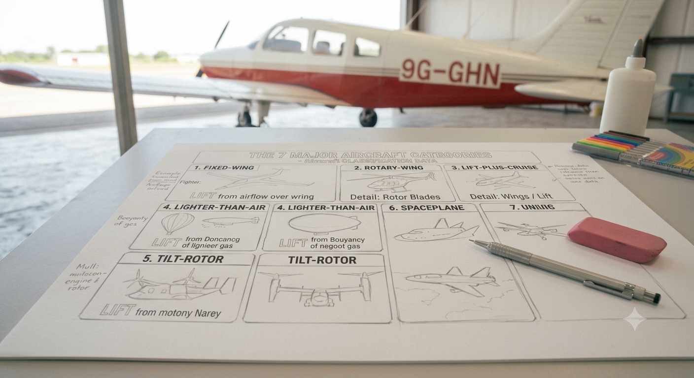
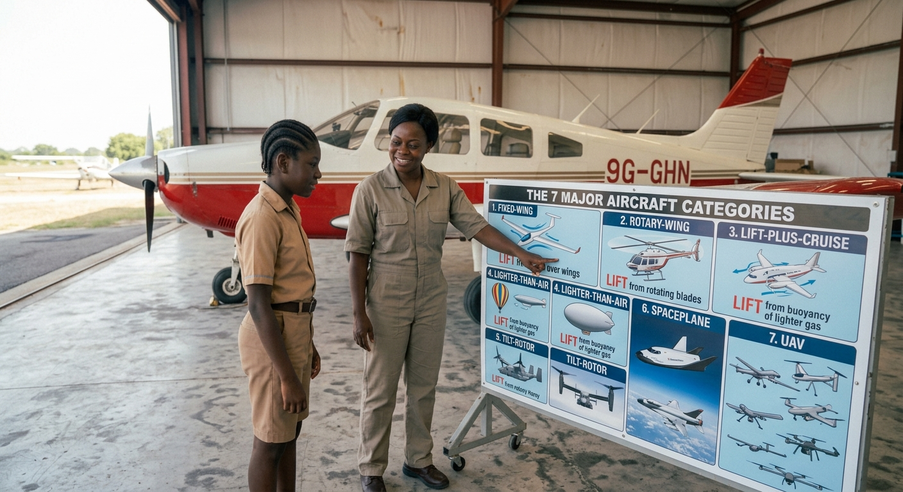
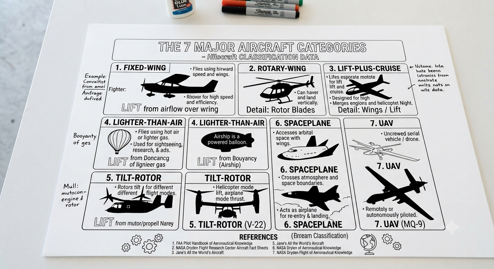
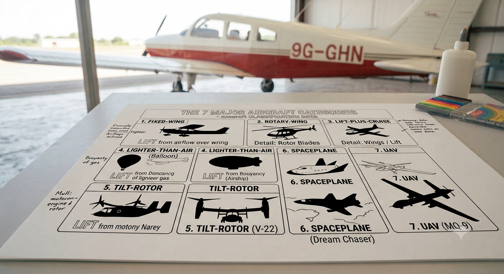
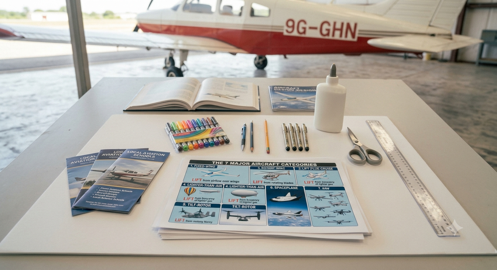

**AVIATION & AEROSPACE EDUCATION KIT**

SECTION 2 • BEGINNER PROJECTS • SHS 1 TERMS 1–2

**PROJECT 6**

**Aircraft Classification**

**Poster Project**

| **LEVEL**  Beginner | **DURATION**  2 Lessons (40–50 min each) | **KIT**  Kit 1 |
| --- | --- | --- |

**Student & Teacher Manual**

**1. Project Overview**

This project develops students' aviation knowledge through research, visual communication, and presentation. Working in groups, students research the seven major categories of aircraft, create a large-format classification poster with labelled silhouettes and key facts, and deliver a short presentation to the class. A local Ghana and Africa context is woven throughout, connecting global aviation to what students can see and experience at Kotoka International Airport and beyond.

| **Curriculum Area** | Aviation Knowledge, Classification & Communication |
| --- | --- |
| **Year Group** | SHS 1 (Terms 1–2) |
| **Duration** | 2 lessons of 40–50 minutes each |
| **Materials Source** | Kit 1 (all items); teacher-provided reference materials |
| **Power Required** | None |
| **Prerequisite** | Projects 1–3 recommended (familiarity with aircraft types encountered so far) |

**Learning Objectives**

* Define the term 'aircraft' and explain the distinction between aircraft and spacecraft
* Identify and describe the seven major categories of aircraft with at least one example per category
* Draw or trace recognisable silhouettes for each aircraft category
* Research and present at least three accurate key facts per category
* Identify at least two aircraft types or operators currently active in Ghana or West Africa
* Deliver a structured group presentation using the poster as a visual aid

**2. Components Required**

| **Item** | **Quantity** | **Source** |
| --- | --- | --- |
| A1 or A2 poster board (white) | 1 | Kit 1 |
| Marker pens (black + colour set) | 1 set | Kit 1 |
| Steel ruler (30 cm) | 1 | Kit 1 |
| Pencil | 1 | Kit 1 |
| Reference books / printouts (aircraft types) | Set | Kit 1 / Teacher-provided |
| Glue stick | 1 | Kit 1 |
| Scissors | 1 pair | Kit 1 |
| Printed aircraft silhouette templates (optional) | Set | Kit 1 |

**3. Session Steps**

**Lesson 1 – Research & Layout Planning**

| **STEP 1** | **Introduce the Seven Categories** |
| --- | --- |
|  | * Teacher introduces all 7 aircraft categories using the Classification Reference Table (Section 5) * For each category, show one image or silhouette and ask: 'How does this generate lift?' * Students copy the 7 categories and one example each into their logbooks * Class discussion: 'Which of these have you seen in Ghana? Which would you most like to fly in?' |

| **STEP 2** | **Assign Research Roles** |
| --- | --- |
|  | * Divide each group of 4 into research roles: * Researcher A: Fixed-wing aircraft + Rotary-wing (2 categories) * Researcher B: Lighter-than-air + Powered lift (2 categories) * Researcher C: Gliders & sailplanes + UAVs (2 categories) * Researcher D: Spacecraft + Ghana / Africa context (1 category + local research) * Each researcher must find: category definition, 2 examples with specifications, and 3 key facts |

| **STEP 3** | **Research Phase** |
| --- | --- |
|  | * Students use reference books, printed materials, or teacher-provided handouts * Key information to record for each category: * Definition: What makes this type of aircraft different from others? * Examples: Name, country of origin, typical use * Key fact 1: Speed, altitude, or payload capacity * Key fact 2: Propulsion type (how it generates thrust) * Key fact 3: A surprising or interesting fact * Ghana researcher: Find 2 aircraft types currently operating from Kotoka International Airport |

| **STEP 4** | **Poster Layout Planning** |
| --- | --- |
|  | * Before touching the poster board, sketch a layout plan in pencil on A4 paper * Recommended layout: 7 sections arranged in a grid (e.g. 3 across, 3 down, 1 spanning the bottom as a banner) * Title banner at the top: 'AIRCRAFT CLASSIFICATION – [Group Name]' * Each section: silhouette drawing, category name, 3 key facts * Allocate a corner for the Ghana / Africa context * Teacher reviews the plan before the group moves to the poster board |

**Lesson 2 – Poster Production & Presentation**

| **STEP 5** | **Create the Silhouettes** |
| --- | --- |
|  | * Students draw or trace a recognisable silhouette for each aircraft category * Use pencil first; go over with black marker only when satisfied with the shape * Silhouettes should be large enough to fill the allocated section (minimum 10 cm wingspan) * Label each silhouette with the aircraft name below it * Optional: use the printed silhouette templates from Kit 1 as a guide |

| **STEP 6** | **Add Key Facts & Colour** |
| --- | --- |
|  | * Write 3 key facts per category in neat, legible text * Use colour to differentiate categories — assign one colour per category * Colour the silhouette outline or background box in the category colour * Add the Ghana / Africa context in a clearly labelled box or banner * Final check: all 7 categories present; all sections have a silhouette, category name, and 3 facts |

| **STEP 7** | **Peer Review** |
| --- | --- |
|  | * Exchange posters with another group * Reviewing group checks: all 7 categories present; silhouettes recognisable; facts accurate * Write 2 strengths and 1 improvement suggestion on a sticky note; attach to the poster * Return posters; groups review the feedback before presenting |

| **STEP 8** | **Group Presentation** |
| --- | --- |
|  | * Each group presents their poster to the class (5–7 minutes per group) * Each group member must speak for at least 30 seconds * Suggested structure: introduce your category → show silhouette → state 3 key facts → connect to Ghana * Class asks one question per group after each presentation * Teacher scores using the rubric in Section 6 |

**4. Power & Safety Notes**

| **⚠ Safety Notes**  Power: None required. This is a research and art-based project.  Scissors: Standard classroom supervision is sufficient. Remind students to cut away from the body.  Markers: Ensure adequate ventilation if using permanent markers. Washable markers are preferred for classroom use.  Workspace: Protect desks with newspaper before using glue or markers. |
| --- |

**5. Engineering Principles – Classification Reference**

**The Seven Categories of Aircraft**

Aviation classifies all flying vehicles into seven major categories based primarily on how they generate lift and whether they operate within or beyond Earth's atmosphere.

| **Category** | **Type** | **Examples** |
| --- | --- | --- |
| **Fixed-Wing** | Conventional aircraft | Cessna 172, Boeing 737, F-16 Fighting Falcon, Northrop B-2 Spirit |
| **Rotary-Wing** | Helicopters & autogyros | Bell 206, Sikorsky Black Hawk, Robinson R22 |
| **Lighter-Than-Air** | Buoyancy-based lift | Hot air balloon, airship (Zeppelin), blimp |
| **Powered Lift** | Hybrid VTOL | V-22 Osprey, F-35B STOVL, Harrier Jump Jet |
| **Gliders & Sailplanes** | Unpowered fixed-wing | Schweizer 2-33, DG-1000, hang glider |
| **Unmanned Aerial Vehicles** | No onboard pilot | DJI Phantom, MQ-9 Reaper, Boeing ScanEagle |
| **Spacecraft** | Beyond atmosphere | SpaceX Falcon 9, Soyuz capsule, Space Shuttle |

**How Lift is Generated – A Quick Comparison**

* Fixed-wing: Aerofoil wing shape + forward speed (Bernoulli + angle of attack)
* Rotary-wing: Spinning rotor blades — the rotor is a rotating wing
* Lighter-than-air: Buoyancy — the craft is filled with a gas lighter than air (helium or hot air)
* Powered lift: A hybrid — uses jet thrust or rotor wash to take off vertically, then transitions to wing lift
* Gliders: Gravity + aerofoil — trades altitude for forward motion; no engine
* UAV: Any of the above, but controlled remotely or autonomously
* Spacecraft: Does not rely on aerodynamic lift — uses rocket thrust to escape Earth's gravity

**Aviation in Ghana & West Africa**

Including local aviation context makes classification immediately relevant. Here are key examples to include on your poster:

| **Organisation / Aircraft** | **Relevance to Ghana** |
| --- | --- |
| **Africa World Airlines** | Ghanaian carrier; operates ATR 72-600 turboprops and Embraer 170 regional jets |
| **Passion Air** | Ghanaian low-cost carrier; operates Airbus A320 and A319 narrow-body jets |
| **Ghana Air Force** | Operates fixed-wing trainers and transport aircraft; headquartered at Burma Camp, Accra |
| **Kotoka International Airport** | Ghana's primary international hub; serves wide-body jets including Boeing 777 and Airbus A330 |
| **GCAA Flight Academy** | Ghana Civil Aviation Authority training centre; trains Ghanaian pilots and engineers |

| **Did You Know?**  Kotoka International Airport handles over 2 million passengers per year and is served by over 20 international airlines.  Africa World Airlines, founded in 2012, was the first Ghanaian airline to operate scheduled regional jet services.  The Ghana Air Force operates from Accra, Kumasi, and Tamale, and participates in UN peacekeeping air operations across Africa. |
| --- |

**6. Assessment Rubric & Success Criteria**

**Poster Assessment Rubric (20 marks total)**

Each criterion is scored out of 4. A score of 14 or higher (70%) is required to pass.

| **Criterion** | **4 – Excellent** | **3 – Good** | **2 – Developing** | **1 – Needs Work** |
| --- | --- | --- | --- | --- |
| **Accuracy of classification** | All 7 categories correct (4) | 5–6 correct (3) | 3–4 correct (2) | Fewer than 3 (1) |
| **Diagram quality** | Neat, clear, labelled silhouettes (4) | Most labels present (3) | Some labels (2) | Unclear or unlabelled (1) |
| **Key Facts accuracy** | All facts correct & sourced (4) | Minor errors only (3) | Some inaccuracies (2) | Significant errors (1) |
| **Ghana / Africa context** | 2+ local references (4) | 1 local reference (3) | Attempted (2) | No local context (1) |
| **Poster presentation** | Visually clear, balanced layout (4) | Good layout (3) | Acceptable (2) | Difficult to read (1) |

**Overall Success Criteria**

| **Outcome** | **Success Criteria** |
| --- | --- |
| **Poster completed** | All 7 categories represented; clearly labelled silhouettes or images |
| **Key facts accurate** | At least 3 key facts per category; sources noted |
| **Ghana / Africa context included** | At least 2 references to aircraft operating in Ghana or Africa |
| **Rubric score achieved** | Total score of 14 or higher out of 20 |
| **Presentation delivered** | Group presents poster to class; each member speaks for at least 30 seconds |

**7. Expected Output**

| **What a Completed Poster Should Contain**  Title banner: 'AIRCRAFT CLASSIFICATION' with group name and date  7 labelled sections, one per category, each with: silhouette drawing, category name, and 3 key facts  Ghana / Africa context box: at least 2 local aviation references with aircraft type and operator  Colour scheme: consistent colour coding across all 7 categories  Sources: at least 2 references listed at the bottom of the poster  Signed by all group members |
| --- |

**8. Common Errors & Fixes**

| **Error** | **Likely Cause** | **Fix** |
| --- | --- | --- |
| **Wrong category assignment** | Confusion between powered lift and fixed-wing | Review the lift source: fixed-wing uses aerofoils only; powered lift uses rotors or jets for VTOL |
| **Spacecraft included in 'aircraft'** | Misconception that any flying vehicle is an aircraft | Clarify definition: aircraft operate within Earth's atmosphere; spacecraft exit it |
| **Silhouettes hard to identify** | Too small or poorly drawn | Use a ruler and pencil first; trace or use printed templates; scale to fill the space |
| **Missing Ghana context** | Local aviation not researched | Direct students to GCAA website and Africa World Airlines fleet page for local examples |
| **Poster unbalanced / crowded** | Poor layout planning | Use pencil grid first; allocate equal space per category before starting in pen |

**9. Upgrade & Extension Ideas**

Groups that finish early or who want to go further can explore:

* Digital Poster – Recreate the poster using presentation software (PowerPoint, Canva, or Google Slides); add images and hyperlinks
* Timeline Extension – Add a historical timeline below the classification grid showing when each category was first invented
* Speed Comparison Chart – Create a bar chart showing the maximum speed of one example from each category
* Future Aircraft – Add an 8th category: 'Future Concepts' (hypersonic, electric, hydrogen-powered); research and illustrate
* Ghana Aviation Map – Create an accompanying map of Ghana showing locations of all airports and the aircraft types that serve them
* Video Presentation – Record the group presentation; edit with titles and captions; screen at a school aviation open day

**10. Teacher Notes & Differentiation**

**Lesson Planning Tips**

* Pre-print a set of reference sheets (one per category) for groups without book access — this ensures research quality regardless of library resources
* Display the rubric on the projector throughout Lesson 2 so students can self-check against criteria as they work
* During Lesson 2, circulate every 10 minutes to check layout balance — crowded posters are hard to fix at the end
* For the presentation, allow the class to use the rubric as peer assessors — it builds critical thinking and reinforces learning
* Photograph all completed posters for the school's aviation display board

**Differentiation Strategies**

* Support – Groups of 5 (extra researcher); teacher provides pre-drawn silhouette outlines to colour and label; reduce to 5 categories
* Core – Full 7 categories; research from reference materials; poster + presentation
* Extension – Digital poster; timeline; speed chart; video presentation

**Assessment Suggestions**

* Rubric score: Poster assessed against the 5-criterion rubric (total 20 marks; pass at 14)
* Peer review: Written feedback from reviewing group — 2 strengths, 1 improvement
* Presentation: Each group member speaks; question handled correctly
* Research quality: Facts verified against reference materials; no unsourced claims

| **Curriculum Links**  Aviation Knowledge: Aircraft classification as foundational knowledge for all subsequent projects  English / Communication: Research skills, written presentation, verbal group presentation  Visual Art: Technical drawing, silhouette, layout design, colour theory  Geography: Global and local aviation context; map literacy (extension)  This project supports GCAA youth aviation literacy goals and NaCCA STEM cross-curricular integration. |
| --- |

## Images

