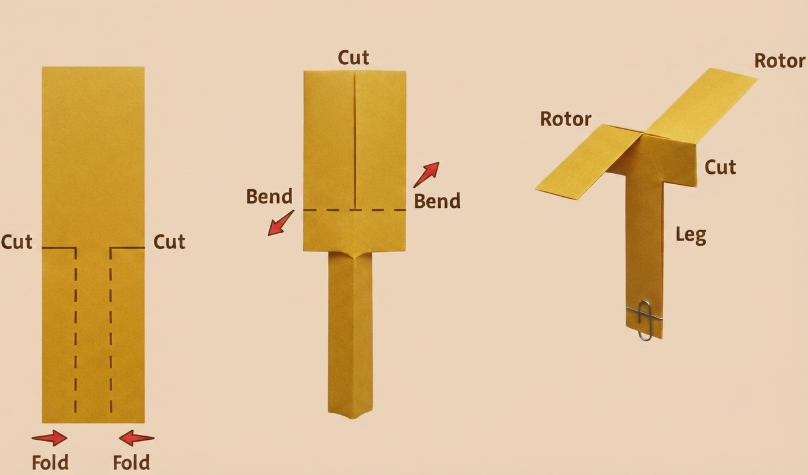

**1. Project Overview**

This project introduces students to rotary-wing aerodynamics through one of the simplest experiments in aviation education. By building and dropping paper helicopters with different rotor configurations, students directly observe how rotor length, width, and symmetry affect descent rate, rotation speed, and stability — the same variables helicopter engineers balance when designing rotor blades.

**2. Components Required**

| **Item** | **Quantity** | **Source** |
| --- | --- | --- |
| **A4 paper** | 10 sheets | Kit 1 |
| **Scissors** | 1 pair | Kit 1 |
| **Ruler (30 cm)** | 1 | Kit 1 |
| **Paper clips (small)** | 5 | Kit 1 |
| **Stopwatch** | 1 | School |
| **Measuring tape (for drop height)** | 1 | Kit 1 |

**3. Build Steps & Assembly**

**Guide 1 – Template & First Builds**

| **STEP 1** | **Template Creation** |
| --- | --- |
|  |  Cut paper into strips: 2 cm × 15 cm (one strip per helicopter)  Fold each strip in half lengthwise; crease firmly  Cut a slit 5 cm from the bottom, along the centre fold |

| **STEP 2** | **Rotor Blade Formation** |
| --- | --- |
|  |  Fold the top 5 cm in opposite directions to form two rotor blades; one toward you, one away  Fold the bottom 2 cm upward to create a weight pocket  Insert one paper clip into the bottom fold  Hold at arm's length and drop, it should spin as it falls |

| **STEP 3** | **Build Five Variable Designs** |
| --- | --- |
|  |  Design 1 – Long Rotors: 6 cm rotor length  Design 2 – Short Rotors: 3 cm rotor length  Design 3 – Asymmetric: one rotor 6 cm, one rotor 3 cm  Design 4 – Wide Rotors: rotor width 1.5 cm (cut wider strip)  Design 5 – Narrow Rotors: rotor width 0.5 cm (cut narrower strip)  Label each helicopter with its design name before testing |

**Guide 2 – Drop Testing & Data Collection**

| **STEP 4** | **Drop Testing Protocol** |
| --- | --- |
|  |  Drop from a consistent height of 2 m (mark on the wall with tape)  One student drops; one student starts the stopwatch at release  Record time from release to landing  Count visible rotations during the drop  Conduct 3 drops per design; record all three times; calculate average  Record stability observations: 'stable' (smooth rotation), 'unstable' (wobbles or drifts) |

| **STEP 5** | **Analysis & Graphing** |
| --- | --- |
|  |  Plot a bar graph: rotor design (x-axis) vs average drop time (y-axis)  Identify which design had the slowest descent and which had the fastest  Write 3 sentences explaining the results with reference to drag and rotor area  Discuss as a class: how does this connect to helicopter autorotation? |

**4. Engineering Principles**

**Rotary Aerodynamics**

* Autorotation: as the helicopter falls, air flows upward through the rotor disk. The rotor blades are angled so this upward flow creates a rotation; converting gravitational potential energy into rotor spin
* Drag: the spinning rotor disk creates drag that slows the descent; the same principle as a parachute, but with rotation
* Rotor area: larger rotors intercept more air and generate more drag, slowing descent
* Symmetry: symmetric rotors create equal drag on both sides, producing smooth stable rotation; asymmetric rotors create unequal drag, causing wobble

| **Real Aviation Connection**  When a real helicopter's engine fails, the pilot immediately lowers the collective pitch lever.  This allows the rotor blades to autorotate — air flowing upward through the descending rotor keeps the blades spinning at safe speed.  Just before touchdown, the pilot flares the nose and applies collective pitch, using stored rotor energy to cushion the landing.  Our paper helicopter demonstrates exactly the same energy conversion: gravitational potential → rotor kinetic energy → drag-limited descent. |
| --- |

**5. Data Collection Table**

| **Design** | **Drop Time (s)** | **Rotations** | **Stability** | **Observations** |
| --- | --- | --- | --- | --- |
| **Long Rotors (6 cm)** |  |  |  |  |
| **Short Rotors (3 cm)** |  |  |  |  |
| **Asymmetric** |  |  |  |  |
| **Wide Rotors (1.5 cm)** |  |  |  |  |
| **Narrow Rotors (0.5 cm)** |  |  |  |  |

**6. Expected Output & Success Criteria**

| **Outcome** | **Success Criteria** |
| --- | --- |
| 5 helicopters built | All five rotor designs correctly folded and weighted |
| Data collected | Drop time and rotation count recorded for each design |
| Observations noted | Stability and descent behaviour described for each |
| Graph created | Drop time vs. rotor length plotted with labelled axes |
| Conclusions drawn | Best design identified and explained with reference to drag and autorotation |

**7. Common Errors & Fixes**

| **Error** | **Likely Cause** | **Fix** |
| --- | --- | --- |
| **Does not rotate** | Rotors folded same direction instead of opposite | Refold so the two rotor blades bend in opposite directions |
| **Too fast descent** | Paper clip too heavy | Use a smaller clip or tape a coin instead |
| **Drifts sideways on drop** | Rotor blades unequal length | Trim both rotors to identical length before testing |
| **Falls straight without spinning** | Rotors folded flat; no pitch angle | Curl the rotor tips slightly to create an angle to the airflow |

**8. Upgrade & Extension Ideas**

* Different Paper: test 80 gsm, 120 gsm, and card stock — graph the effect of paper weight on drop time
* Rotor Count: add a third rotor blade; observe the effect on rotation speed and stability
* Wind Effect: drop in front of the Kit 3 desk fan; compare drop time and drift with and without airflow
* Parachute Comparison: add a 5 cm paper parachute; compare descent time with the same helicopter without one
* Drop Height Experiment: test drop times from 1 m, 2 m, and 3 m; graph height vs. time

