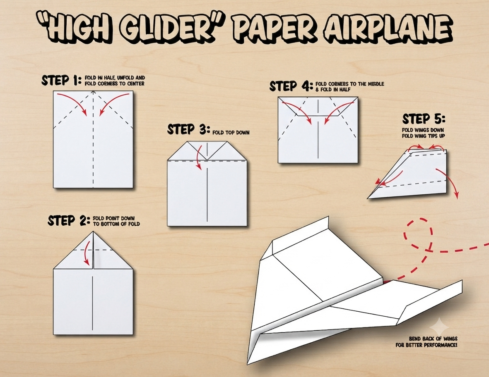
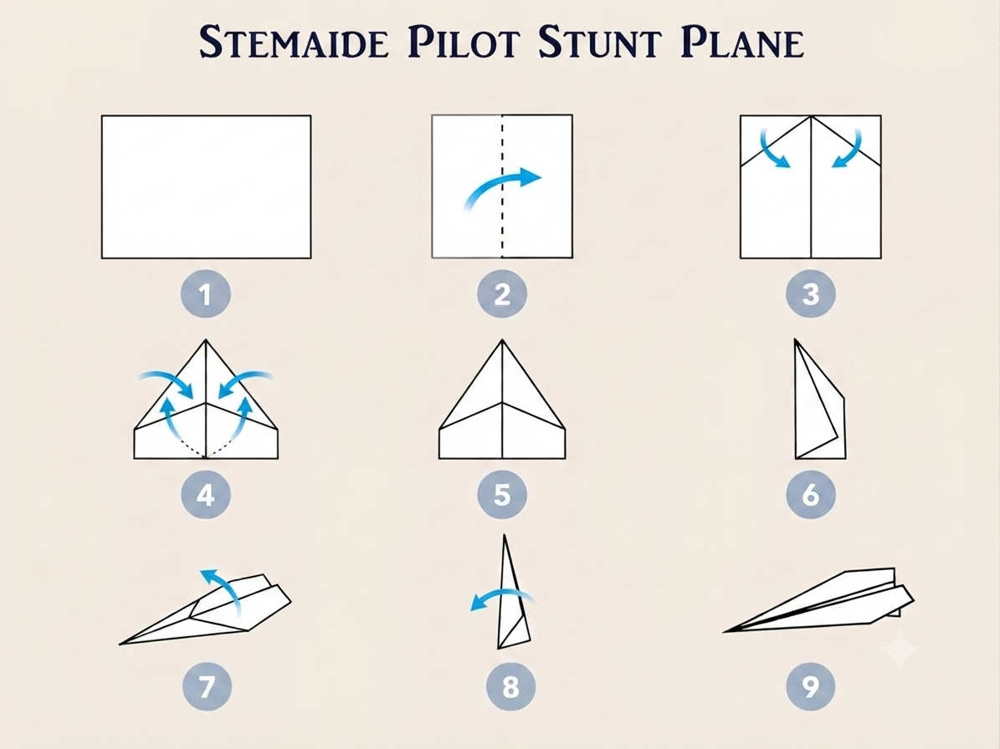
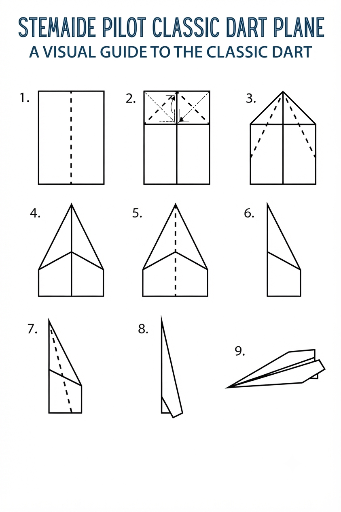

# 1.1.1 Paper Dart Glider Preparation And Build

## Overview

This project introduces students to the fundamental principles of aerodynamics by designing, building, and testing three different paper aircraft. Through a structured tournament format, students collect flight data, compare the effect of different design features, and apply scientific methodology to analyse results.

## Required Components

| **Item** | **Quantity** | **Source** |
| --- | --- | --- |
| A4 card stock paper | 10 sheets | Kit 1 |
| Steel ruler (30 cm) | 1 | Kit 1 |
| Craft knife with safety guard | 1 | Kit 1 |
| Cutting mat (A3) | 1 | Kit 1 |
| Masking tape | 1 roll | Kit 1 |
| Pencil | 1 | Kit 1 |
| Measuring tape (5 m) | 1 | Kit 1 |

## Step-by-Step Assembly

**Lesson 1 – Preparation & Build**

### Step 1: Tool Orientation & Safety Contract

* Introduce all tools: craft knife, steel ruler, cutting mat
* Demonstrate safe cutting technique (cut away from the body, mat beneath the work)
* Students sign the safety contract before touching any tools
* Review the project brief and tournament rules

### Step 2: Template Preparation

* Distribute A4 card stock and printed templates
* Each group traces three designs onto card stock:
* Design A – Classic Dart (long, narrow body)
* Design B – Wide Glider (broad, high-aspect-ratio wings)
* Design C – Stunt Plane (small body with elevator flaps)
* Label each template with the group name before cutting

### Step 3: Build All Three Aircraft

* Cut out each design carefully using the craft knife and steel ruler
* Fold along dashed lines precisely – hold folds for 5 seconds to crease
* Apply masking tape only at indicated locations
* Check for symmetry: hold each aircraft at arm's length and sight along the wing
* Write the group name on the underside of each aircraft

### Step 4: Decorate & Name
* Decorate each aircraft with a unique colour or pattern
* Give each aircraft an individual name (e.g. Ghana Eagle, Kotoka Flyer)
* Keep decorations on the underside only – markings on the upper surface can affect airflow

## Power & Safety
For safety instructions and power requirements, please refer to [Safety Notes](../../Getting%20Started/Safety_Notes.md).

