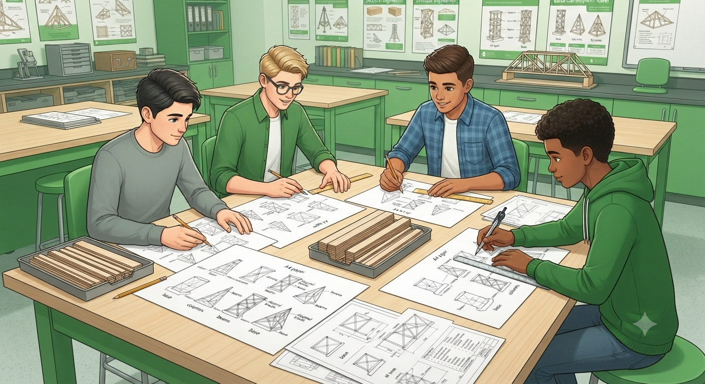
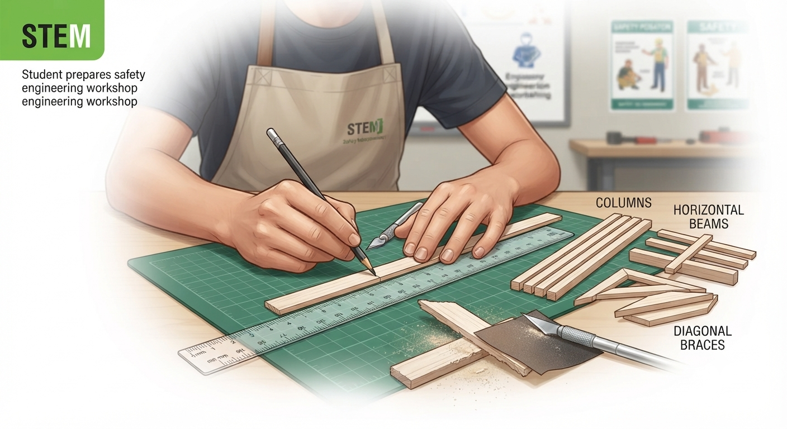

# 1.10.1 Balsa Wood Tower Design And Cutting

## Overview

Structural engineering is the foundation of all aircraft design. By building and load-testing four different balsa wood tower designs, students directly experience the principles of compression, tension, buckling, and bracing that structural engineers apply to aircraft fuselages, spars, and landing gear. The efficiency metric — load carried divided by tower weight — mirrors the strength-to-weight ratio that drives every real aircraft structural decision.

## Required Components

| **Item** | **Quantity** | **Source** |
| --- | --- | --- |
| **Balsa wood strips (3 mm × 3 mm)** | 20 | Kit 1 |
| **PVA wood glue** | 1 bottle | Kit 1 |
| **Craft knife** | 1 | Kit 1 |
| **Cutting mat** | 1 | Kit 1 |
| **Ruler (30 cm)** | 1 | Kit 1 |
| **Sandpaper** | 1 sheet | Kit 1 |
| **Test weights (small)** | 1 set | Kit 6 |
| **Right-angle card (jig for square joints)** | 1 | Teacher-made or Kit 1 |

## Step-by-Step Assembly

**Lesson 1 – Design & Cutting**

### Step 1: Design Phase

* Each group sketches 4 tower designs on A4 paper before cutting any balsa
* Square base: 4 vertical columns on a square footprint; horizontal rungs; no diagonals
* Triangular base: 3 vertical columns on a triangular footprint; horizontal rungs
* X-Braced: 4 vertical columns with X-shaped diagonal bracing on each face
* Pyramid: 4 leaning columns meeting at the top with no vertical uprights
* All towers must be 25 cm tall; base footprint: 8 cm × 8 cm (or equivalent area)

### Step 2: Cutting

* Cut all balsa strips to required lengths using the craft knife and steel ruler on the cutting mat
* Organise cut pieces by function: columns, horizontals, diagonals
* Sand all cut ends smooth immediately to prevent splinters

## Power & Safety
For safety instructions and power requirements, please refer to [Safety Notes](../../Getting%20Started/Safety_Notes.md).

