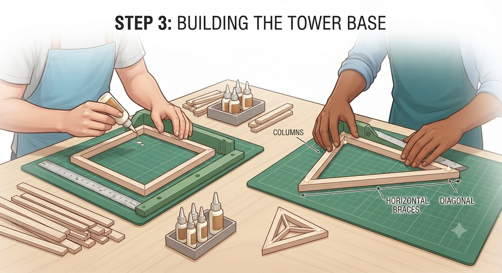
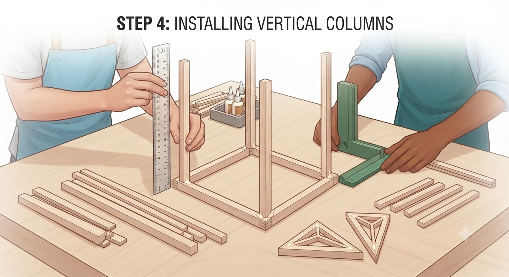
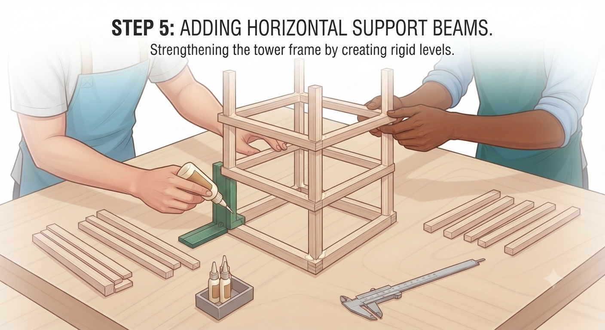
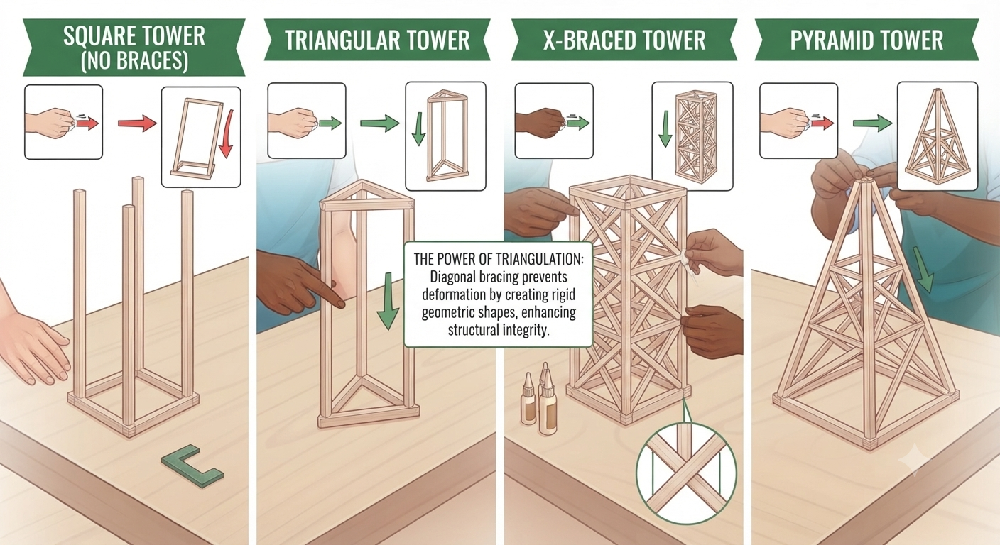
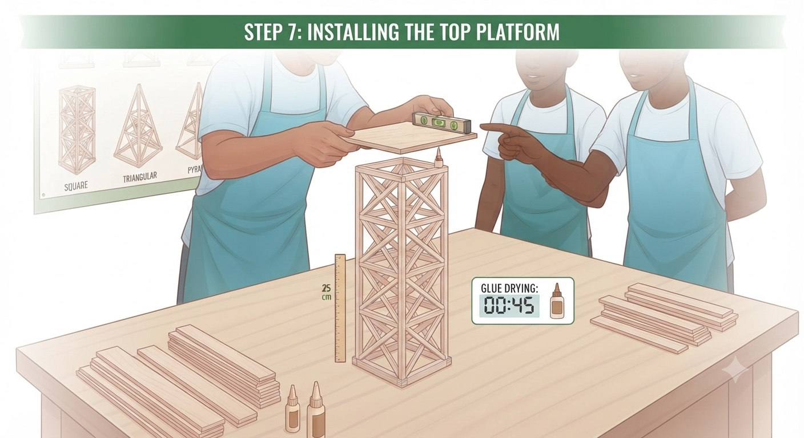

# 1.10.2 Balsa Wood Tower Assembly

## Step-by-Step Assembly (Continued)

**Lesson 2 – Assembly**

### Step 3: Assembly

* Apply PVA glue sparingly to each joint — too much glue adds weight without strength
* Use the right-angle card to hold joints at 90° while glue sets
* Build from the base upward: base frame → vertical columns → cross-bracing → top platform
* Allow all joints to cure for a minimum of 20 minutes before adding the next level
* Label each tower with its design name

