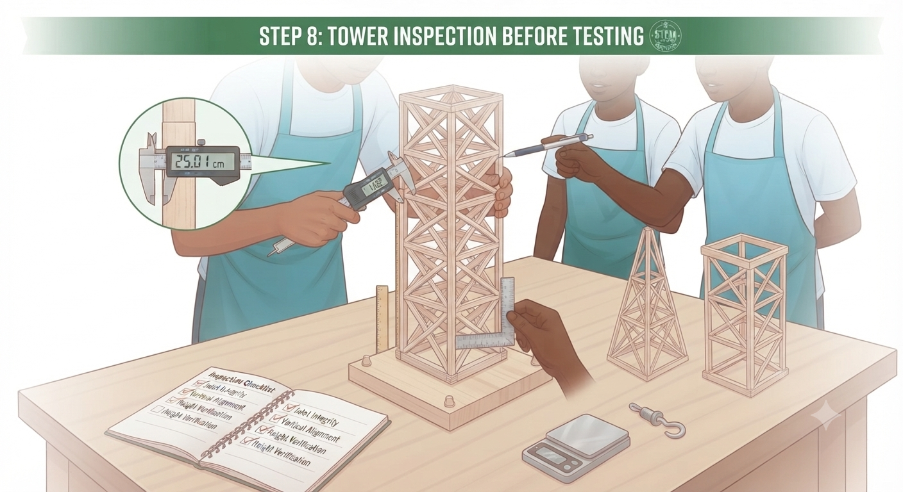
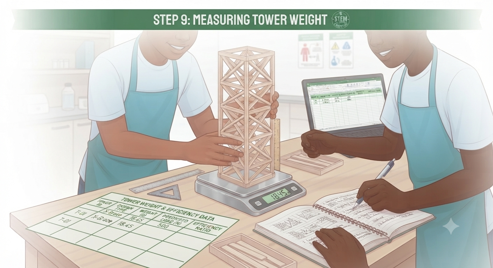
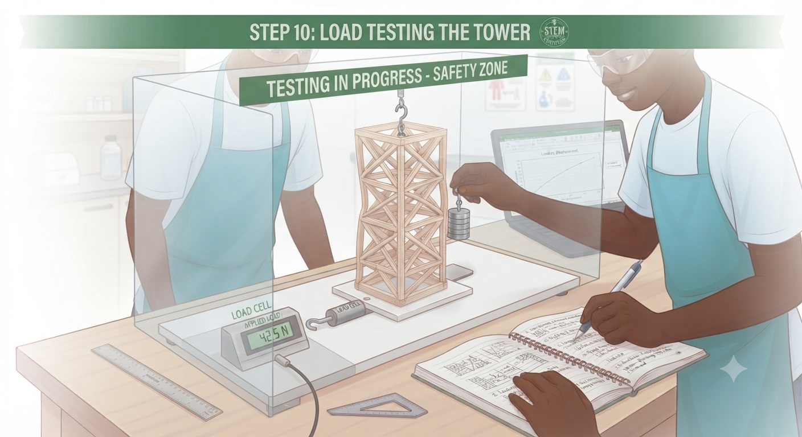
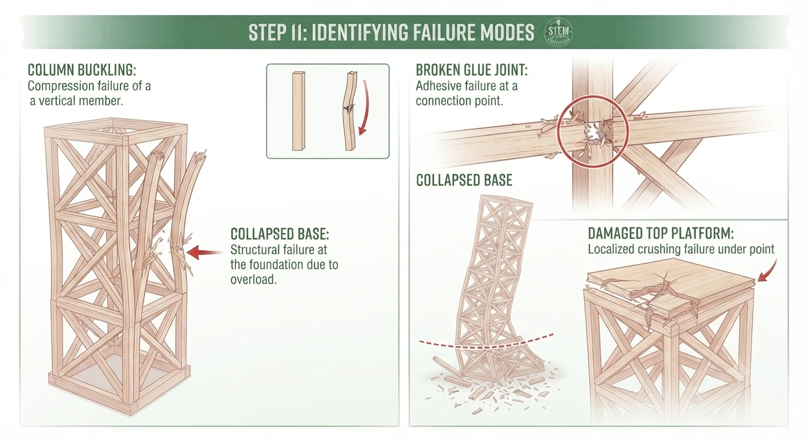
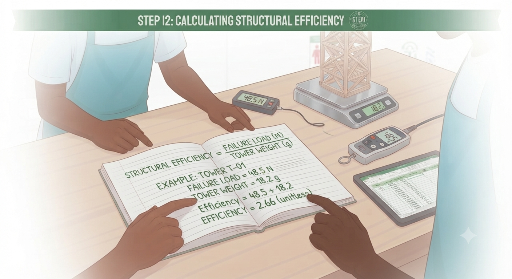
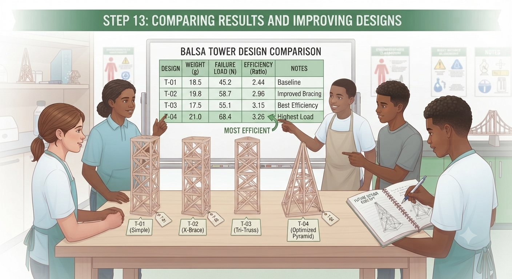

# 1.10.3 Balsa Wood Tower Load Testing

## Step-by-Step Assembly (Continued)

**Lesson 3 – Load Testing**

### Step 4: Load Testing Protocol

* Place tower on a flat surface; ensure it stands without support
* Weigh each tower using the kitchen scale; record in the data table
* Add weights to the top platform one at a time, pausing 10 seconds between additions
* Record the total load when the first sign of failure occurs (lean, crack, buckle)
* Identify the failure mode: column buckling, joint failure, base collapse, or top platform failure
* Calculate efficiency: failure load ÷ tower weight; record in the data table

