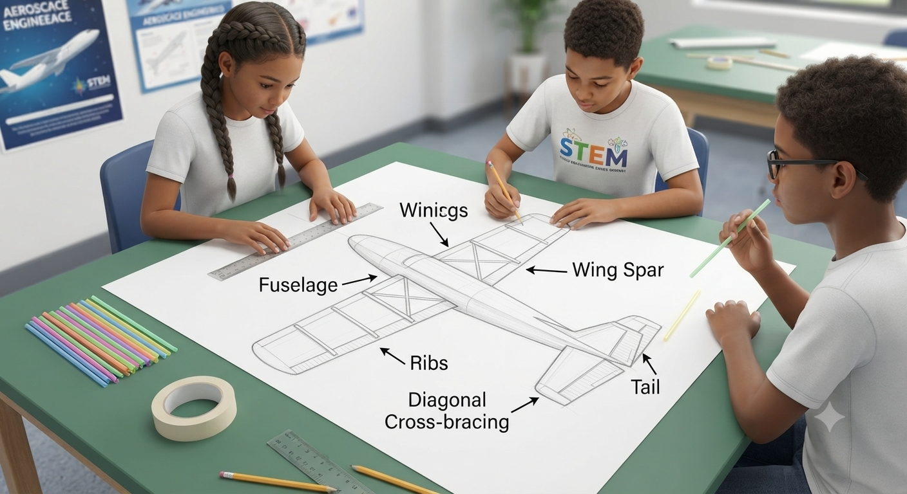
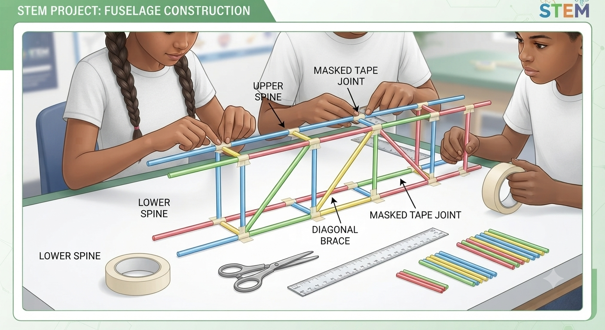
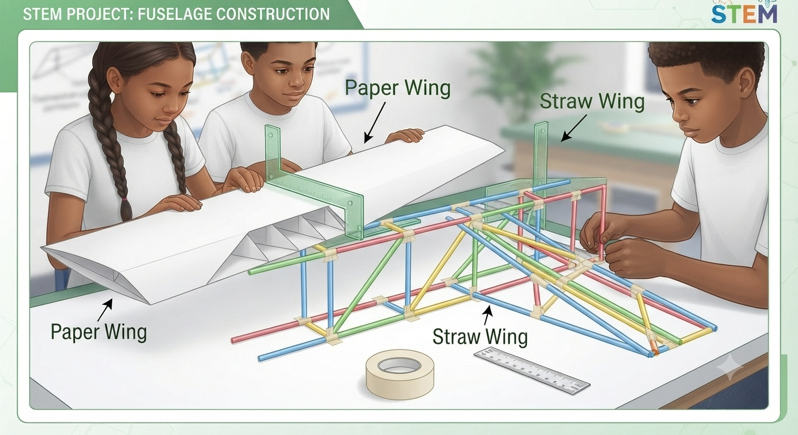

# 1.11.1 Straw Paper Structure Build

## Overview

Every aircraft must carry its own weight plus passenger, cargo, and aerodynamic loads — all transferred through the airframe without failing. This project uses drinking straws and paper to model the load paths inside a real aircraft structure. Students build a simple airframe, load it to failure, and then redesign it to carry more weight — experiencing in miniature the iterative structural testing that real aircraft manufacturers conduct before certification.

## Required Components

| **Item** | **Quantity** | **Source** |
| --- | --- | --- |
| **Drinking straws** | 30 | Kit 1 |
| **A4 paper** | 10 sheets | Kit 1 |
| **Masking tape** | 1 roll | Kit 1 |
| **String** | 1 roll | Kit 1 |
| **Test weights (small)** | 1 set | Kit 6 |
| **Scissors** | 1 pair | Kit 1 |
| **Ruler (30 cm)** | 1 | Kit 1 |

## Step-by-Step Assembly

**Lesson 1 – Structure Build**

### Step 1: Design the Airframe

* Sketch a simple aircraft top-view on A4 paper: fuselage (spine), two wings, tail
* Identify where the main spar will run (left wing tip → right wing tip through the fuselage centre)
* Mark where cross-bracing will be added to prevent fuselage bending

### Step 2: Build the Fuselage

* Connect 4 straws end-to-end with tape to form the fuselage spine (approximately 40 cm total)
* Add a parallel second spine 3 cm below the first, connected with 5 cm vertical cross-straws
* Add diagonal cross-bracing straws between the verticals to prevent racking
* Tape all joints with 3 cm of masking tape; press firmly

### Step 3: Add Wings

* Structure A (Paper Wing): tape a folded A4 paper strip (10 cm wide) across the fuselage midpoint
* Structure B (Straw Wing): tape 4 straws side-by-side to form a 20 cm × 3 cm wing panel; attach to fuselage
* Ensure wings are perpendicular to the fuselage; check with a right-angle card

## Power & Safety
For safety instructions and power requirements, please refer to [Safety Notes](../../Getting%20Started/Safety_Notes.md).

