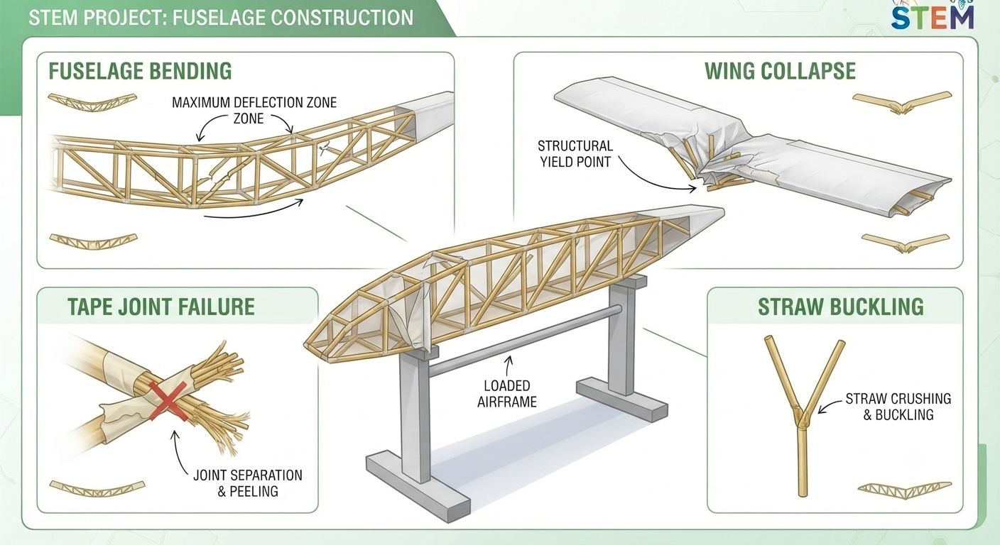
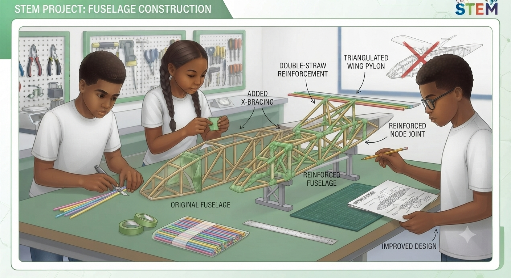
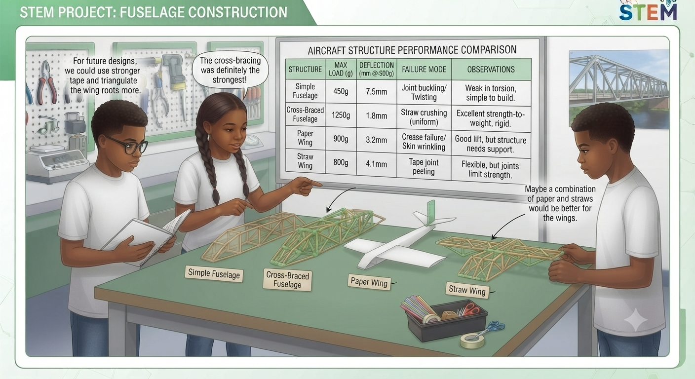

# 1.11.2 Straw Paper Load Testing And Improvement

## Step-by-Step Assembly (Continued)

**Lesson 2 – Load Testing & Improvement**

### Step 4: Load Testing

* Support the airframe at two points: hold each wing tip over the edge of a table
* Place weights at the fuselage centre, one at a time
* Measure deflection (how much the fuselage bends) at the midpoint with a ruler
* Continue until failure; record maximum load and failure mode in the data table

### Step 5: Improvement & Retest

* Identify the weakest failure mode; design one modification to fix it
* Build the modification; re-test using the same loading procedure
* Record improved load; calculate the percentage improvement
* Draw the load path on your airframe sketch: arrows showing force direction through each member

