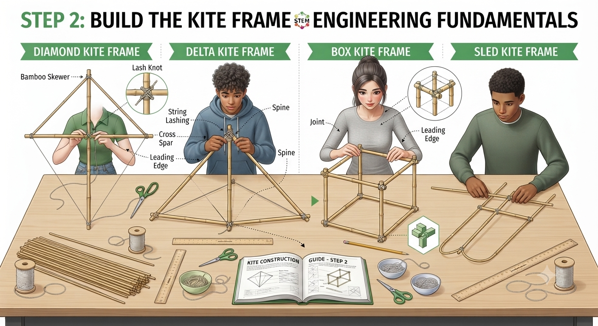

# 1.12.1 Kite Building Design And Frame Construction

## Overview

Kites are the oldest flying devices in human history — and the first tools aviation pioneers like the Wright Brothers used to study aerodynamics. By building and flying four different kite designs, students observe lift, drag, stability, and bridle angle in a wind-powered system that requires no engine. The competition between designs — which flies highest, which is most stable, which is easiest to launch — directly reflects the engineering trade-offs in real aircraft design.

## Required Components

| **Item** | **Quantity** | **Source** |
| --- | --- | --- |
| **A4 paper or light plastic sheet** | 5 sheets | Kit 1 |
| **Bamboo skewers (30 cm)** | 10 | Kit 1 |
| **String (for bridle and flying line)** | 1 roll | Kit 1 |
| **Masking tape** | 1 roll | Kit 1 |
| **Scissors** | 1 pair | Kit 1 |
| **Coloured ribbon / streamers (for tail)** | 1 roll | Kit 3 |
| **Ruler (30 cm)** | 1 | Kit 1 |

## Step-by-Step Assembly

**Lesson 1 – Design & Frame Construction**

### Step 1: Choose and Design Kite Type

* Each group assigns one design per student (4 students = 4 designs); groups of fewer than 4 build fewer designs
* Diamond: cross-shaped frame (spine + cross-spar); classic pointed diamond cover
* Delta: triangular frame (spine + two angled spars meeting at the nose); triangular cover
* Box: rectangular 3D frame (4 spars forming a box with open sides); complex but stable
* Sled: simple flat rectangle with two parallel spars; no cross-spar; curved into shape by the wind

### Step 2: Frame Construction

* Build each frame from bamboo skewers: tie joints with string (not tape — it allows adjustment)
* Diamond: tie the cross-spar 1/3 from the top of the spine
* Delta: tie two spars to the nose point and spread to 45° on each side
* Box: tie 4 skewers into a rectangle using overhand knots; add corner skewers for 3D shape
* Sled: two parallel skewers with a horizontal spar tied across the middle

## Power & Safety
For safety instructions and power requirements, please refer to [Safety Notes](../../Getting%20Started/Safety_Notes.md).

