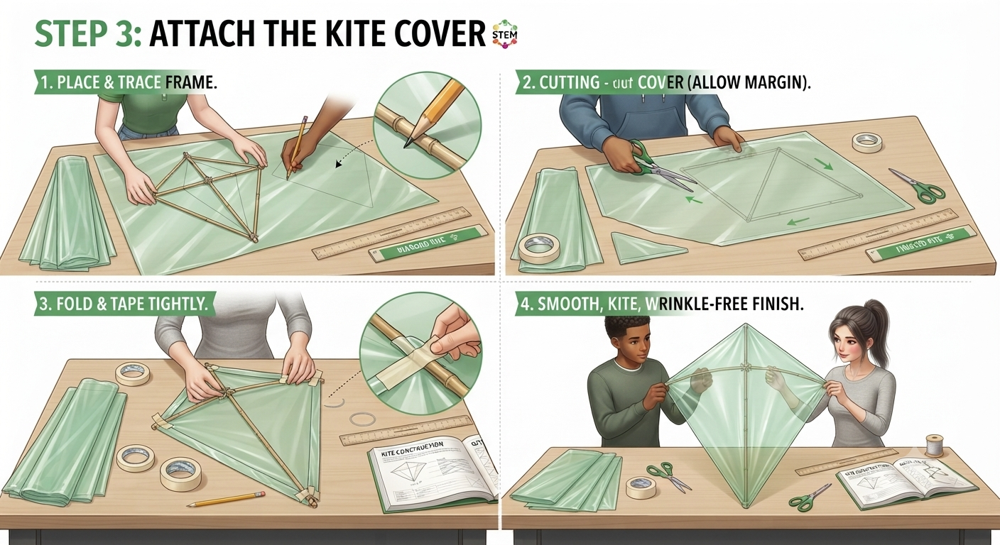
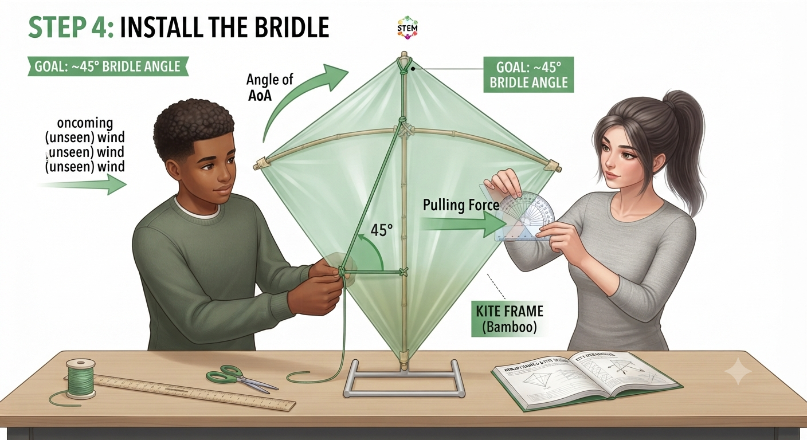
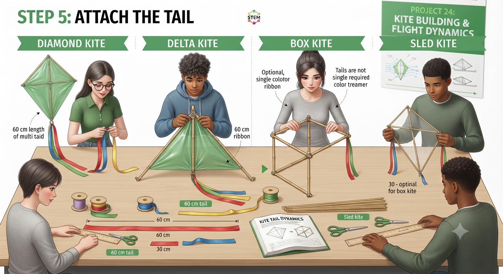

# 1.12.2 Kite Building Cover And Tail

## Step-by-Step Assembly (Continued)

**Lesson 2 – Cover & Tail**

### Step 3: Cover Attachment

* Lay the frame on the paper/plastic; trace the outline; add 1 cm border all round
* Cut out the cover; fold the 1 cm border over each spar and tape firmly
* Check: cover must be taut and smooth, with no wrinkles or air pockets
* Add the bridle: tie string from the nose and a lower point; the bridle angle should be approximately 45°

### Step 4: Tail Attachment

* Cut 60 cm of ribbon as a starting tail; tie to the base of the kite
* A tail is mandatory for diamond and delta designs; optional for box and sled
* Longer tail = more drag = more stability; short tail = kite can spin
* Test tail length during first flights; adjust by adding or removing 10 cm sections

