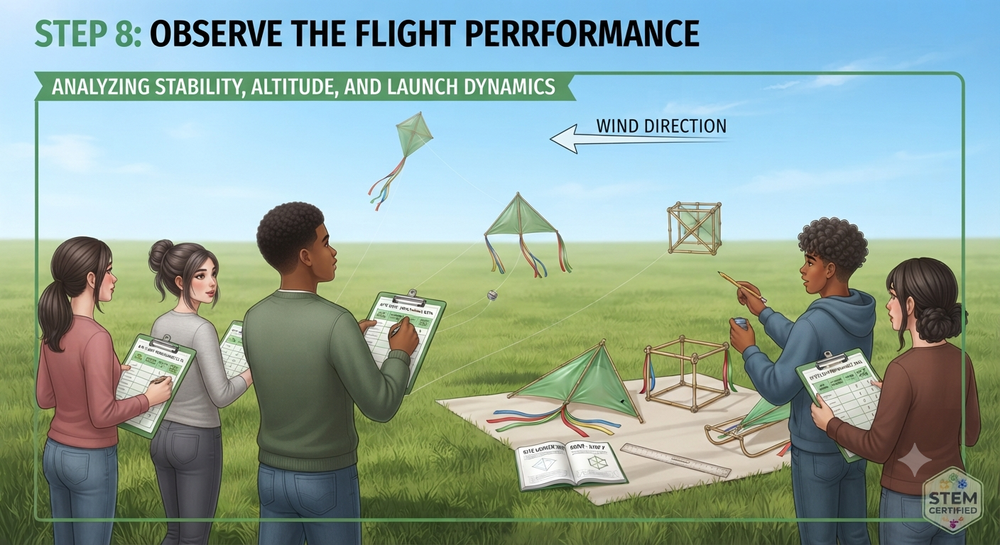
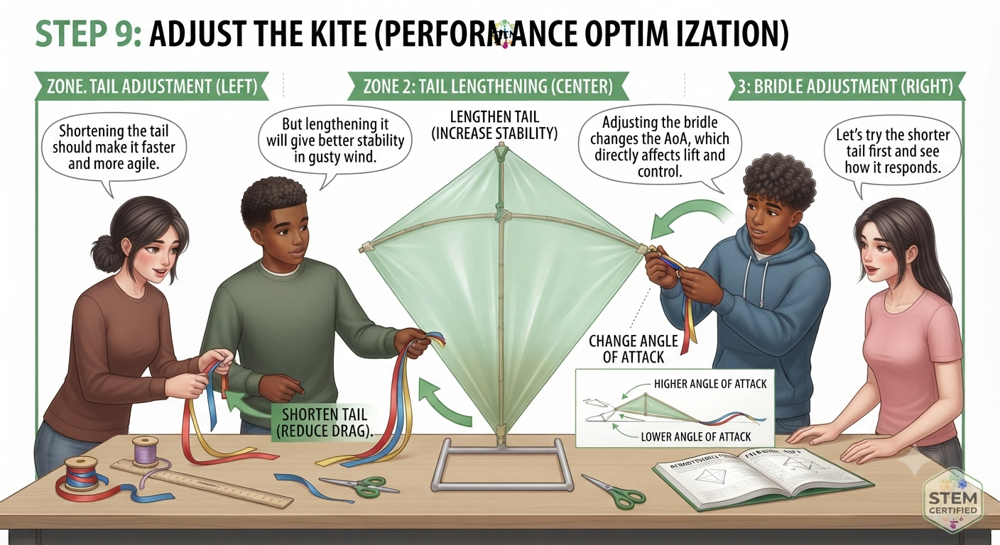
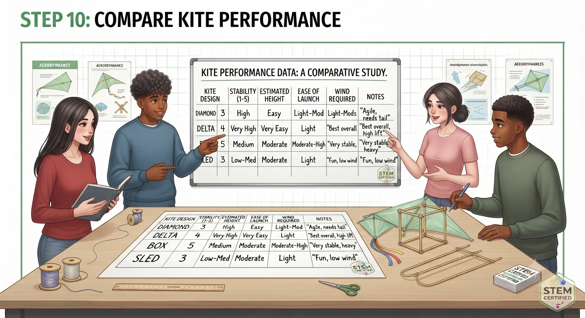

# 1.12.3 Kite Building Flight Testing

## Step-by-Step Assembly (Continued)

**Lesson 3 – Flight Testing**

### Step 5: Flight Testing Protocol

* Find an open outdoor area of at least 50 m with no overhead power lines
* Launch into the wind: one student holds the kite above their head; pilot walks backward paying out string
* Record stability (1 = spins constantly, 5 = completely stable) and estimated height
* Test each design for at least 2 minutes before adjusting
* After each flight: adjust bridle or tail length if needed; record all adjustments

