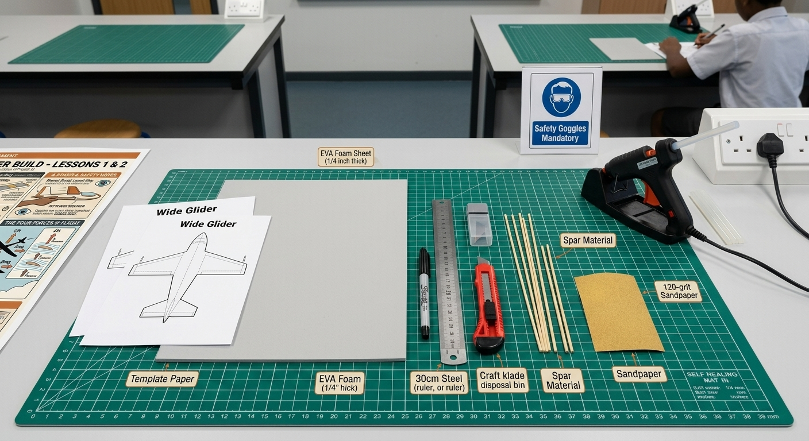
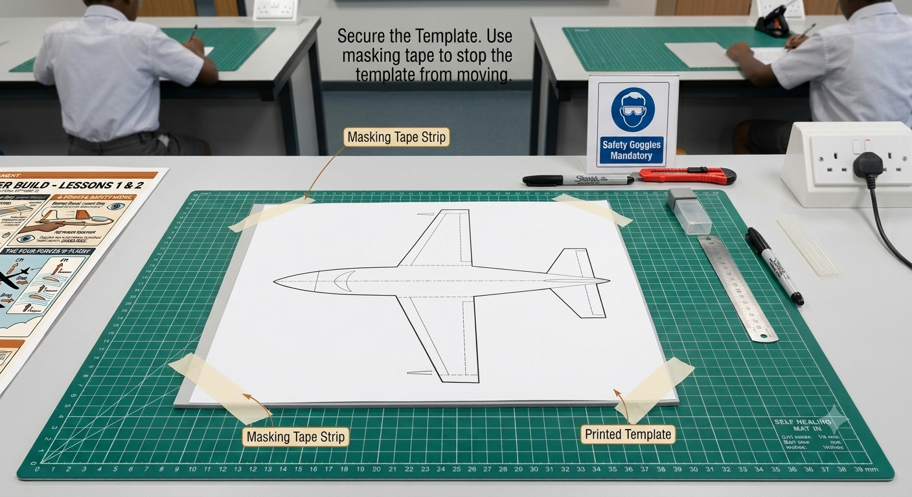
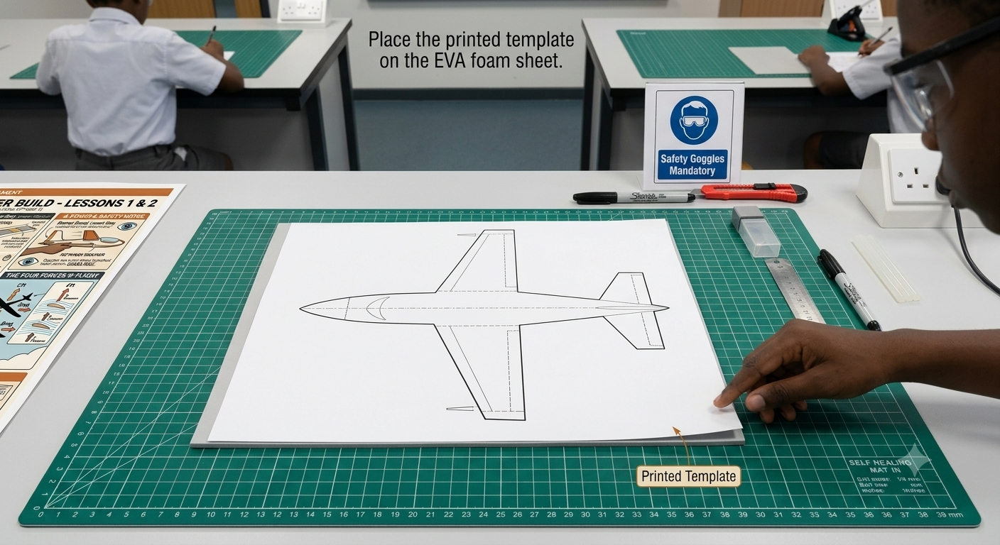
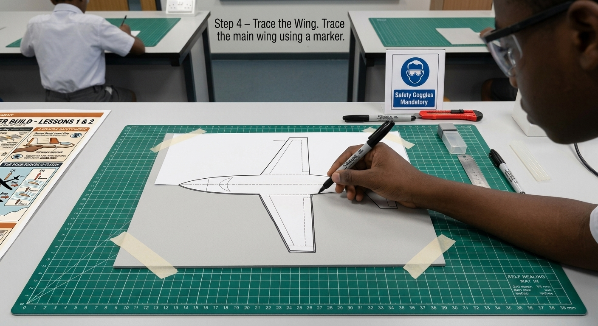
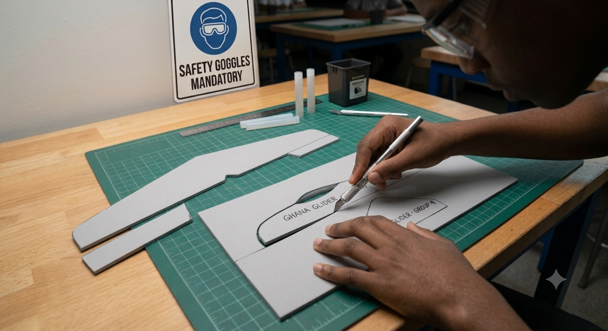
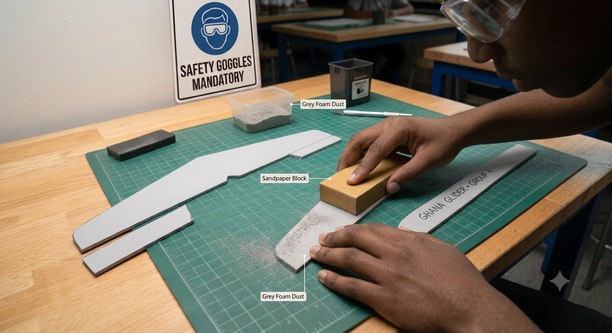
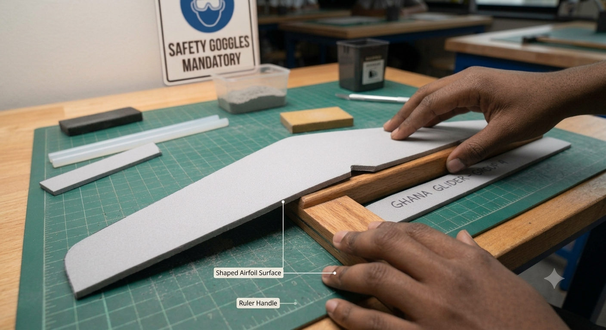
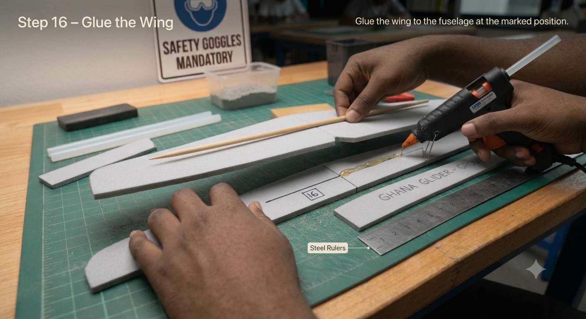
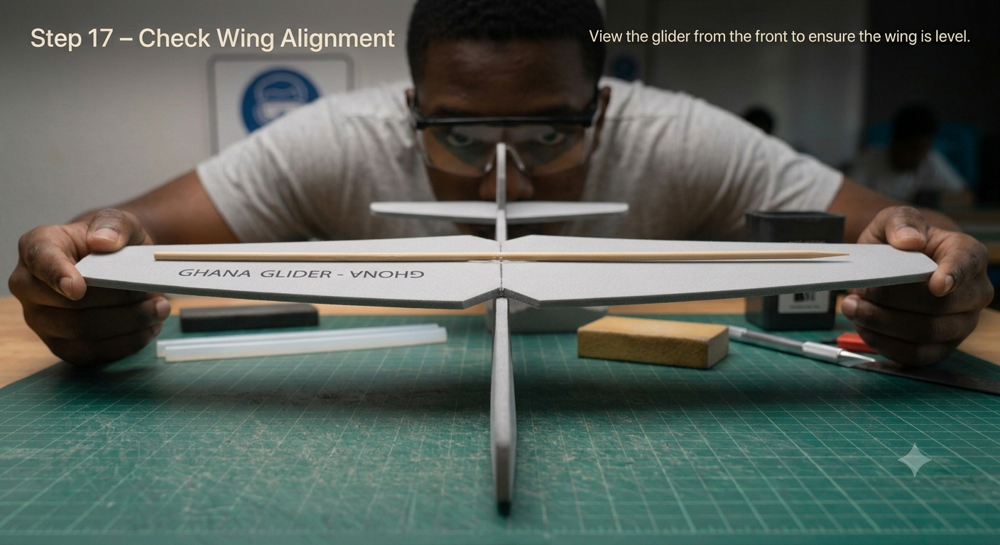
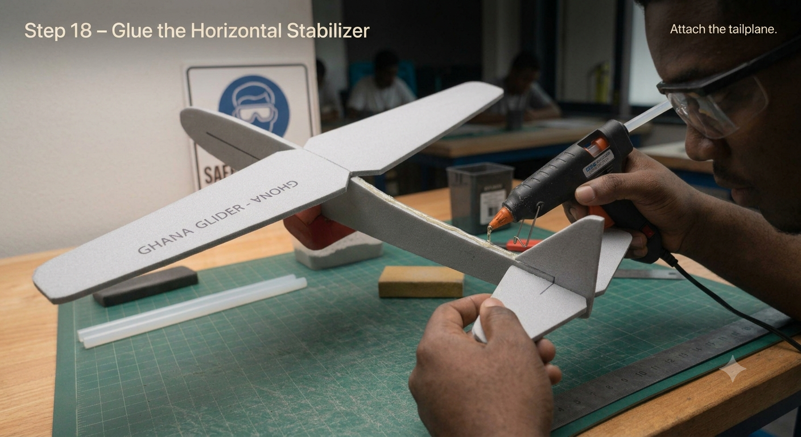

# 1.2.1 Foam Hand Launch Cutting And Assembly

## Overview

Building on the paper aircraft skills developed in Project 1, this project guides students through constructing a durable EVA foam hand-launch glider from scratch. Students learn to shape an airfoil, locate and adjust the centre of gravity, and trim the glider's control surfaces to achieve stable, straight flight — mirroring the workflow real aircraft engineers follow during initial test-flight programmes.

## Required Components

| **Item** | **Quantity** | **Source** |
| --- | --- | --- |
| EVA foam sheet (3 mm, A4) | 2 sheets | Kit 1 & 2 |
| Bamboo skewers | 5 | Kit 1 |
| Glue sticks (hot glue) | 3 | Kit 1 |
| Sandpaper (assorted grit) | 1 sheet | Kit 1 |
| Marker pen | 1 | Kit 1 |
| Steel ruler (30 cm) | 1 | Kit 1 |
| Craft knife with safety guard | 1 | Kit 1 |
| Cutting mat (A3) | 1 | Kit 1 |
| Masking tape | 1 roll | Kit 1 |
| Small coins or metal washers (weights) | 4–6 | Teacher-provided |

## Step-by-Step Assembly

**Lesson 1 – Cutting & Assembly**

### Step 1: Template Tracing

* Distribute foam sheets and printed templates to each group
* Using a marker pen and ruler, trace the following four parts onto foam:
* Main wing – wide shape with slight forward sweep
* Horizontal stabilizer – small wing for the tail
* Vertical stabilizer – the tail fin
* Fuselage – long rectangular body strip
* Label each traced piece with the group name before cutting

### Step 2: Cutting the Foam

* Use the craft knife and steel ruler on the cutting mat
* Cut slowly along traced lines; do not rush – foam tears if the knife is not sharp
* After cutting, use sandpaper to smooth all edges; aim for a clean, rounded leading edge on the wing
* Only blunt-edge cutting is permitted; no powered cutting tools
* Teacher or adult must be present during all cutting activities

### Step 3: Shaping & Assembling the Wing

* To create an airfoil, gently curve the wing by rolling it over a round object (e.g., a ruler handle)
* The upper surface should be slightly more curved than the lower surface
* Insert a bamboo skewer lengthwise through the wing centre as a spar for rigidity
* Trim skewer flush with the wing tips using scissors
* Glue the wing to the fuselage at the position marked on the template (approximately 40% from the nose)
* Hold firmly for 60 seconds while hot glue sets; check alignment before glue cools

### Step 4: Tail Assembly

* Apply a thin bead of hot glue along the bottom edge of the horizontal stabilizer
* Press onto the tail of the fuselage, centred left-to-right; hold for 60 seconds
* Glue the vertical stabilizer on top of the horizontal stabilizer, exactly centred
* Use a set square or right-angle card to check that the fin is perfectly vertical
* Allow glue to fully cure (5 minutes) before handling further

## Power & Safety
For safety instructions and power requirements, please refer to [Safety Notes](../../Getting%20Started/Safety_Notes.md).

