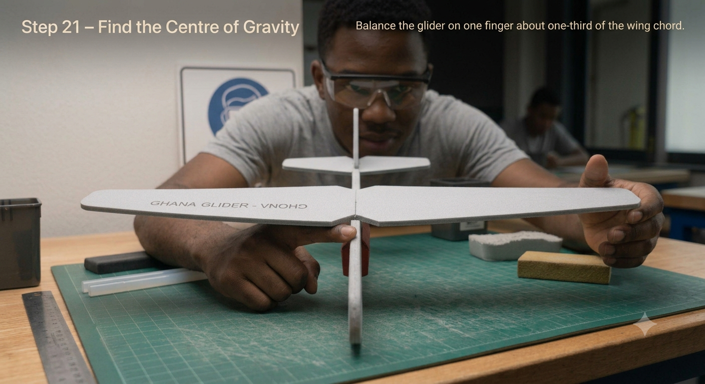
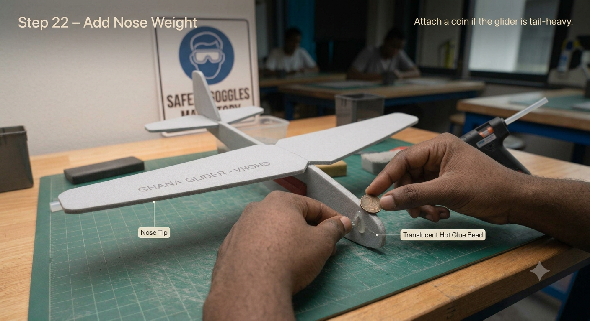
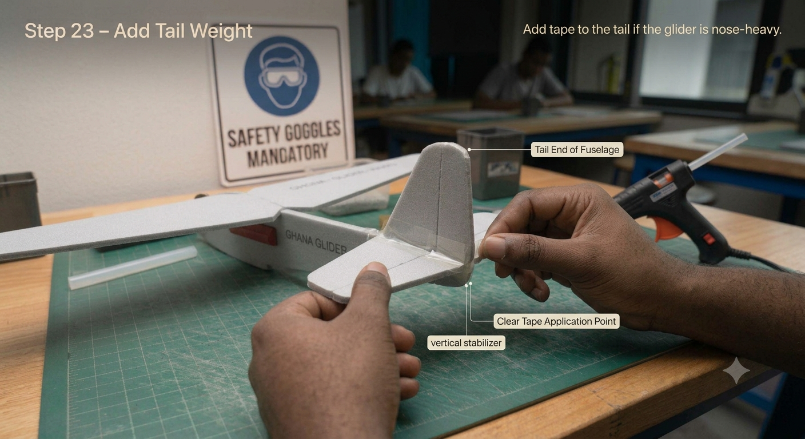
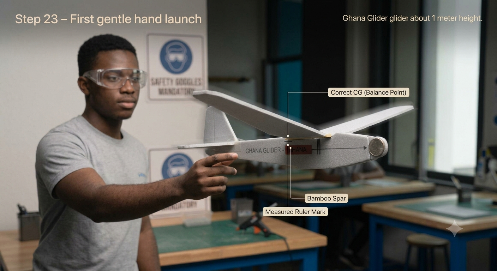

# 1.2.2 Foam Hand Launch Balancing And Trimming

## Step-by-Step Assembly (Continued)

**Lesson 2 – Balancing & Trimming**

### Step 5: Finding & Setting the Centre of Gravity (CG)

* Balance the completed glider on one fingertip placed under the wing
* The balance point (CG) should sit at approximately 1/3 of the wing chord from the leading edge
* If the nose drops (tail-heavy): add masking tape or a small coin to the nose until balanced
* If the tail drops (nose-heavy): add a small piece of tape to the tail, or trim foam from the nose area
* Mark the CG position on the fuselage with a marker dot for reference

### Step 6: Initial Glide Test
* Hold the glider at the fuselage, level, and release with a gentle forward push
* Launch at a slight downward angle (about 10 degrees below horizontal)
* Observe the flight path carefully:
* Nose dives immediately -> tail-heavy -> add nose weight or reduce tail weight
* Climbs then stalls -> nose-heavy -> add tail weight or reduce nose weight
* Turns left or right -> rudder or wing is misaligned -> see Step 7
* Repeat until the glider flies straight and level for at least 5 metres

### Step 7: Trimming the Control Surfaces

* Make only ONE small adjustment at a time; test fly after every change
* Elevator (trailing edge of horizontal stabilizer): bend up to pitch nose up; bend down to pitch nose down
* Rudder (trailing edge of vertical stabilizer): bend right to turn right; bend left to turn left
* Adjustments of 1–2 mm are sufficient – foam responds sensitively
* Record every adjustment and result in the Trim Log table (Section 6)
* Continue until the glider achieves straight, level flight with no corrections needed

