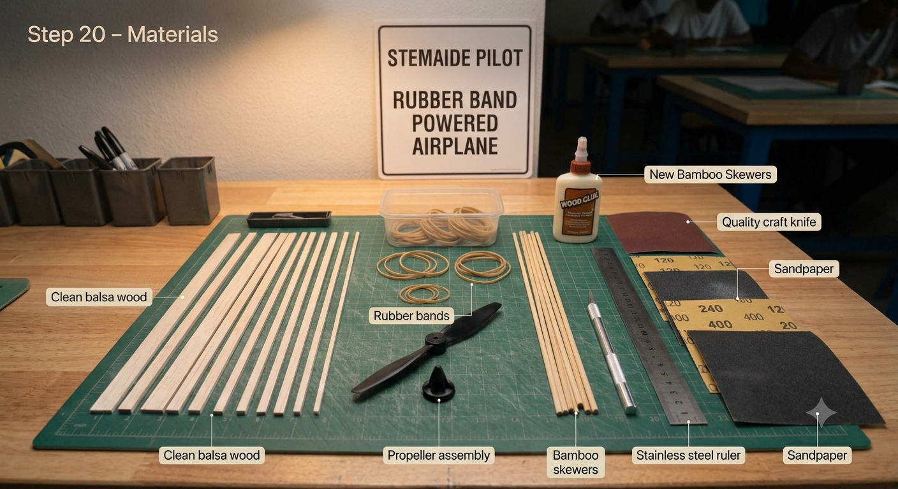
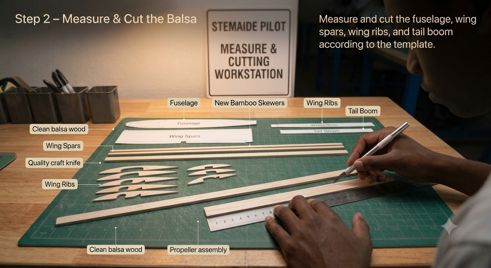
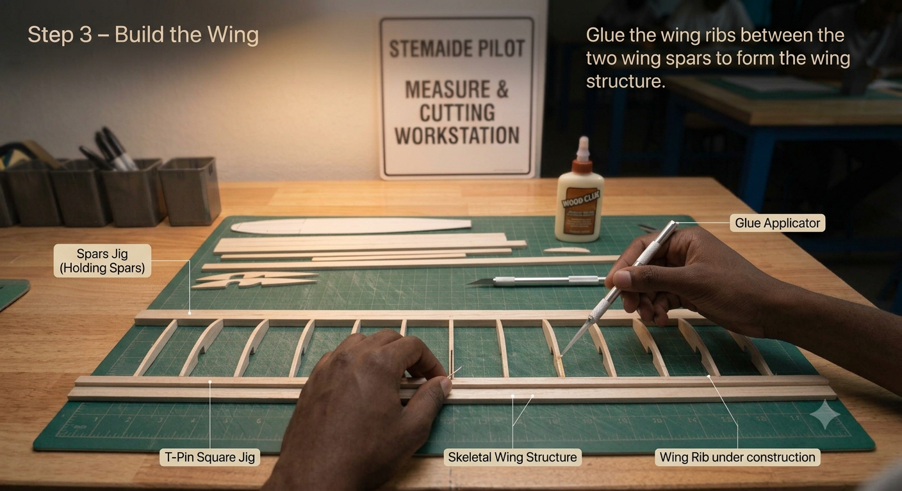
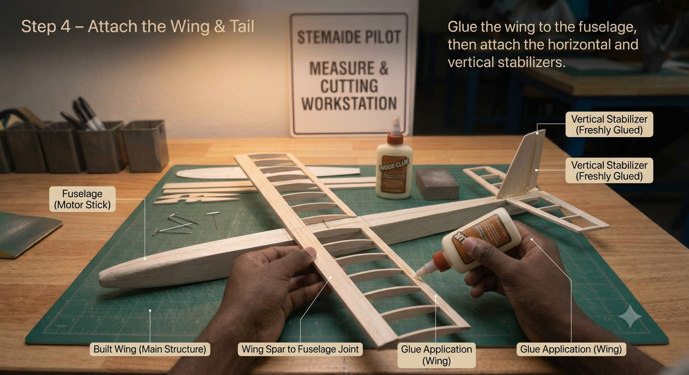
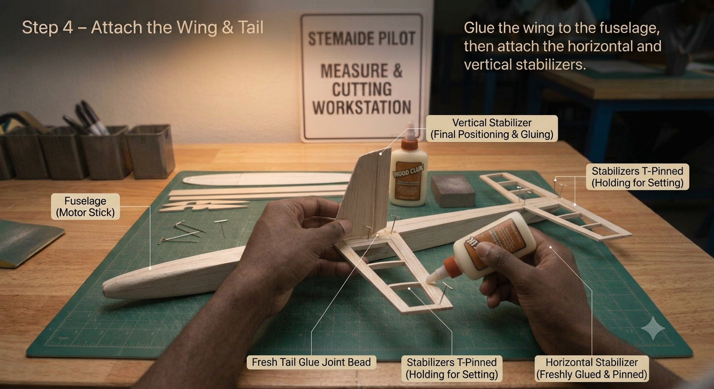

# 1.3.1 Rubber Band Powered Airframe Construction

## Overview

This project takes students from passive flight (gliding) to active propulsion. By constructing a balsa wood airframe and fitting it with a rubber-band powered propeller mechanism, students directly experience how stored elastic energy is converted into thrust — the same fundamental principle used in early aviation pioneers' aircraft. Through systematic wind-and-fly data collection, students discover the relationship between energy input and flight performance, including the phenomenon of diminishing returns.

## Required Components

| **Item** | **Quantity** | **Source** |
| --- | --- | --- |
| Balsa wood strips (3 mm × 3 mm) | 5 | Kit 1 |
| Bamboo skewers | 3 | Kit 1 |
| Rubber bands (thick, 10 cm) | 3 | Kit 1 |
| Small plastic propeller | 1 | Kit 5 |
| PVA wood glue | 1 bottle | Kit 1 |
| Sandpaper (assorted grit) | 1 sheet | Kit 1 |
| Scissors | 1 pair | Kit 1 |
| Steel ruler (30 cm) | 1 | Kit 1 |
| Craft knife | 1 | Kit 1 |
| Cutting mat (A3) | 1 | Kit 1 |
| Small hook screws (or bent paperclips) | 2 | Kit 1 |
| Small bead or metal washer (bearing) | 1 | Kit 1 |

## Step-by-Step Assembly

**Lesson 1 – Airframe Construction**

### Step 1: Cutting the Balsa Wood

* Measure and mark the following pieces on the balsa strips with a pencil:
* Fuselage: 30 cm (1 piece)
* Wing spars: 25 cm (2 pieces)
* Tail boom: 15 cm (1 piece)
* Wing ribs: 5 cm (4 pieces)
* Cut using the craft knife and steel ruler on the cutting mat; cut in a single smooth stroke
* Sand all cut ends smooth immediately after cutting

### Step 2: Wing Construction

* Lay the two 25 cm spars parallel on a flat surface, 3 cm apart
* Glue ribs perpendicular across the spars at equal intervals
* Apply PVA glue sparingly – excess glue adds unnecessary weight
* Place a heavy book on top while drying to keep the wing flat
* Allow to dry for a minimum of 20 minutes before handling
* Sand the leading edge to a gentle round profile; taper the trailing edge

### Step 3: Fuselage & Tail Assembly

* Glue the completed wing to the top of the fuselage, centred fore-to-aft at the 40% mark from the nose
* Glue the tail boom to the rear of the fuselage; check it is perfectly straight by sighting from the nose
* Glue the horizontal stabilizer to the end of the tail boom, centred
* Glue the vertical stabilizer on top of the horizontal stabilizer; use a right-angle card to ensure it is vertical
* Allow all joints to cure for at least 30 minutes

### Step 4: Final Sanding
* Sand all surfaces lightly with fine-grit sandpaper
* Round the wing leading edge – this creates the airfoil effect
* Taper the wing trailing edge to a thin, sharp line
* Wipe away all dust with a dry cloth before the next lesson

## Power & Safety
For safety instructions and power requirements, please refer to [Safety Notes](../../Getting%20Started/Safety_Notes.md).

