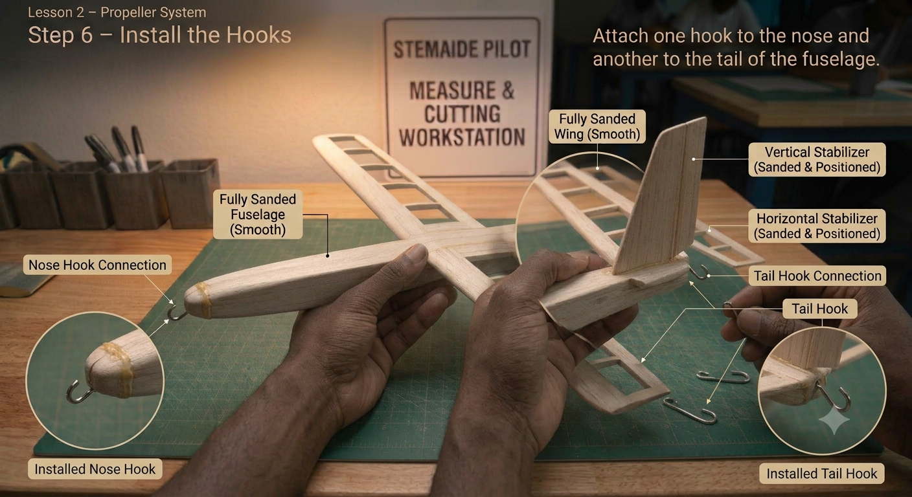
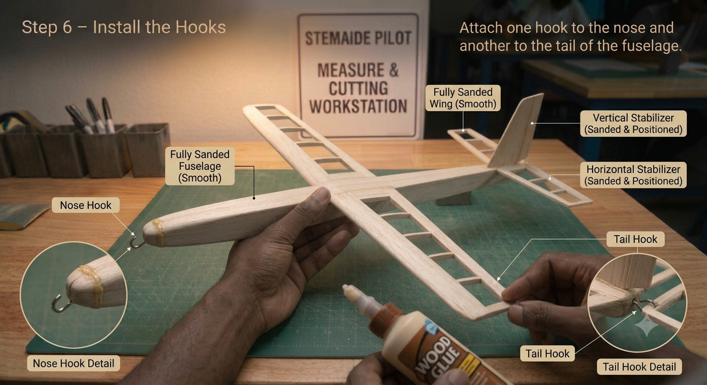
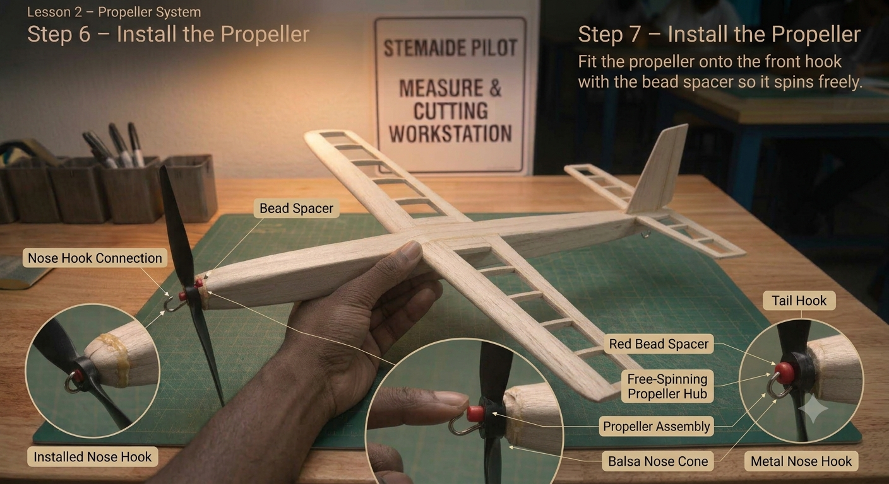
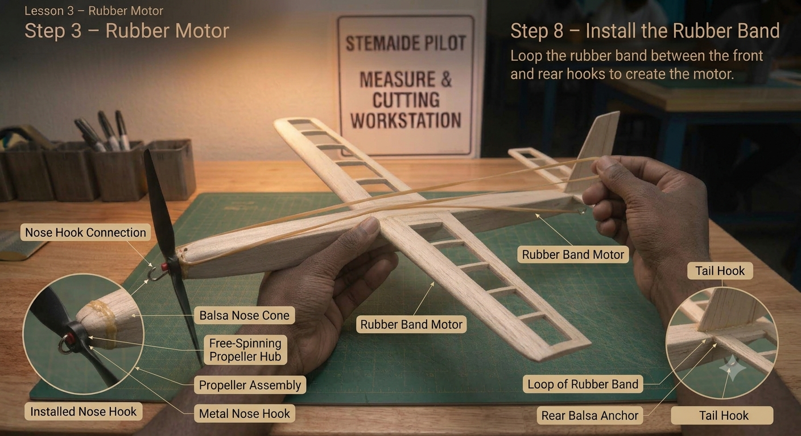

# 1.3.2 Rubber Band Powered Propeller Mechanism

## Step-by-Step Assembly (Continued)

**Lesson 2 – Propeller Mechanism**

### Step 5: Hook Installation

* Screw or press-fit a small hook into the nose of the fuselage
* Install a second identical hook at the tail end of the fuselage
* Ensure both hooks point in the same direction (upward) and are perfectly aligned front-to-back
* Test alignment by stretching a piece of thread between the two hooks – it should lie straight along the centreline

### Step 6: Propeller Attachment

* Slide the propeller hub onto the front hook
* Place the small bead or washer between the propeller hub and the fuselage nose as a bearing
* Spin the propeller by hand – it should rotate freely with minimal friction
* If it catches, add a second washer or sand the bearing contact surface lightly

### Step 7: Rubber-Band Motor Assembly

* Loop one thick rubber band between the front hook (through the propeller hub) and the rear hook
* The rubber band should be slightly under tension when the propeller is in the rest position
* Wind the propeller by hand in the correct direction (check which way it spins to pull air forward)
* Test with 10 winds; release and verify the propeller spins in the correct direction to generate thrust
* Do not exceed 20 test winds at this stage

