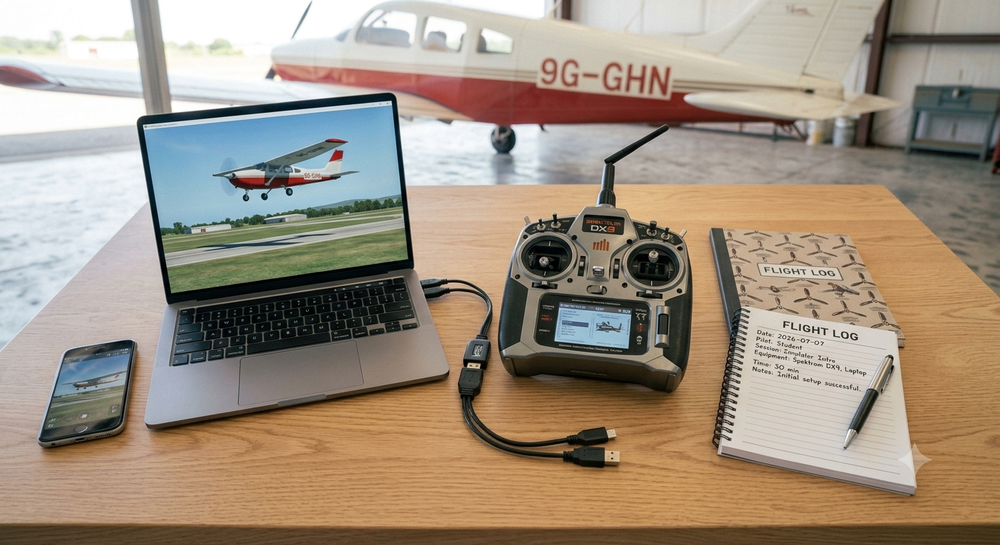
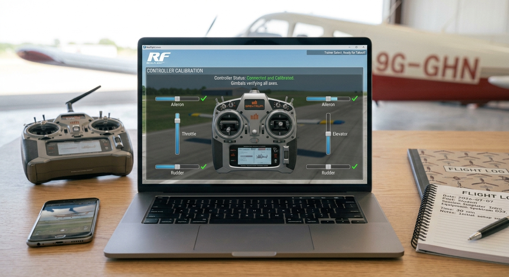
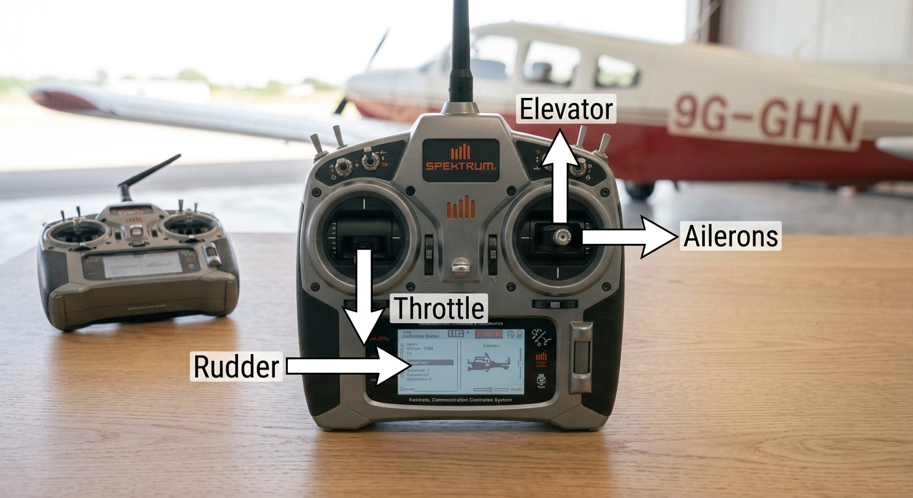
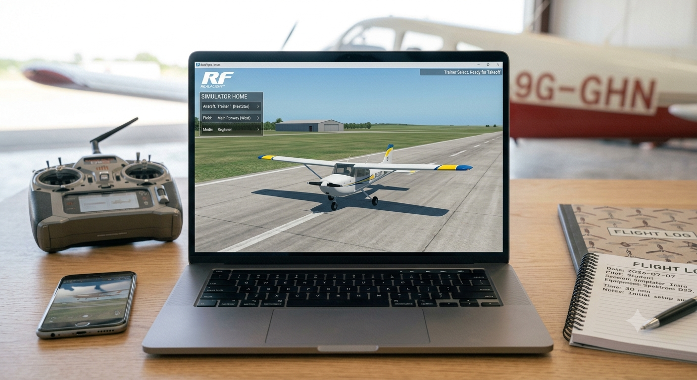

# 1.4.1 Rc Flight Simulator Installation And Control Familiarisation

## Overview

This project bridges physical aircraft construction and real aircraft operation by introducing students to Radio Control (RC) flight through a safe, risk-free simulator environment. Students learn to identify and operate the four primary flight controls, progress through five structured flight exercises, and build the hand-eye coordination and situational awareness required for future real RC or full-scale aircraft operations — all without the consequence of a real crash.

## Required Components

| **Item** | **Quantity** | **Source** |
| --- | --- | --- |
| RC transmitter (Mode 2, 4-channel) | 1 | Kit 10 |
| Computer or smartphone (school/student) | 1 | School / Student |
| RC flight simulator software (free) | 1 | Download – see Section 3 |
| USB trainer cable (if required) | 1 | Kit 10 |
| Flight log template (paper) | 1 | Appendix E / this manual |

| **Simulator Software – Recommended Options**  PicaSim (Android / iOS / Windows): Free download at pica-sim.com — excellent beginner trainer aircraft  DroneSim Pro (Android / iOS): Free version available — good for fixed-wing and multirotor  RealFlight Mobile (iOS / Android): Free basic version — most realistic physics engine  Offline option: Download the APK or installer in advance for use without internet access  USB trainer cable in Kit 10 allows the physical transmitter to control the simulator directly |
| --- |

## Setup Steps

**Lesson 1 – Installation & Control Familiarisation**

### Step 1: Install & Launch the Simulator

* Install the chosen simulator on the classroom computer, tablet, or student phone   (
* PicaSim
* (Free)
* RC Desk Pilot
* (Free)
* Multiplex MULTIflight
* )
* If using the USB trainer cable: connect the transmitter to the computer via the cable before launching
* Open the simulator and select a trainer aircraft (slow, stable, forgiving flight model)
* Choose a flat, open scenery with no obstacles for the first lesson

### Step 2: Calibrate the Controller

* Follow the on-screen calibration wizard to register the transmitter
* Move all sticks and switches through their full range when prompted
* After calibration, verify all four controls respond correctly on screen:
* Left stick up/down: throttle increases/decreases
* Left stick left/right: rudder deflects left/right
* Right stick up/down: elevator deflects up/down
* Right stick left/right: ailerons deflect left/right
* If any control is reversed, use the transmitter's reverse switch for that channel

### Step 3: Control Identification & Diagram

* Students draw an outline of the transmitter in their logbook
* Label all four controls with their name, stick location, and aircraft effect
* Refer to the Controls Reference Table in Section 5
* Note: Mode 2 is the international standard — left stick controls throttle and rudder; right stick controls aileron and elevator
* Confirm understanding with a partner before proceeding

### Step 4: First Virtual Flight – Orientation

* Set aircraft on the runway; apply 50% throttle slowly
* Allow aircraft to lift off; climb to approximately 10 m altitude
* Maintain straight and level flight for 30 seconds using only small stick inputs
* Reduce throttle and allow aircraft to descend gently back to the runway
* Do not worry about a perfect landing at this stage — focus on feel for the controls

## Power & Safety
For safety instructions and power requirements, please refer to [Safety Notes](../../Getting%20Started/Safety_Notes.md).

