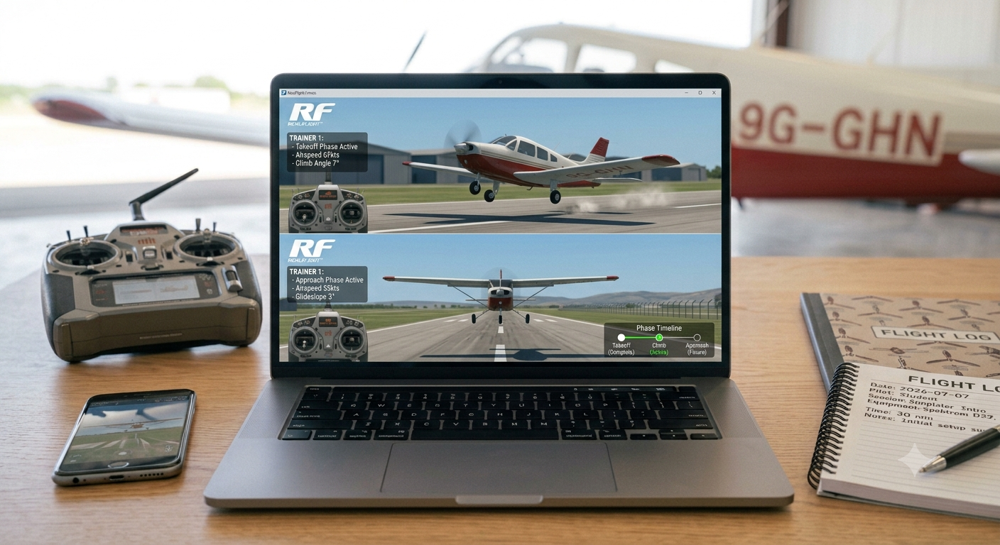
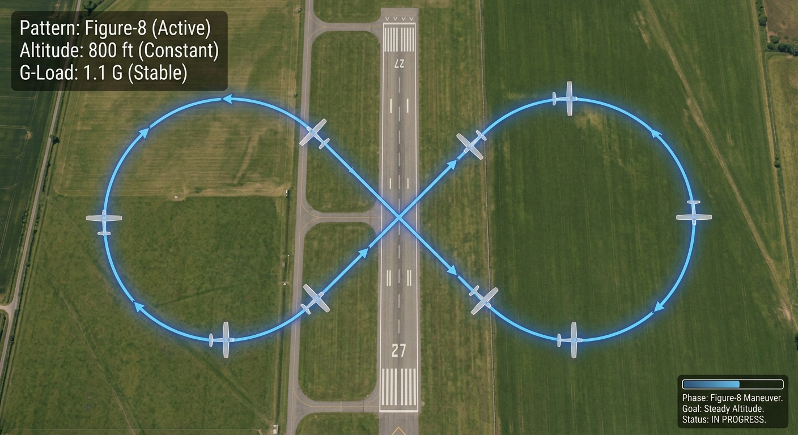
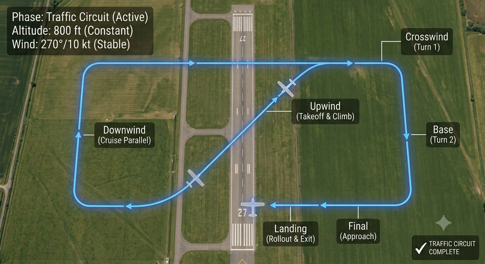
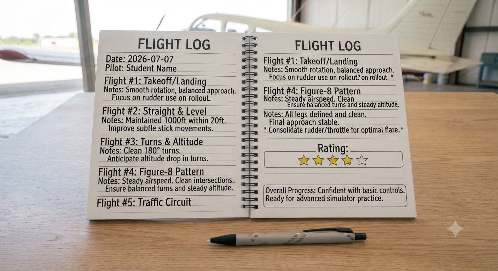

# 1.4.2 Rc Flight Simulator Five Structured Flights And Logbook

## Step-by-Step Assembly (Continued)

**Lesson 2 – Five Structured Flights & Logbook**

### Step 5: Flight 1 – Takeoff & Landing

* Apply throttle smoothly to 70%; allow aircraft to accelerate down runway
* Apply gentle up elevator as speed builds; rotate at approximately 40% of full speed
* Climb to 10 m; hold altitude; reduce throttle to cruise (~50%)
* Turn downwind; reduce throttle; descend on approach; flare and touch down
* Record outcome in flight log: tick if successful takeoff and landing completed

### Step 6: Flight 2 – Straight & Level Flight

* Take off normally; climb to 15 m
* Fly a straight heading for 30 seconds; make only small corrections
* Focus: Keep wings level using small aileron inputs; hold altitude with minimal elevator
* Land; record outcome and any tendency to drift or bank

### Step 7: Flight 3 – Gentle Turns
* Take off; climb to 20 m
* Apply right aileron to bank ~30°; simultaneously apply slight up elevator to maintain altitude in the turn
* Complete a 90° right turn; level the wings; fly straight for 5 seconds
* Repeat with a 90° left turn
* Key skill: Coordinated turn = aileron + elevator together; rudder only used to prevent adverse yaw
* Land; record outcome

### Step 8: Flight 4 – Figure-8 Pattern
* Take off; climb to 20 m
* Complete a 180° right turn; fly straight across the centre; complete a 180° left turn
* The aircraft should trace a figure-8 when viewed from above
* Challenge: Maintain constant altitude throughout both turns
* Land; record outcome; note which turn direction felt harder to control

### Step 9: Flight 5 – Full Traffic Circuit

* A traffic circuit is the standard rectangular flight pattern used at all aerodromes
* Legs: Takeoff (upwind) → Crosswind (90° turn) → Downwind (parallel to runway, opposite direction) → Base (90° turn) → Final (aligned with runway) → Land
* Fly each leg at a consistent altitude; aim for 90° turns at each corner
* Reduce throttle gradually on final approach; aim to touch down within 50 m of the runway threshold
* This is the same circuit pattern used by all pilots at Kotoka International Airport and every aerodrome in Ghana

### Step 10: Debrief & Logbook Completion

* Complete all entries in the flight log table (Section 6)
* Discuss as a group: Which flight was hardest? Why?
* Identify one specific area for improvement for each student
* Teacher signs off completed logbooks

