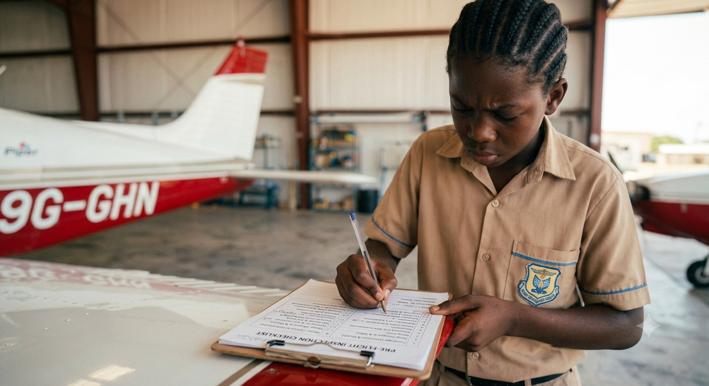
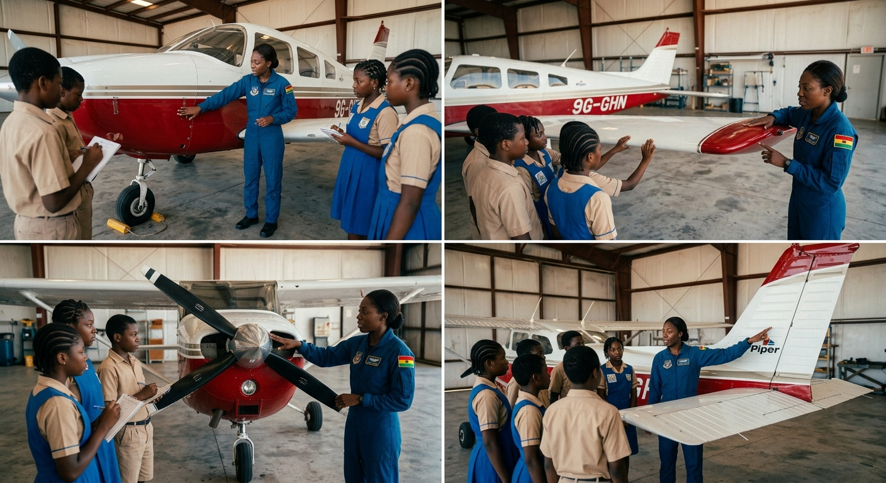

# 1.5.1 Pre Flight Safety Checklist Safety Theory And Checklist Creation

## Overview

This project instils the systematic safety discipline that underpins all aviation operations. Students learn why checklists are the single most important tool in an aviator's toolkit, master a 10-point pre-flight inspection procedure, and practice identifying real defects on a foam model aircraft. By the end of the project, every student will have personally signed off a completed inspection — the same act performed by every commercial, military, and private pilot before departure.

## Required Components

| **Item** | **Quantity** | **Source** |
| --- | --- | --- |
| Foam model aircraft (from Project 2 or pre-built) | 1 | Kit 1 & 2 |
| Laminated safety rules poster | 1 | Kit 1 |
| Clipboard | 1 | Kit 1 |
| Checklist template (paper) | 1 per student | Kit 1 / this manual |
| Marker pen | 1 | Kit 1 |
| Defects kit (tape, loose part, simulated crack, etc.) | 1 set | Kit 1 (teacher-prepared) |
| Laminating pouches (optional) | 1 per student | Teacher-provided |

## Step-by-Step Assembly

**Lesson 1 – Safety Theory & Checklist Creation**

### Step 1: Safety Poster Review
* Display the laminated safety poster at the front of the class
* Read each rule aloud as a class; discuss why each rule exists
* Key question for discussion: 'What could happen if a pilot skips the battery check?'
* Discuss real aviation incidents where checklist failures contributed to accidents
* Students write the 3 safety rules they consider most important in their logbook, with a reason for each

### Step 2: Learn the 10-Point Inspection

* Teacher introduces each of the 10 inspection points using the reference table below
* For each point, demonstrate what a GOOD item looks like and what a DEFECTIVE item looks like
* Students copy the 10-point sequence into their logbooks
* Key principle: always inspect in the SAME order every time — this prevents omissions
* Practice saying each point aloud; the class repeats it together (verbal reinforcement)

### Step 3: Create Your Own Checklist

* Each student creates their own pre-flight inspection checklist on paper
* Must include: all 10 inspection items, a tick/cross column, a notes column, and a sign-off block
* Use the template at the end of Section 6 as a guide, or design your own layout
* If laminating pouches are available, laminate the completed checklist so it can be reused with a whiteboard marker
* Teacher checks each checklist is complete before the student moves on

### Step 4: Simulated Walk-Around Practice

* Teacher demonstrates a full 10-point walk-around on the foam model, verbalising each step
* Students then perform their own walk-around in pairs
* One student inspects while the other follows the checklist and ticks off each point
* Swap roles and repeat
* Teacher circulates and corrects any missed steps or incorrect sequence

## Power & Safety
For safety instructions and power requirements, please refer to [Safety Notes](../../Getting%20Started/Safety_Notes.md).

