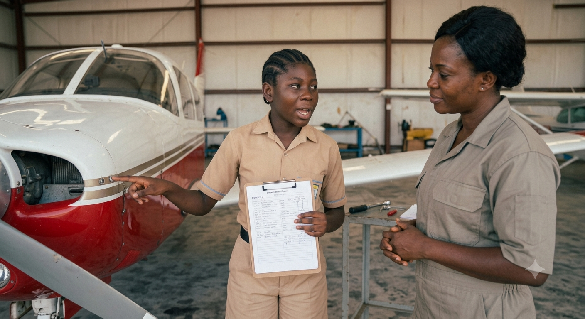
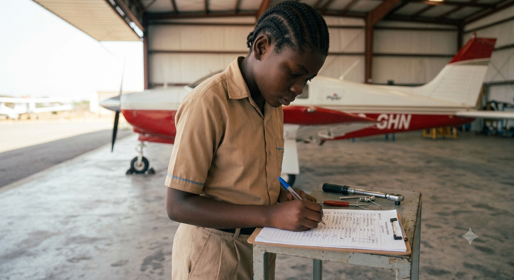
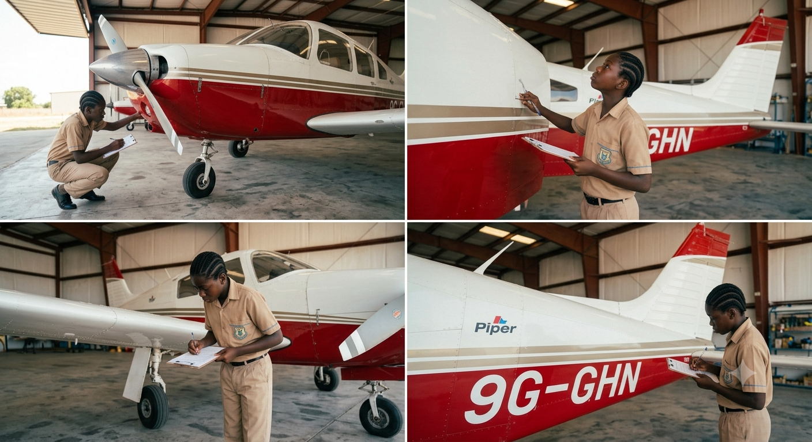
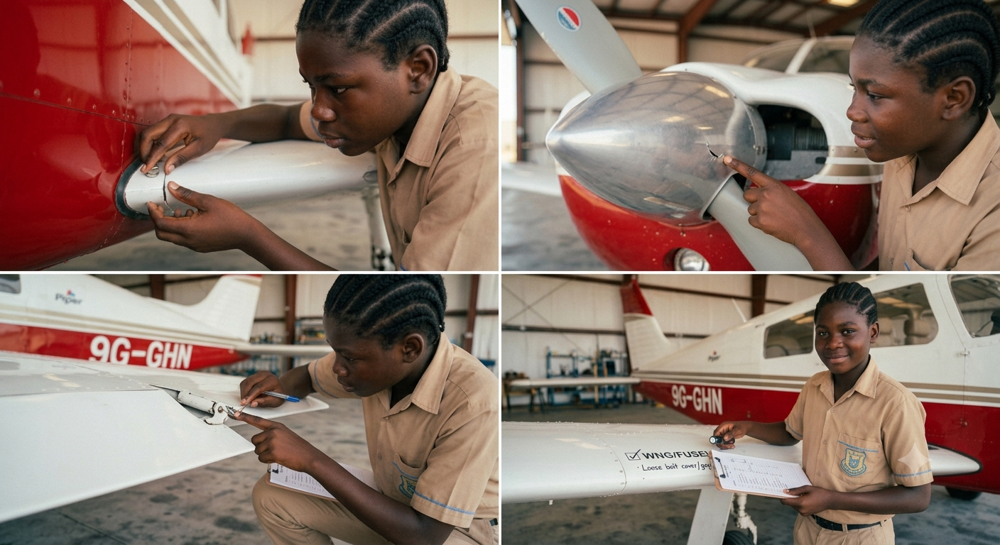
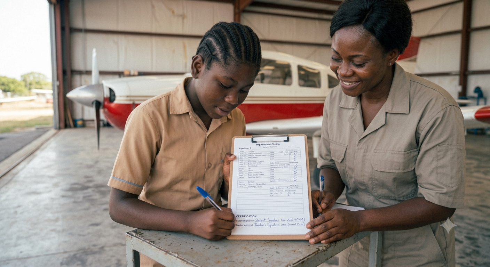

# 1.5.2 Pre Flight Safety Checklist Defect Detection Challenge And Sign Off

## Step-by-Step Assembly (Continued)

**Lesson 2 – Defect Detection Challenge & Sign-Off**

### Step 5: Defect Detection Challenge

* Before Lesson 2: Teacher hides 5–8 defects on the foam model aircraft
* Suggested defects: loose wing joint, partially detached control surface, covered propeller chip, hidden tape added as weight, bent tail fin, disconnected 'wire' (string), obstructed antenna
* Students perform a full 10-point walk-around using their checklist
* Record every defect found: location, nature, and recommended action
* Success criterion: 80% or more of hidden defects identified

### Step 6: Results Debrief & Comparison
* Groups compare their defect findings
* Class discussion: Which defects were hardest to find? Why?
* Teacher reveals all hidden defects; students score their results
* Discuss: In a real aircraft, which of these defects would prevent flight? Which are acceptable with monitoring?

### Step 7: Walk-Around Demonstration for Teacher

* Each student performs a solo walk-around verbally, naming each point without reading the checklist
* Teacher observes and evaluates using the assessment criteria in Section 10
* Student must correctly identify all 10 points in sequence without prompting
* This mirrors the verbal competency check required for real pilot licensing

### Step 8: Final Sign-Off

* Student completes a clean copy of the pre-flight checklist on the foam model
* All 10 items ticked; notes completed for any defects found
* Student signs and dates the checklist
* Teacher countersigns to confirm the inspection was witnessed
* Completed checklist is filed in the student's aviation logbook

