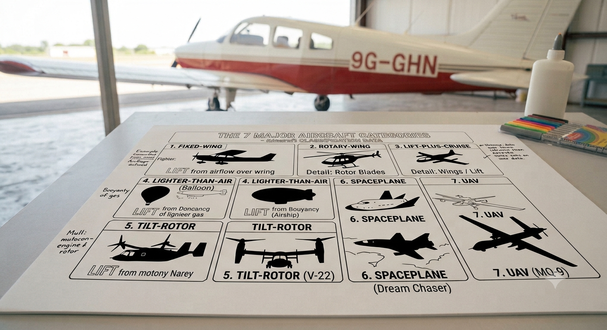
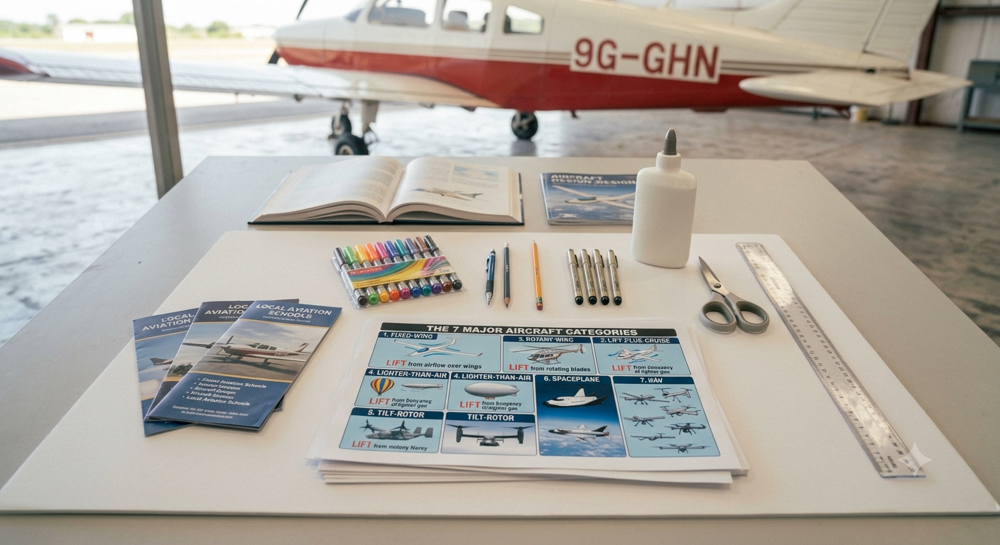

# 1.6.1 Aircraft Classification Research And Layout Planning

## Overview

This project develops students' aviation knowledge through research, visual communication, and presentation. Working in groups, students research the seven major categories of aircraft, create a large-format classification poster with labelled silhouettes and key facts, and deliver a short presentation to the class. A local Ghana and Africa context is woven throughout, connecting global aviation to what students can see and experience at Kotoka International Airport and beyond.

## Required Components

| **Item** | **Quantity** | **Source** |
| --- | --- | --- |
| A1 or A2 poster board (white) | 1 | Kit 1 |
| Marker pens (black + colour set) | 1 set | Kit 1 |
| Steel ruler (30 cm) | 1 | Kit 1 |
| Pencil | 1 | Kit 1 |
| Reference books / printouts (aircraft types) | Set | Kit 1 / Teacher-provided |
| Glue stick | 1 | Kit 1 |
| Scissors | 1 pair | Kit 1 |
| Printed aircraft silhouette templates (optional) | Set | Kit 1 |

## Step-by-Step Assembly

**Lesson 1 – Research & Layout Planning**

### Step 1: Introduce the Seven Categories

* Teacher introduces all 7 aircraft categories using the Classification Reference Table (Section 5)
* For each category, show one image or silhouette and ask: 'How does this generate lift?'
* Students copy the 7 categories and one example each into their logbooks
* Class discussion: 'Which of these have you seen in Ghana? Which would you most like to fly in?'

### Step 2: Assign Research Roles

* Divide each group of 4 into research roles:
* Researcher A: Fixed-wing aircraft + Rotary-wing (2 categories)
* Researcher B: Lighter-than-air + Powered lift (2 categories)
* Researcher C: Gliders & sailplanes + UAVs (2 categories)
* Researcher D: Spacecraft + Ghana / Africa context (1 category + local research)
* Each researcher must find: category definition, 2 examples with specifications, and 3 key facts

### Step 3: Research Phase
* Students use reference books, printed materials, or teacher-provided handouts
* Key information to record for each category:
* Definition: What makes this type of aircraft different from others?
* Examples: Name, country of origin, typical use
* Key fact 1: Speed, altitude, or payload capacity
* Key fact 2: Propulsion type (how it generates thrust)
* Key fact 3: A surprising or interesting fact
* Ghana researcher: Find 2 aircraft types currently operating from Kotoka International Airport

### Step 4: Poster Layout Planning

* Before touching the poster board, sketch a layout plan in pencil on A4 paper
* Recommended layout: 7 sections arranged in a grid (e.g. 3 across, 3 down, 1 spanning the bottom as a banner)
* Title banner at the top: 'AIRCRAFT CLASSIFICATION – [Group Name]'
* Each section: silhouette drawing, category name, 3 key facts
* Allocate a corner for the Ghana / Africa context
* Teacher reviews the plan before the group moves to the poster board

## Power & Safety
For safety instructions and power requirements, please refer to [Safety Notes](../../Getting%20Started/Safety_Notes.md).

