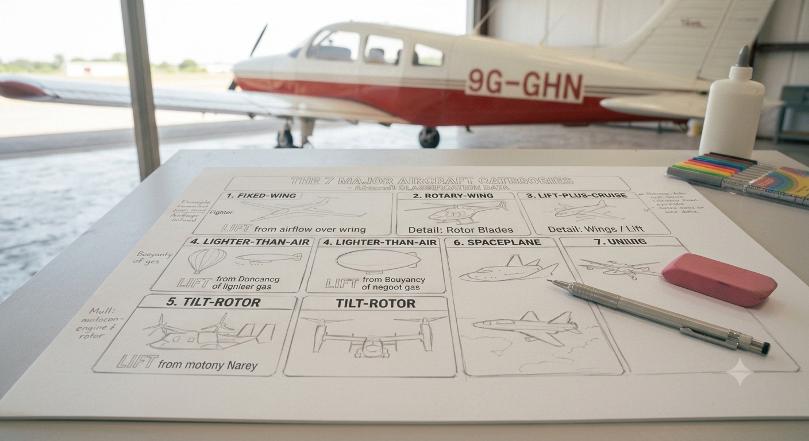
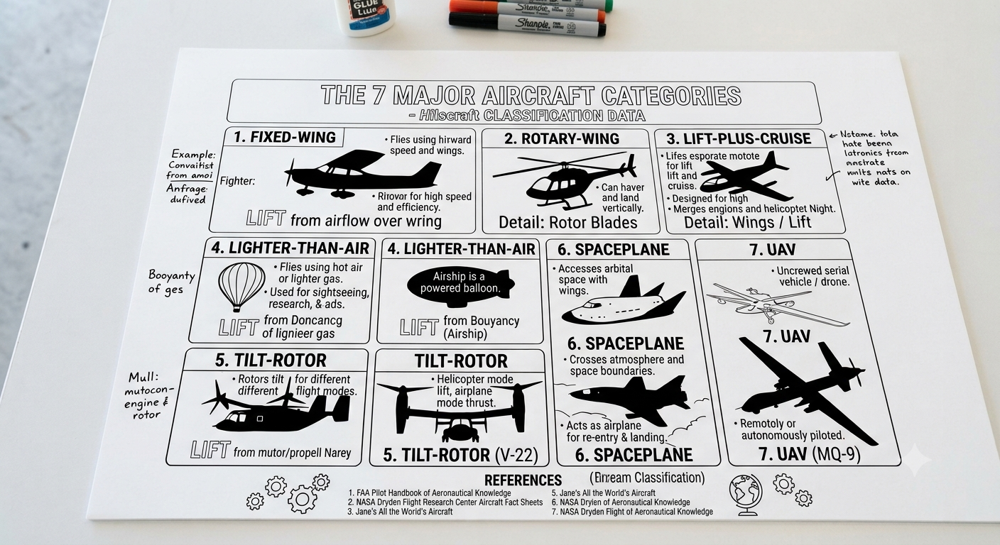

# 1.6.2 Aircraft Classification Poster Production And Presentation

## Step-by-Step Assembly (Continued)

**Lesson 2 – Poster Production & Presentation**

### Step 5: Create the Silhouettes

* Students draw or trace a recognisable silhouette for each aircraft category
* Use pencil first; go over with black marker only when satisfied with the shape
* Silhouettes should be large enough to fill the allocated section (minimum 10 cm wingspan)
* Label each silhouette with the aircraft name below it
* Optional: use the printed silhouette templates from Kit 1 as a guide

### Step 6: Add Key Facts & Colour
* Write 3 key facts per category in neat, legible text
* Use colour to differentiate categories — assign one colour per category
* Colour the silhouette outline or background box in the category colour
* Add the Ghana / Africa context in a clearly labelled box or banner
* Final check: all 7 categories present; all sections have a silhouette, category name, and 3 facts

### Step 7: Peer Review

* Exchange posters with another group
* Reviewing group checks: all 7 categories present; silhouettes recognisable; facts accurate
* Write 2 strengths and 1 improvement suggestion on a sticky note; attach to the poster
* Return posters; groups review the feedback before presenting

### Step 8: Group Presentation
* Each group presents their poster to the class (5–7 minutes per group)
* Each group member must speak for at least 30 seconds
* Suggested structure: introduce your category → show silhouette → state 3 key facts → connect to Ghana
* Class asks one question per group after each presentation
* Teacher scores using the rubric in Section 6

