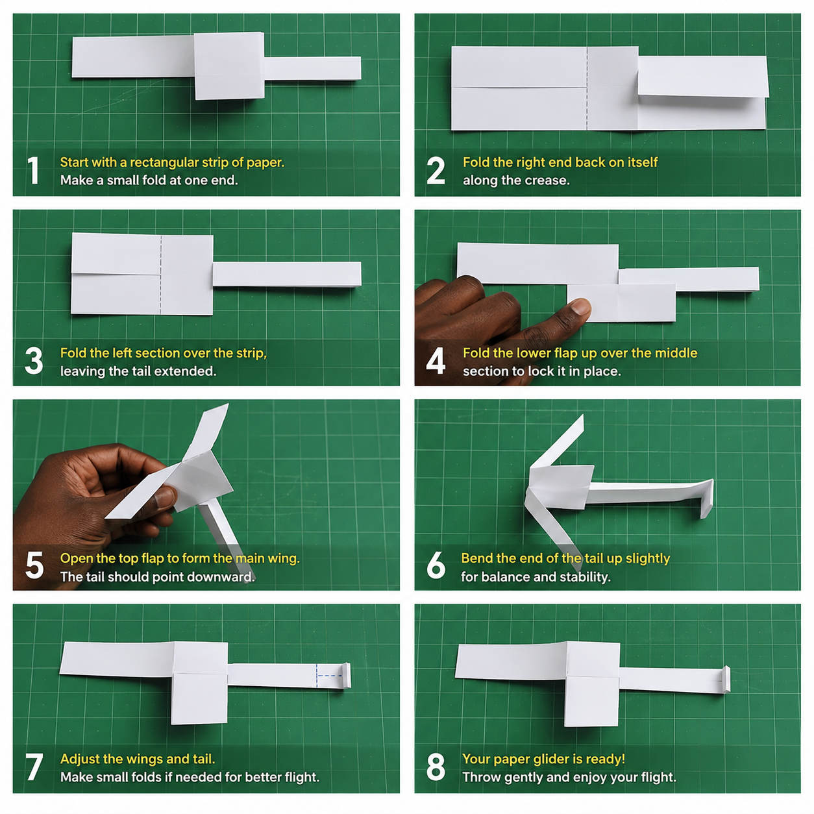
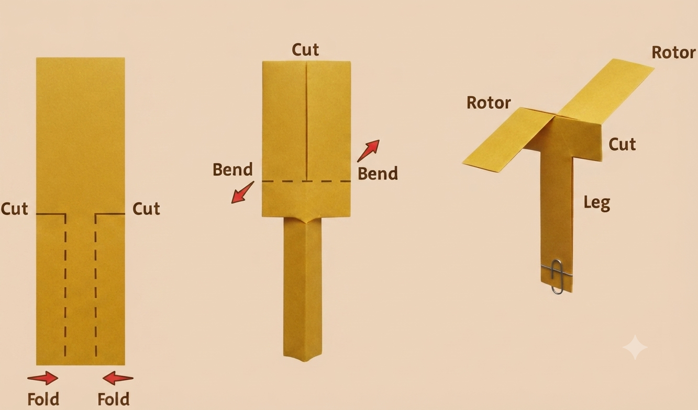

# 1.9.1 Paper Helicopter Template And First Builds

## Overview

This project introduces students to rotary-wing aerodynamics through one of the simplest experiments in aviation education. By building and dropping paper helicopters with different rotor configurations, students directly observe how rotor length, width, and symmetry affect descent rate, rotation speed, and stability — the same variables helicopter engineers balance when designing rotor blades.

## Required Components

| **Item** | **Quantity** | **Source** |
| --- | --- | --- |
| **A4 paper** | 10 sheets | Kit 1 |
| **Scissors** | 1 pair | Kit 1 |
| **Ruler (30 cm)** | 1 | Kit 1 |
| **Paper clips (small)** | 5 | Kit 1 |
| **Stopwatch** | 1 | School |
| **Measuring tape (for drop height)** | 1 | Kit 1 |

## Step-by-Step Assembly

**Lesson 1 – Template & First Builds**

### Step 1: Template Creation
* Cut paper into strips: 2 cm × 15 cm (one strip per helicopter)
* Fold each strip in half lengthwise; crease firmly
* Cut a slit 5 cm from the bottom, along the centre fold

### Step 2: Rotor Blade Formation
* Fold the top 5 cm in opposite directions to form two rotor blades — one toward you, one away
* Fold the bottom 2 cm upward to create a weight pocket
* Insert one paper clip into the bottom fold
* Hold at arm's length and drop — it should spin as it falls

### Step 3: Build Five Variable Designs

* Design 1 – Long Rotors: 6 cm rotor length
* Design 2 – Short Rotors: 3 cm rotor length
* Design 3 – Asymmetric: one rotor 6 cm, one rotor 3 cm
* Design 4 – Wide Rotors: rotor width 1.5 cm (cut wider strip)
* Design 5 – Narrow Rotors: rotor width 0.5 cm (cut narrower strip)
* Label each helicopter with its design name before testing

## Power & Safety
For safety instructions and power requirements, please refer to [Safety Notes](../../Getting%20Started/Safety_Notes.md).

