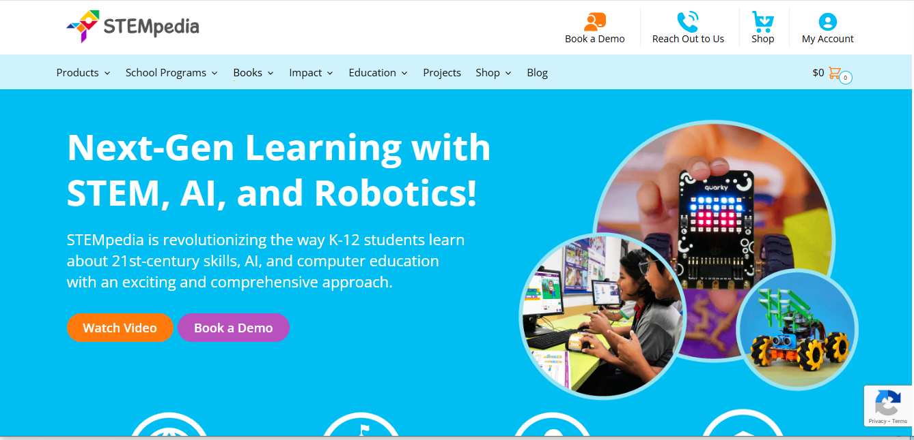
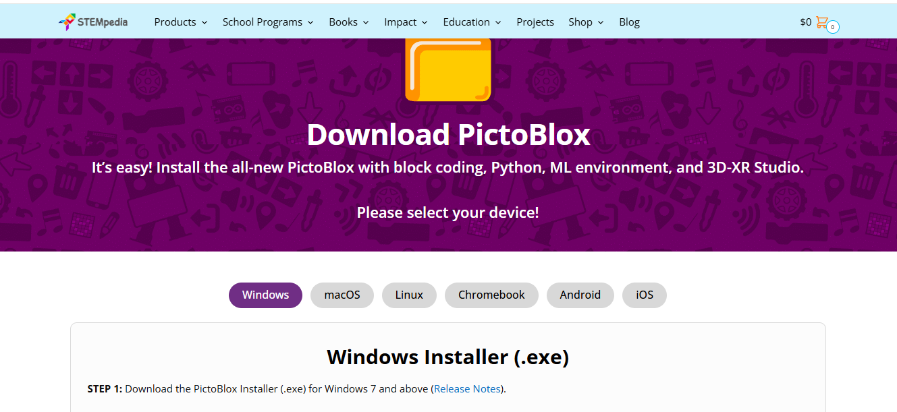
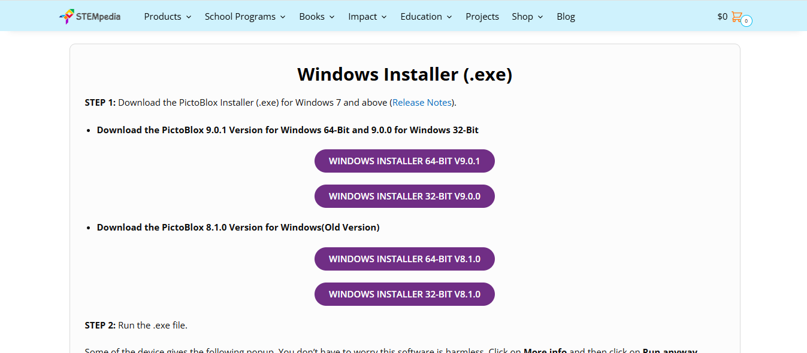
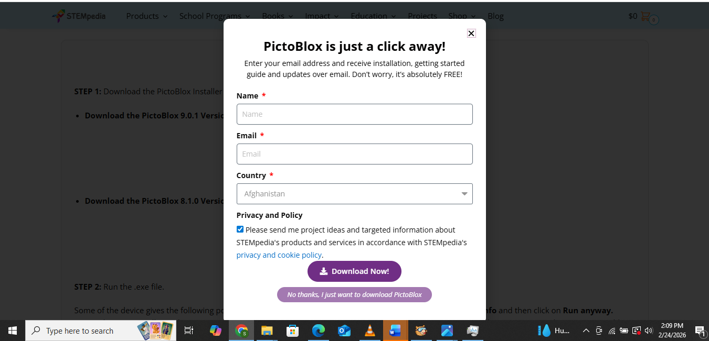

# 1.1 Downloading PictoBlox

**1.** Open your preferred web browser (Chrome, Microsoft Edge, or Firefox).

**2.** Go to the official STEMpedia website by typing [**https://thestempedia.com**](https://thestempedia.com) into your address bar and pressing **Enter**.

**3.** Navigate to **Products** in the top menu and select **PictoBlox**.

*(Alternatively, you can search Google for “Download PictoBlox official website” and click the link from STEMpedia).*

**4.** Click **Download** on the PictoBlox page. Choose your operating system (Windows, macOS, or Linux).

**5.** Select the appropriate version for your computer:
- Choose the **64-bit version** if you are using a modern, high-performance computer.
- Choose the **32-bit version** if you are using an older or lower-spec device.

**6.** If a popup appears, select **Just download** to proceed.

