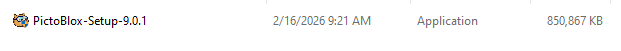
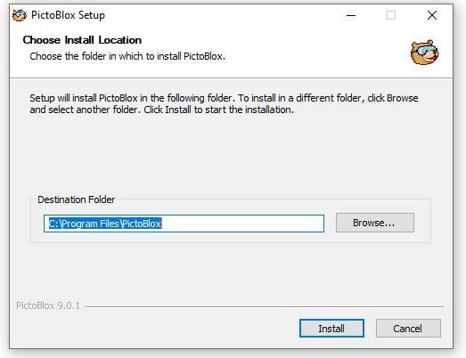

# 1.2 Running The Installer

## For Windows Users

**1.** Open the downloaded `.exe` file.

**2.** Click **Yes** if asked by Windows User Account Control.

**3.** Follow the on-screen instructions: Click **Next** → **Install** → **Finish**.

## For Mac Users

**1.** Open the downloaded `.dmg` file.

**2.** Drag the **PictoBlox** icon into your **Applications** folder.

## Launching PictoBlox

**1.** Open PictoBlox from your desktop or Applications folder. You are now ready to start coding!
