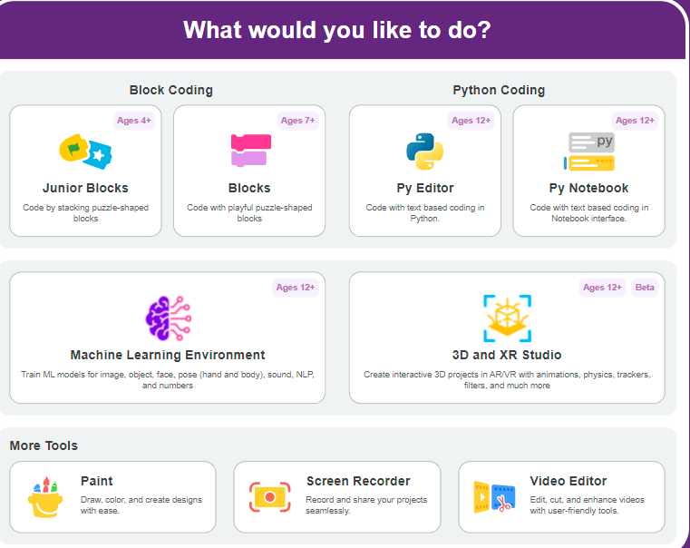
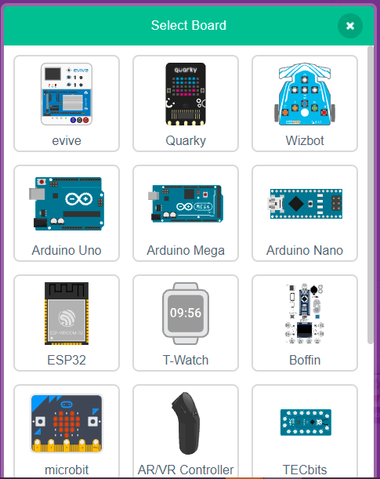
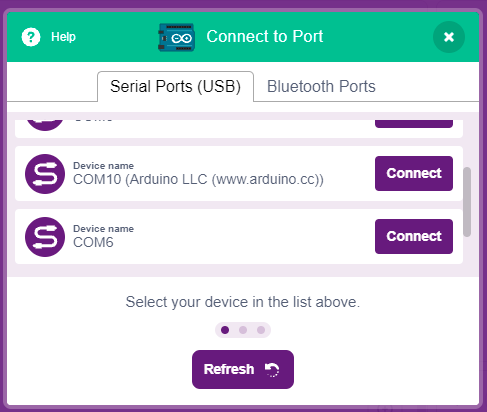
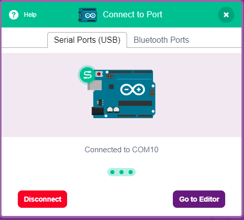
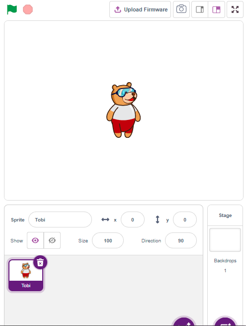
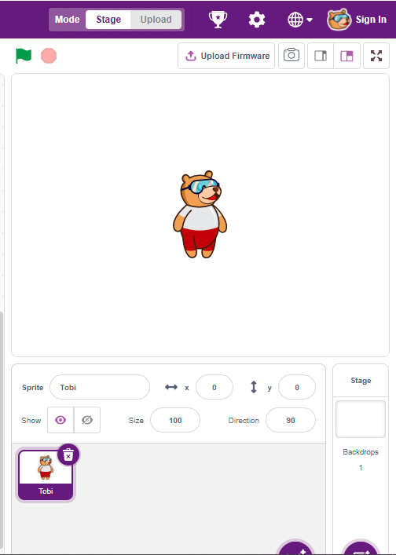
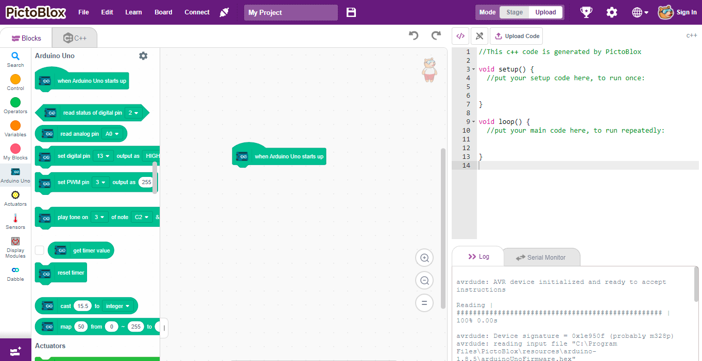

# 2.1 Connecting to PictoBlox

Before opening the software, make sure your hardware is wired correctly.

## 1. Connect Arduino to Computer

Use a USB cable to connect your **Arduino Uno** to your PC. This cable will power the board and allow you to upload code.

## 2. Open and Set Up PictoBlox

**1.** Launch **PictoBlox** and select the **BLOCKS** environment.

**2.** Click **Board** in the top menu and select **Arduino Uno**.

**3.** Click **Connect** and choose the correct **COM Port** for your Arduino Uno.

You should now see that the board is successfully connected, indicated by the status showing **"Connected"**.

## 3. Upload the Firmware

**1.** Click the **Upload Firmware** button.

**2.** Select **Upload Mode** (Upload Mode means the code will be saved directly onto the Arduino).

When connected successfully, you will see a confirmation message!

