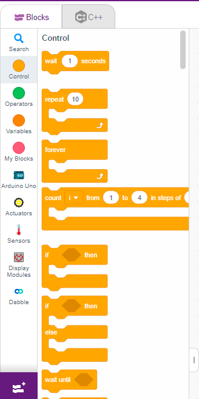
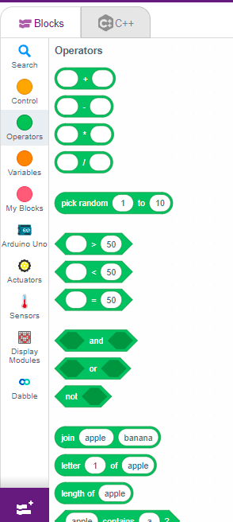
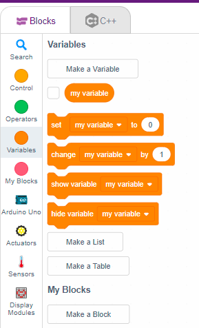
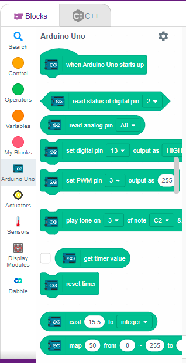
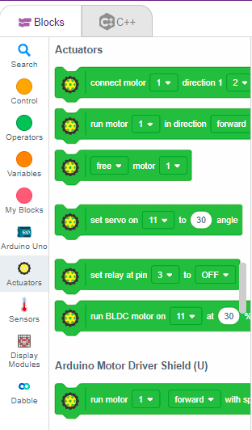
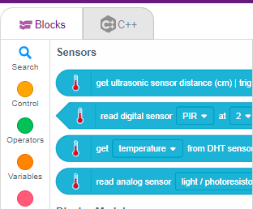
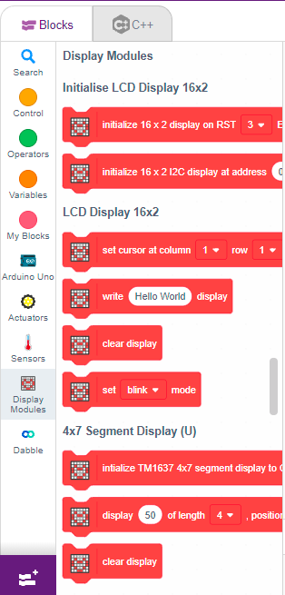
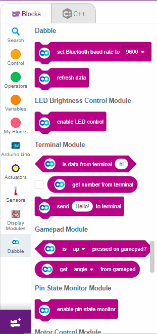

# 2.2 Understanding Block Categories

Before we start building complex programs, it's important to understand the different block categories in PictoBlox and what they do.

## 🟡 Control
**What It Does:** Controls the **flow of your program** — when things happen and how many times they repeat.
**Common Blocks:**
- **Wait ( ) seconds** → pauses the program
- **Repeat ( )** → runs blocks multiple times
- **Forever** → keeps running continuously
- **If / If-Else** → makes decisions

*Think of it as the **brain that controls timing and decisions**.*

## 🟢 Operators
**What It Does:** Performs **math and logic calculations**.
**Examples:**
- `+`, `-`, `*`, `/`
- Greater than (`>`), Less than (`<`), Equals (`=`)
- `AND` / `OR`

*Think of it as the **calculator of your program**.*

## 🟠 Variables
**What It Does:** Stores information (like a container) such as Speed, Distance, Score, or Sensor values.
*Think of it as the **memory box**.*

## 🔴 My Blocks
**What It Does:** Lets you create your **own custom block**. Instead of repeating the same code many times, you create one block and reuse it.
*Think of it as **creating your own shortcut button**.*

## 🔵 Arduino Uno
**What It Contains:** Digital Write, Analog Read, PWM control, Pin mode settings. This lets you directly control pins like turning an LED on or reading a button input.
*Think of it as **direct hardware control**.*

## 🟣 Actuators
**What It Does:** Controls output devices (things that move or act) like Motors, Servos, Buzzers, and LEDs.
*Think of it as the **muscles of your robot**.*

## 🟢 Sensors
**What It Does:** Reads information from the environment using Ultrasonic sensors, IR sensors, Light sensors, etc.
*Think of it as the **eyes and ears of your robot**.*

## 🟣 Display Modules
**What It Does:** Shows information visually on an LCD display, OLED display, or LED matrix.
*Think of it as the **robot’s screen**.*

## 🔵 Dabble
**What It Does:** Allows you to control Arduino using a **mobile phone app** via Bluetooth.
*Think of it as **wireless control from your phone**.*

