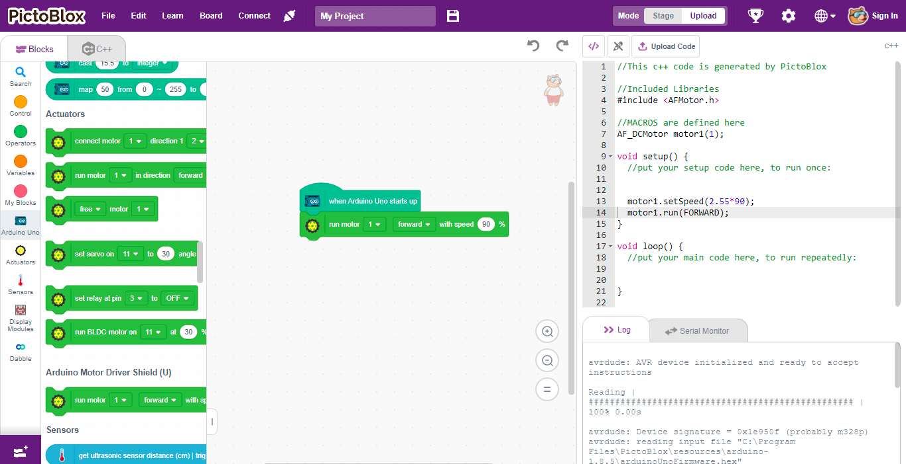
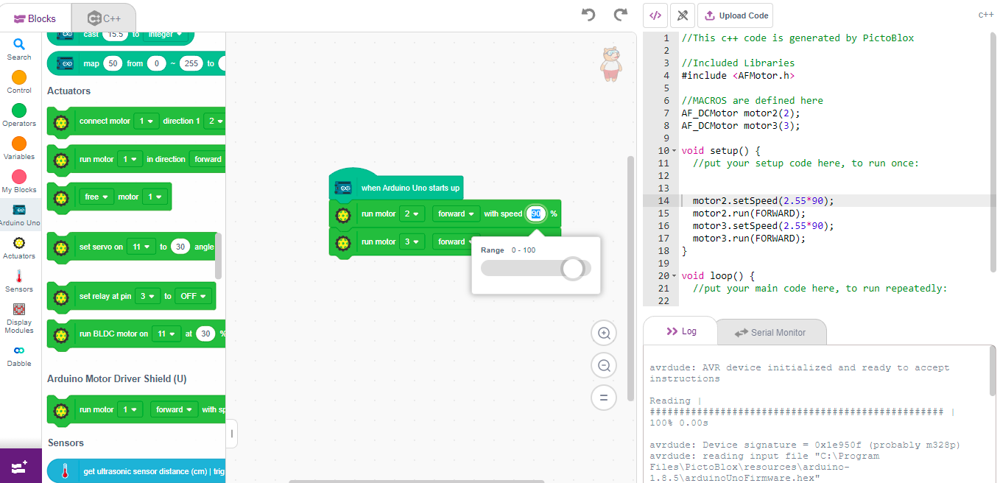
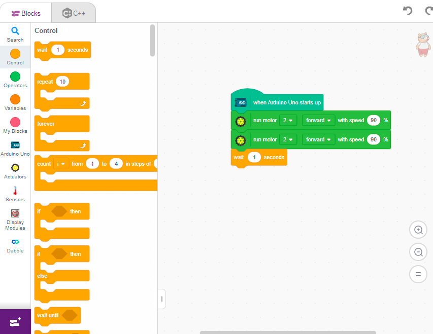
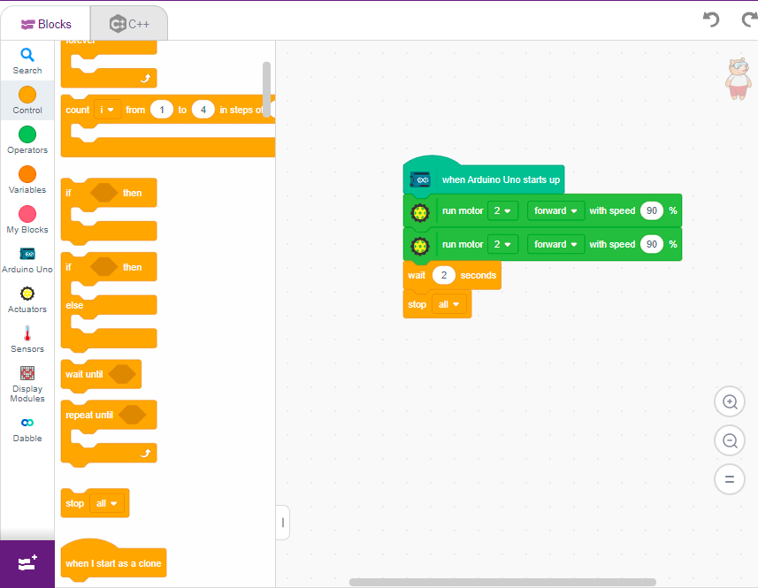
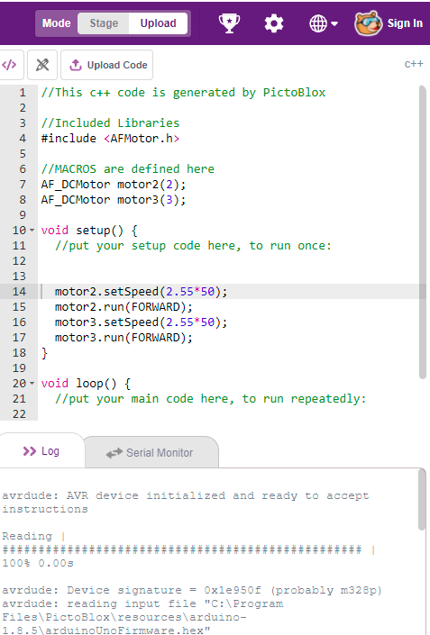
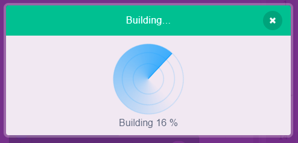

# 2.3 Basic Movement: Forward

Let's write our first program to make the robot move forward.

## Step 1: Start the Program

**1.** Drag the block **"when Arduino Uno starts up"**. This means the robot will start moving immediately after power is supplied.

**2.** Inside it, add the **Run Motors** block from the Actuators category.

**3.** Configure the block:
- **Left Motor (2)** → Forward
- **Right Motor (3)** → Forward
- **Speed** → 100%

This tells both wheels to rotate forward at the same speed, making the robot move straight.

## Step 2: Add Duration & Stop

**1.** To make it move for a specific time, add **Wait 2 seconds** from the Control category.

**2.** Then add **Stop Motors** from the Actuators category.

## Step 3: Upload and Test

**1.** Click **Upload**, wait for completion, and power the robot.

> [!TIP]
> **Troubleshooting:** If the robot turns instead of moving straight, one of your motors may be wired in reverse. Simply change that motor's direction to **Backward** in the Run Motors block to correct it!
