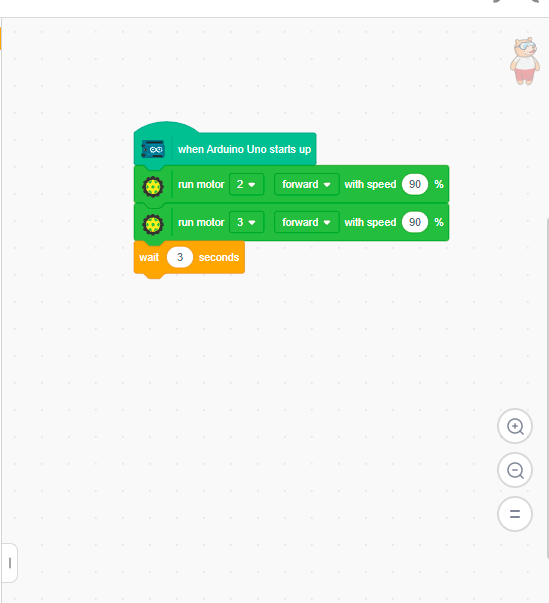
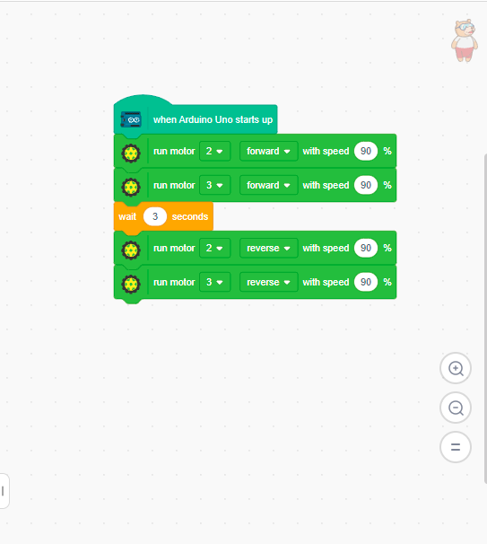
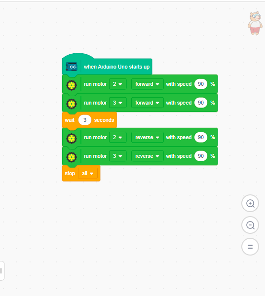

# 2.5 Forward and Backward

Now let's create a program that moves the robot forward for 3 seconds, then reverses backward for 3 seconds.

## Step 1: Start Block
Drag the **When Arduino Starts Up** block.

## Step 2: Move Forward
**1.** From Actuators, add **Run Motors**:
- Set Left Motor (2) and Right Motor (3) to **90%** speed.
- Direction: **Forward**.

**2.** Add **Wait 3 seconds**. The robot will move forward for 3 seconds.

## Step 3: Move Backward
**1.** Add another **Run Motors** block:
- Set Left Motor (2) and Right Motor (3) to **90%** speed.
- Direction: **Backward**.

**2.** Add **Wait 3 seconds**.

## Step 4: Stop Motors
Finally, add **Stop Motors** so the robot stops after moving backward.

## Step 5: Upload
Click **Upload**, wait for confirmation, and power the robot. It will move forward 3 seconds, reverse for 3 seconds, and then stop!
