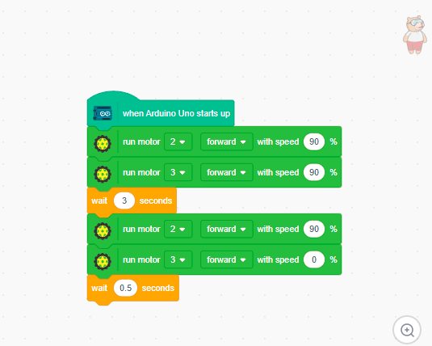
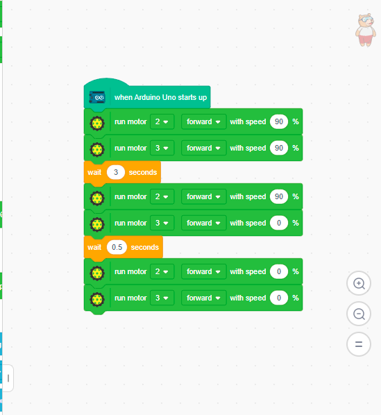

# 2.6 Turning Logic

There are two primary ways to make your ROVER turn: a **Clean Turn (Pivot)** and a **Sharp Turn (Spin)**.

## Method 1: Clean Turn (Smooth 90° Pivot)

To turn left cleanly, we stop the left wheel and drive the right wheel forward.

**1.** Add a **Run Motors** block:
- Left Motor → **0%** (Stop)
- Right Motor → **100%**
- Direction → **Forward**

**2.** Add **Wait 0.5 - 1 second** (depending on your robot's speed and battery). This causes the robot to pivot left using only the right wheel.

## Method 2: Sharp Turn (Spin in Place)

If you want a sharper, tighter turn, you can spin the wheels in opposite directions.

**1.** Add a **Run Motors** block:
- Left Motor → **100% Backward**
- Right Motor → **100% Forward**

**2.** Add **Wait 0.5 - 0.8 seconds**. This makes the robot spin aggressively in place.

## Stop After Turning

Always add a **Stop Motors** block after your turn if you want the robot to halt.

> [!TIP]
> **Tuning Your Turns:**
> - If it turns too much → reduce the wait time.
> - If it turns too little → increase the wait time.
> Turn angles depend heavily on your motor speed, wheel size, and current battery voltage!
