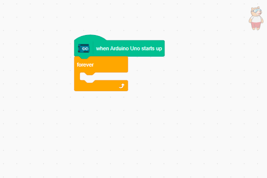
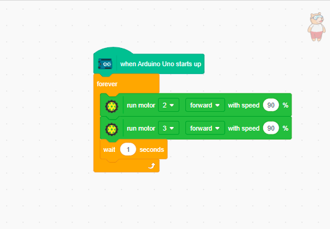
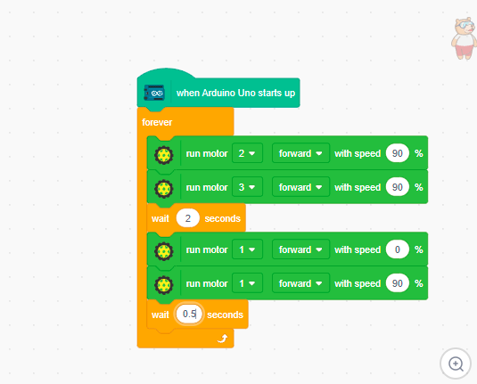

# 2.7 Continuous Movement Loop

Let's combine movement and turning into a continuous loop! We will program the robot to move forward, turn right, and repeat forever.

## Step 1: Start and Forever Loop
**1.** Drag **When Arduino Starts Up**.
**2.** From Control, attach a **Forever** loop. Everything inside this loop will repeat continuously.

## Step 2: Add Forward Movement
Inside the Forever block:
**1.** Add **Run Motors** (Both to **100% Forward**).
**2.** Add **Wait 2 seconds**.

## Step 3: Add Right Turn
After the 2-second wait (still inside Forever):
**1.** Add **Run Motors**:
- Left Motor → **100% Forward**
- Right Motor → **0% Forward** (Stopped)
**2.** Add **Wait 0.5 seconds** (Adjust between 0.5 – 1.0s for a perfect 90-degree turn).

## What Will Happen?
The robot will move forward, turn right, move forward, turn right, and repeat endlessly! If you adjust the turn timing perfectly to 90 degrees, it will drive in a continuous square shape.
