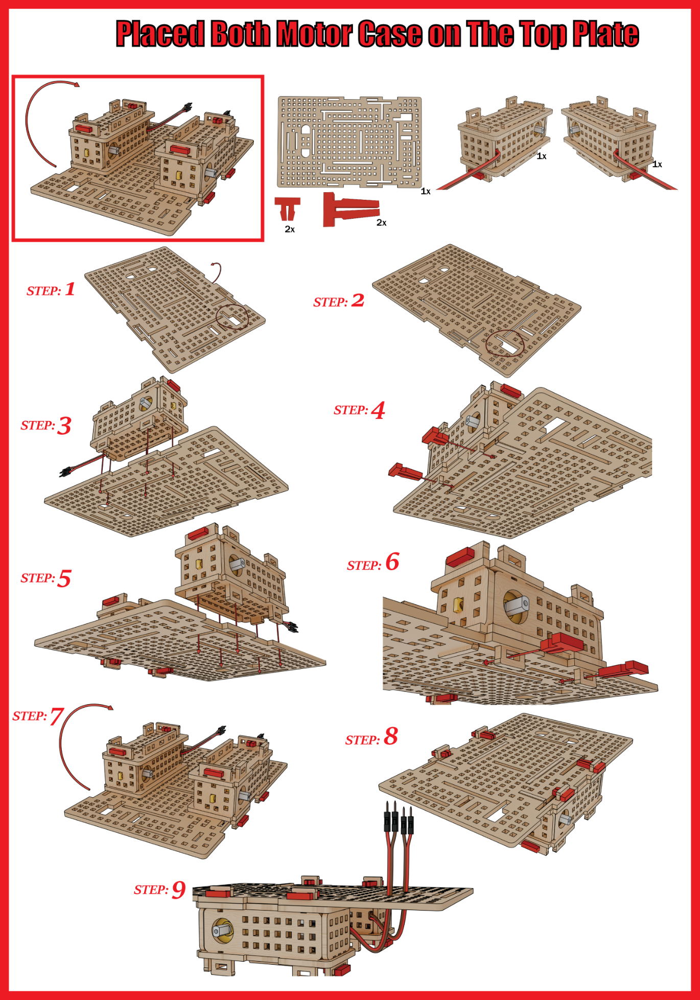

# 3.3 Assemble Motor Cases On Base Plate

With the motor cases assembled, it is time to mount them onto the base plate for our STEMAIDE ROVER 

To do this, carefully follow the steps in the image below:

