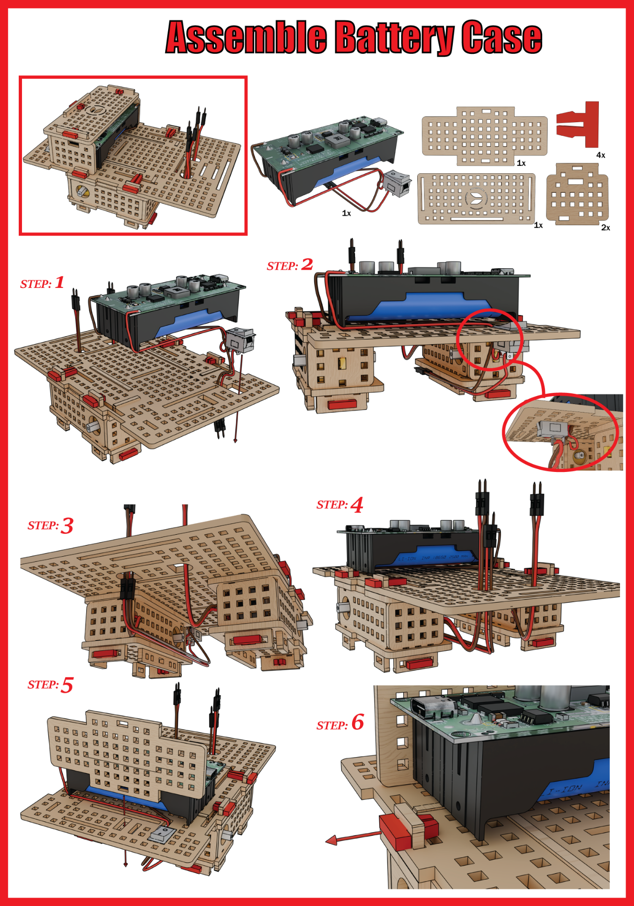
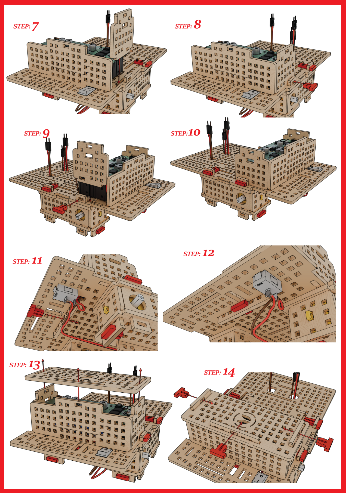

# 3.4 Assemble Battery Case Part

Now, let's assemble our battery case. This will house our battery that would supply consistent power to our ROVER. 

To do this, carefully follow the steps in the image below:

