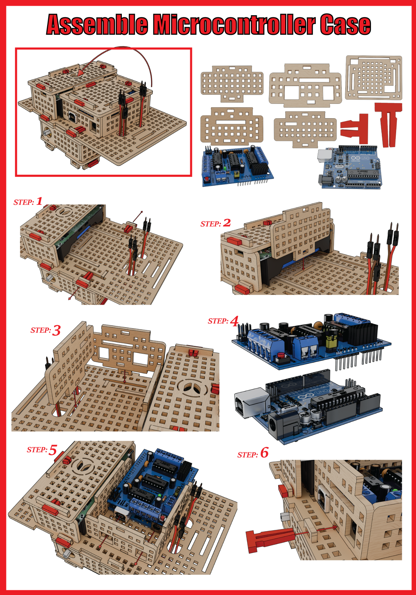
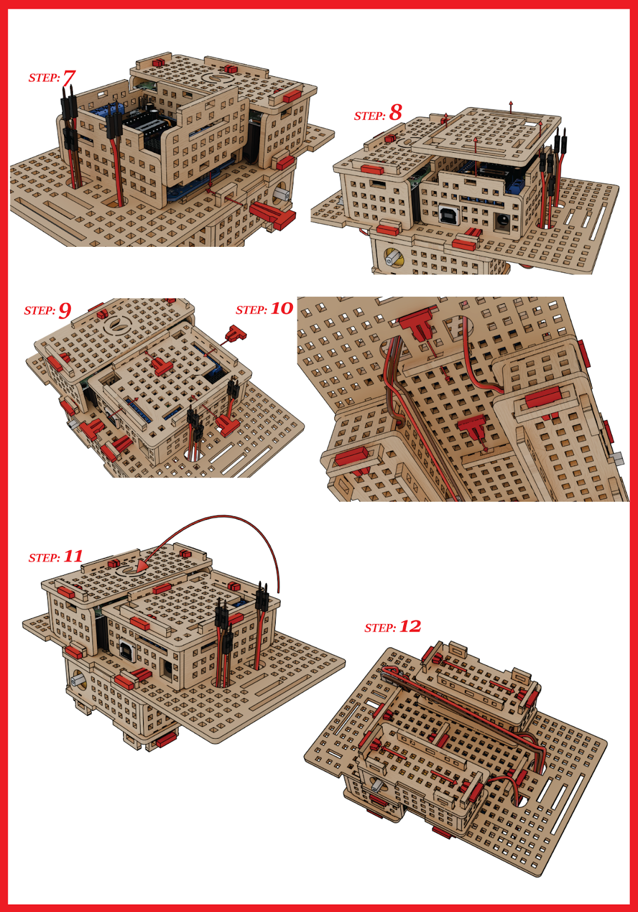

# 3.5 Assemble Microcontroller Case Part

Let's build the case to house our microcontroller. The microcontroller is the brains of our ROVER and it is important that it is well protected. 

To do this, carefully follow the steps in the image below:

