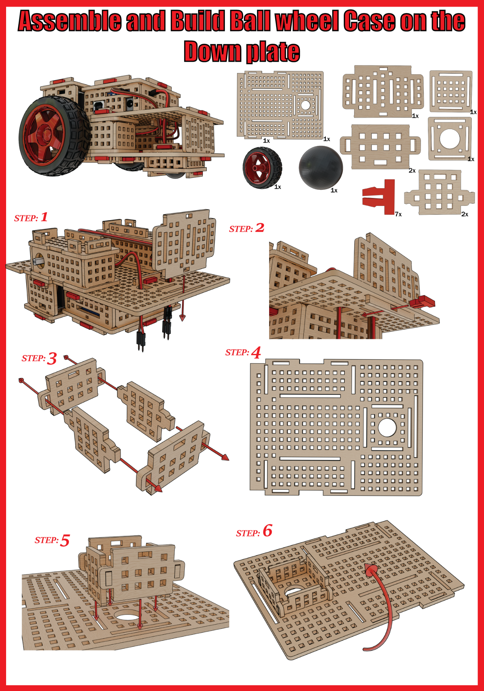
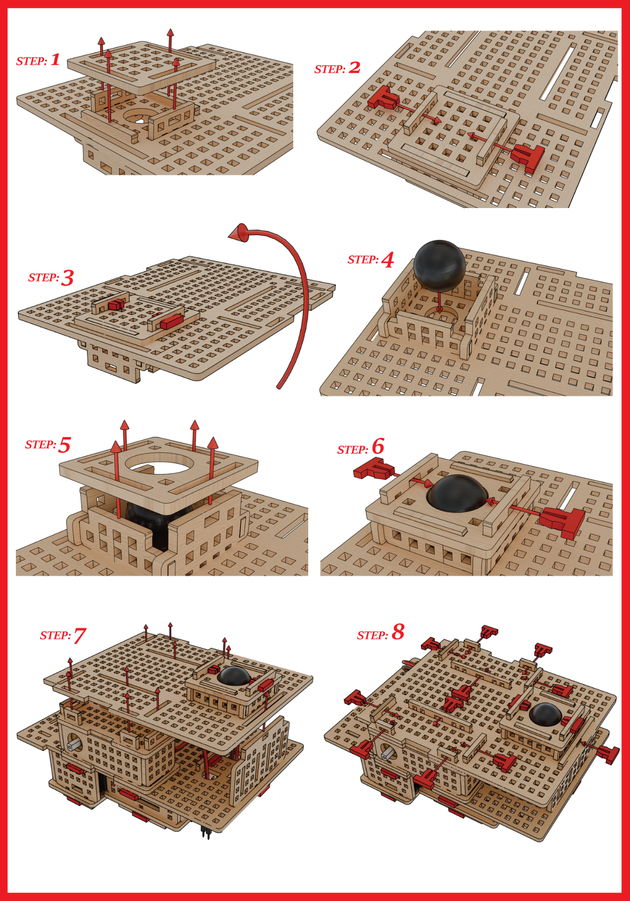
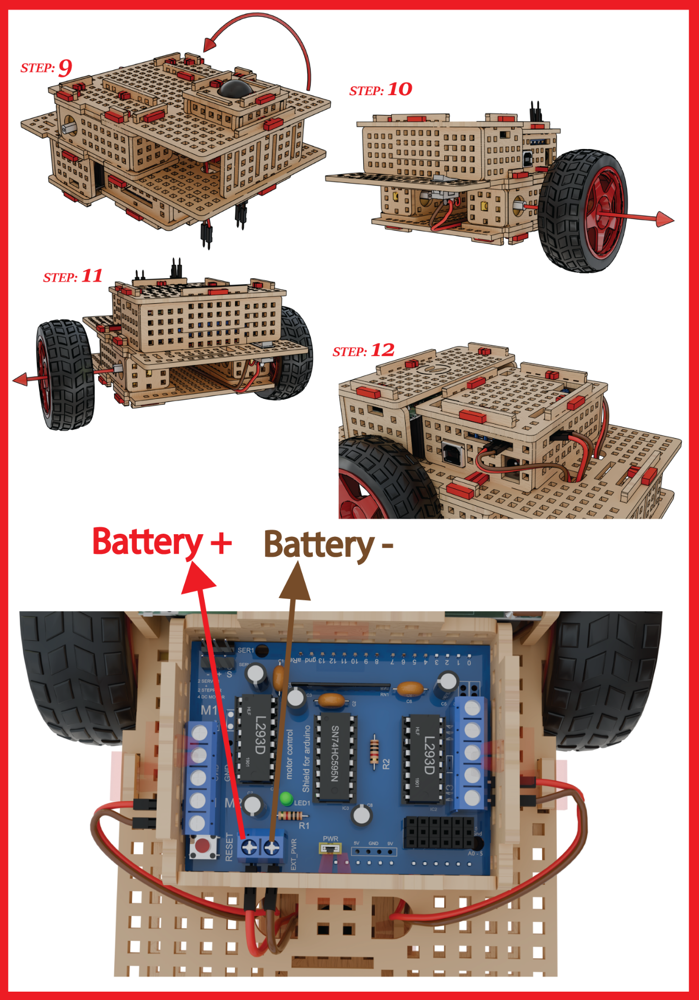

# 3.6 Assemble Ball Wheel Case & The Down Plate

Now let's assemble the case for the ball wheel. This is important for movement as it will support our tires when attach them to the motor to keep our ROVER balanced during movement.

