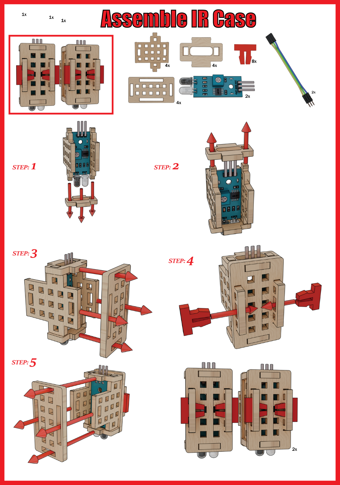
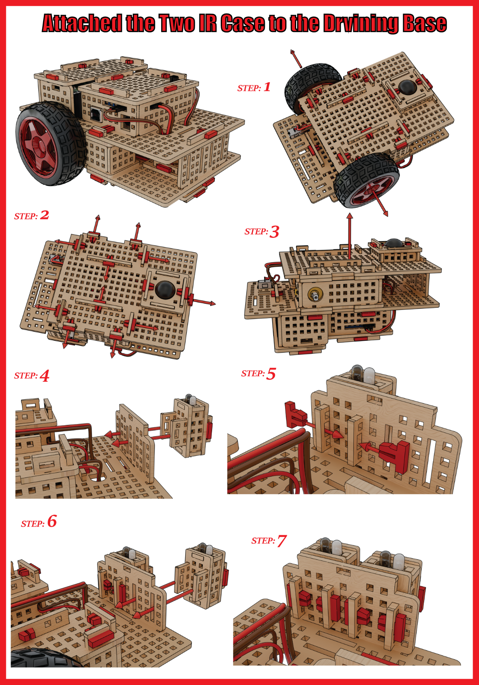
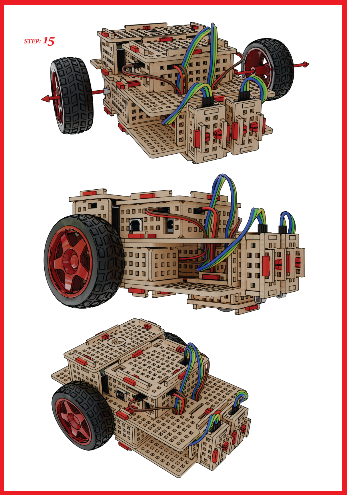
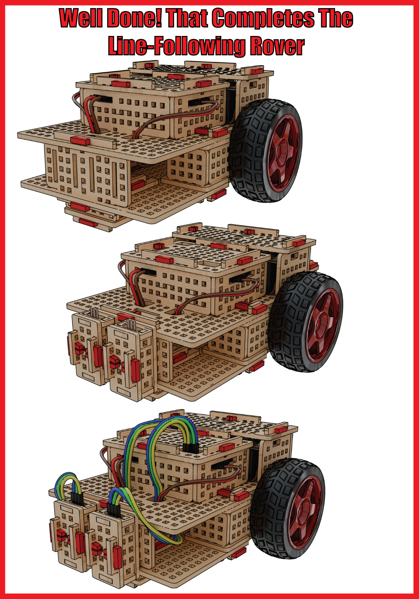

# 1.1 Assembly

## Assembling the IR sensor attachment 

## Attaching the IR sensor attachment to the base of the ROVER

## Connecting the wires of the IR sensor to the microcontroller

## The finished line following robot

