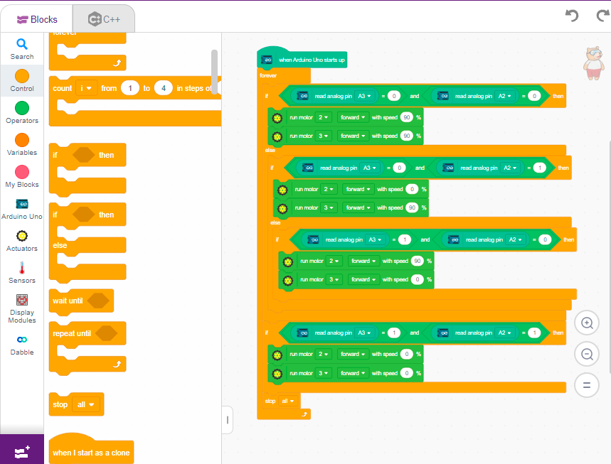

# 1.2 Line Following Program Block by Block

## 1. Start Block

**1.** Drag the block **"when Arduino Uno starts up"**.

**2.** Attach the **"forever"** loop block. Everything below will go inside this forever block.

## 2. Move Forward (Both Sensors on White)

**1.** Add an **"if"** block:
`if (read analog pin A3 = 0) and (read analog pin A2 = 0) then`

**2.** Inside the block, place the motor commands:
- `run motor 2 forward with speed 90%`
- `run motor 3 forward with speed 90%`

The robot moves **straight forward**.

## 3. Turn Right (Left Sensor on Line)

**1.** Add an **"else if"** condition:
`if (read analog pin A3 = 0) and (read analog pin A2 = 1) then`

**2.** Inside it, place:
- `run motor 2 forward with speed 0%`
- `run motor 3 forward with speed 90%`

The robot **turns right**.

## 4. Turn Left (Right Sensor on Line)

**1.** Add another **"else if"** condition:
`if (read analog pin A3 = 1) and (read analog pin A2 = 0) then`

**2.** Inside it, place:
- `run motor 2 forward with speed 90%`
- `run motor 3 forward with speed 0%`

The robot **turns left**.

## 5. Stop (Both Sensors on Black)

**1.** Add the final **"if"** block:
`if (read analog pin A3 = 1) and (read analog pin A2 = 1) then`

**2.** Inside it, place:
- `run motor 2 forward with speed 0%`
- `run motor 3 forward with speed 0%`

The robot **stops**.

## Final Work

