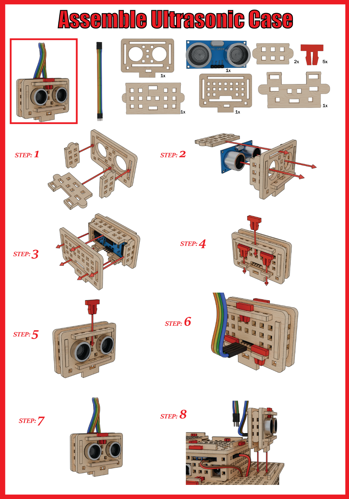
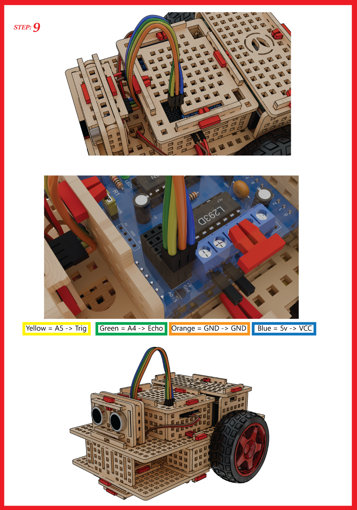

# 2.1 Assembly

Let's assemble the attachment that is used to hold the ultrasonic sensor

To do this, carefully follow the steps in the images below:

## Assembling the ultrasonic sensor attachment

## Connecting the wires of the ultrasonic sensor to the microcontroller

