## Introducing the STEMAIDE kit
The STEMAIDE Kit is a comprehensive plug-and-play educational toolkit designed  to  inspire  and  empower young  learners  in  Africa.  It  is  specifically  curated  to  promote  STEM  (Science,  Technology, Engineering,  and  Mathematics)  education  and  foster  the  development  of  critical  skills,  creativity, problem-solving abilities, and an entrepreneurial mindset.

The  STEMAIDE  kit  includes  a  range  of  components  and  materials  that  allow  you  to  engage  in  first-hand learning experiences and build over two hundred projects to explore various STEM concepts.

This guide helps you discover all the amazing things the STEMAIDE kit can do.

## Getting started
To  get  started  with  your  STEMAIDE  kit,  it  is  particularly  important  that  you  have  some  basic knowledge of ICT.

You will need a Laptop / PC, the Arduino IDE. Group learning is encouraged when you are using the STEMAIDE kit.

## The Arduino IDE and Basic Set Up
**Step 1:** Double click on the Arduino IDE icon on your computer / laptop to open Arduino IDE.

.

**Step 2:** Find the three buttons in the top right corner of the window.

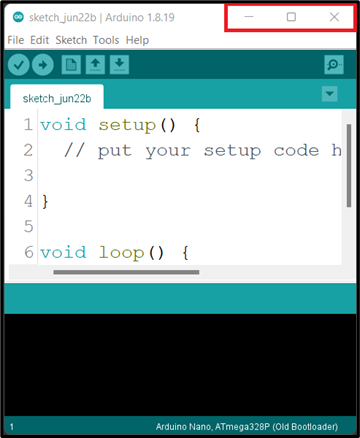

**Step 3:** Click the middle button "Maximize" in the top right corner of the window to maximize its size.

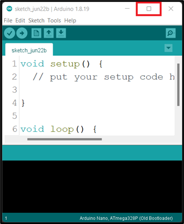.

At the point you should see the code below on your computer / laptop.

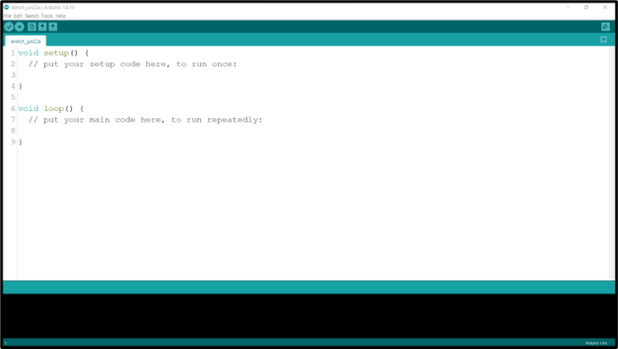

**Step 4:** Left Click before the ( void setup () ) and click on the Enter key on your keyboard to get space at the top of the void setup(). Then click above the void setup().

|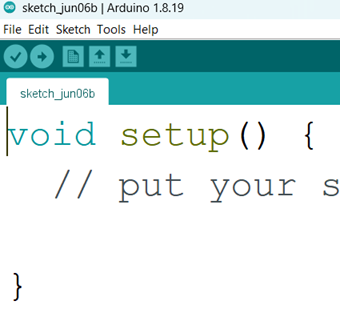 | 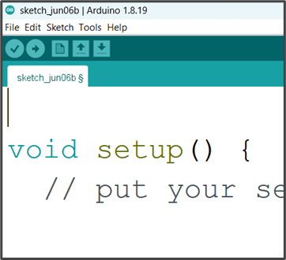 |
|----------------------------------|----------------------------------|

_**NB:** we will write the necessary code and comment at the space we created above the void setup ()._

## Comment
In programming, a comment is a piece of text that is added to the source code of a program to provide information or explanations. Comments are intended for human readers and are ignored by the compiler or interpreter when the program is executed.

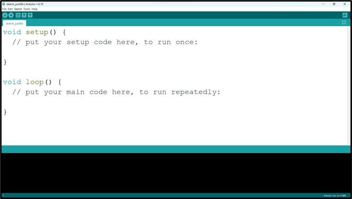.

_**NB:** before you type a comment, type two slash (//) before you complete your sentence._

 Selecting Arduino Board Type and Uploading your code

**Step 1:** Select the Board type. 
Click on tools on the menu bar hover your mouse on Board, a new window will appear. Look through and click on Arduino UNO.

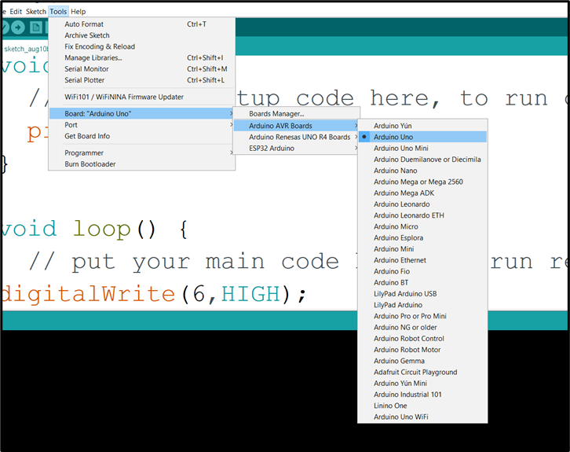.

**Step 2:** Select the Port.

Click on tools on the menu bar and hover your mouse on Port, a new window will appear. Look through and click on COM which has Arduino Uno  attached to it.

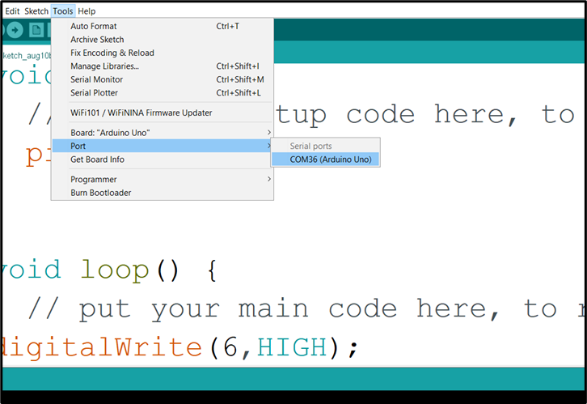.

_**NB:** Your COM number may be different. In this example we have COM36 (Arduino Uno)_

**Step 3:**  Click Control S (CTRL S) on your keyboard or click Save on the Arduino task bar.

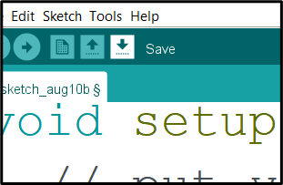.

A new window will pop up, type the project name and click save.

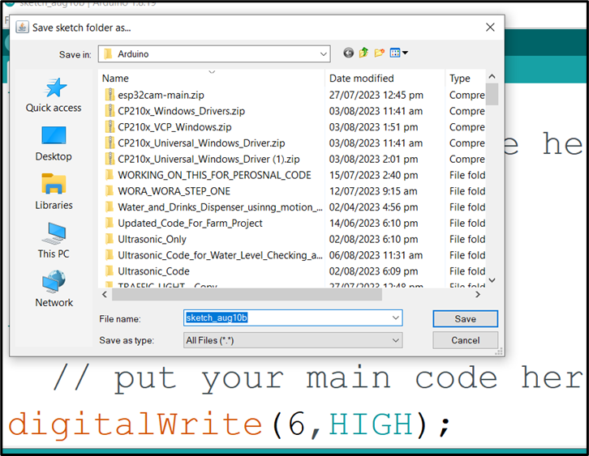.

**Step 4:** Click Verify. 

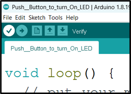.

**Step 5:** Click Upload. 

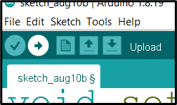.

_**NB:** Make sure there is no error in your code and the Arduino USB cable is connected to your laptop / desktop before you click **Upload**._

**WAIT** _Done uploading_

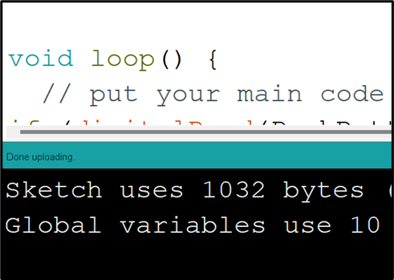.
